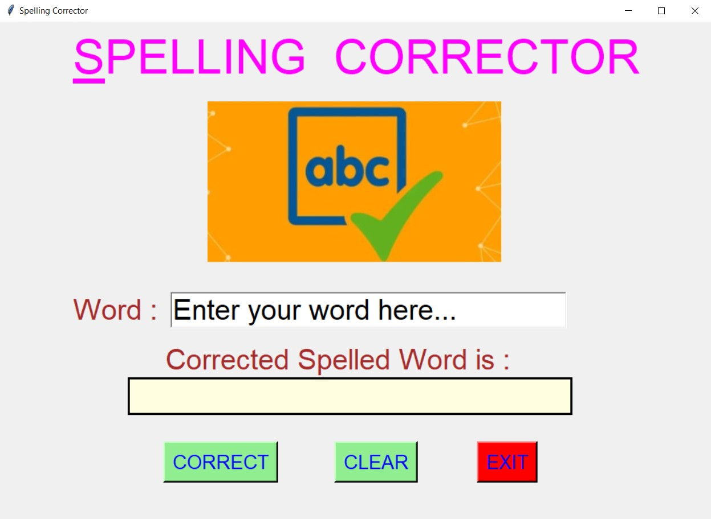
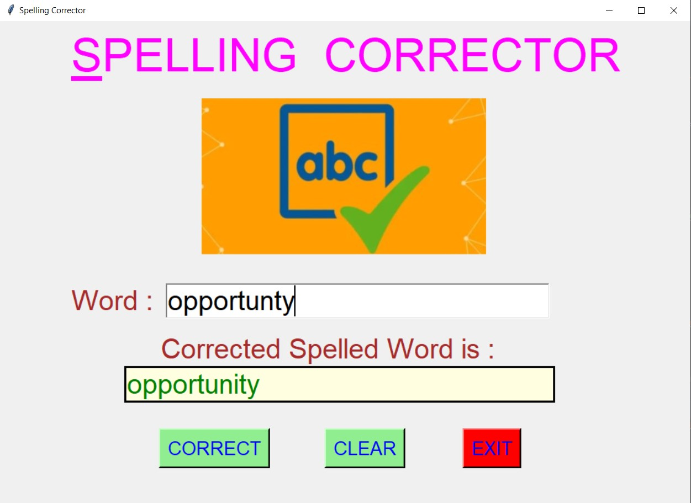
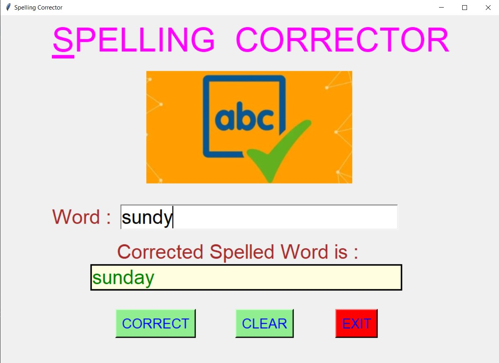
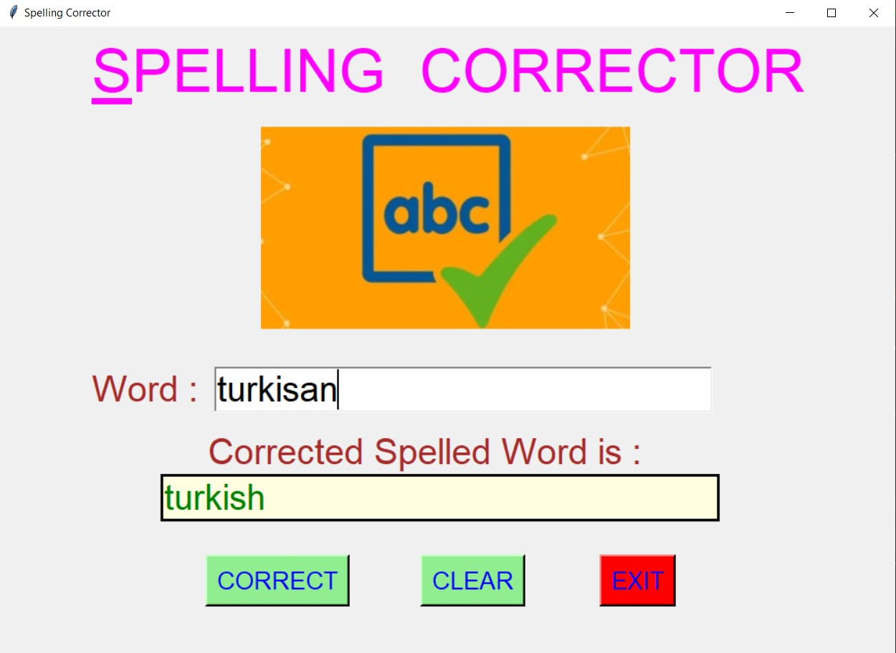
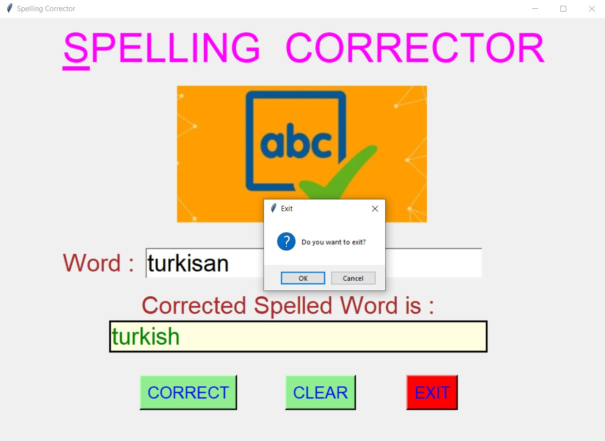

# ✔ SPELLING CORRECTOR
- ### A Spelling Corrector created in python with tkinter gui.
- ### In this script, the user can enter any word, either correct or misspelled, and get the correct spelled word for that entered word.

****

# REQUIREMENTS :
- ### python 3
- ### tkinter module
- ### from tkinter messagebox module
- ### PIL module
- ### from textblob import TextBlob

****

# How this Script works :
- ### User just need to download the file and run the spelling_corrector.py on their local system.
- ### Now on the main window of the appplication, the user will be asked to enter any word or text either correct or missplelled.
- ### After entering the work, when user clicks on the correct button, he/she will be able to see the correct spelled word in the text area.
- ### Also there is a clear button, clicking on which allows the user to clear the text that is entered and the output text.
- ### Also there is an exit button, clicking on which exit dialog box appears asking for the permission of the user for closing the window.

****

# SCREENSHOTS :

****

   
   
   
   
   

****
