# ✔ TAXI HIRE APPLICATION
- ### A "Taxi Hire Application" is an application created in python with tkinter gui.
- ### In this application user will be able to get full hand on experience of how hiring of taxies takes place in online mode.
- ### Here in this application, user need to create an account if already not have an account, else go to login.
- ### After this, user need to enter the basic details about the tours like FirstName, SurName, Address, PostCode, Telephone, Mobile No., Email Id, starting address, destination address, type of route, any preference, number of pooling user can allow, etc.
- ### After that, user will be able to count the total amount he/she needs to pay, also user will be able to see the receipt of his/her trip also. 
- ### And For storing the user account information like Username and Password, Sqlite data base is used.

****

# REQUIREMENTS :
- ### python 3
- ### tkinter module
- ### from tkinter messagebox module
- ### random
- ### time
- ### datetime
- ### sqlite3

****

# How this Script works :
- ### User just need to download the file and run the taxi_hire_applicaton.py on their local system.
- ### First on the starting page of application, user need to click on the START button to enter the LOGIN/CREATE ACCOUNT page.
- ### Here user needs to create a new account is he/she doesn't already have an account.
- ### If User already has an account in Taxi Hire Appplication, then he/she just need to LOGIN using Username and Password.
- ### After User Login is sucessfull, then user will be directed to the main application window.
- ### Now here user needs to enter his details like FirstName, SurName, Address, PostCode, Telephone, Mobile No., Email Id. Also user needs to select with which feature he/she want to go like, Strandard, or Prime Sedan or Premium Sedan. And how he/she wants to go, like Single, Return or with special needs.
- ### After selecting these details, now user needs to select the starting and destination address of his/her route.
- ### After selcting all thses details, when user clicks on the TOTAL button, he/she, will be able to see the total price he/she needs to pay.
- ### User will also be able to see the receipt for that particular route.
- ### Also there is RESET button, clicking on which user can reset the details entered.
- ### Also there is an exit button, clicking on which exit dialog box appears asking for the permission of the user for closing the window.
- ### Also user will be able to see the Users.db, database using and database application.

# Purrpose :
- ### This scripts helps users to easily get full hand on experience of how hiring of taxies takes place in online mode.

# Compilation Steps :
- ### Install tkinter, pandas
- ### After that download the code file, and run taxi_hire_applicaton.py on local system.
- ### Then the script will start running and user can explore more about this application by creating account in it and also taking some trip.

****

# SCREENSHOTS :

****

  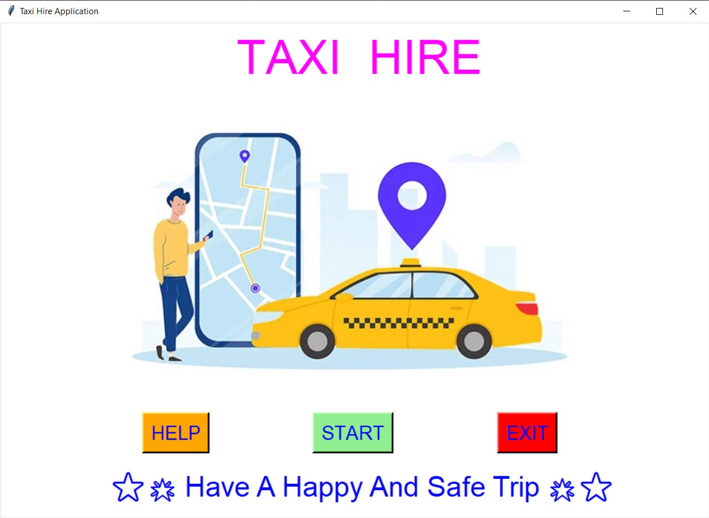 
  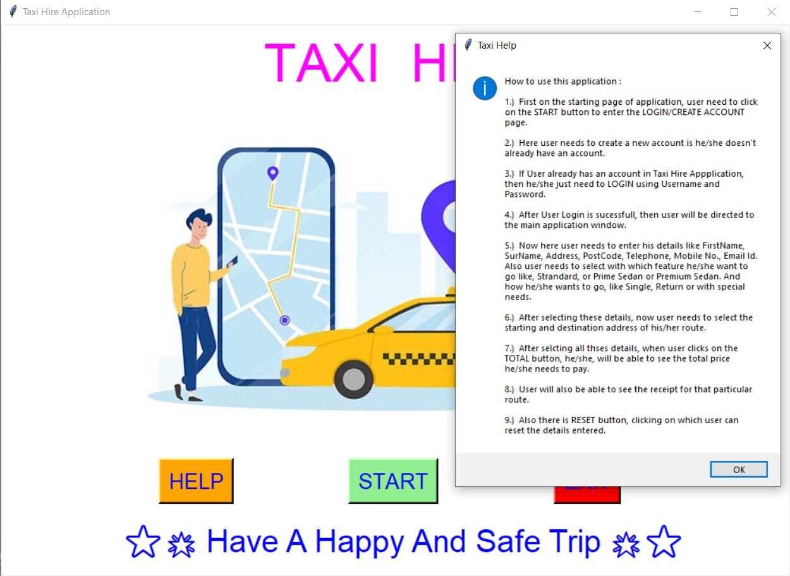 
  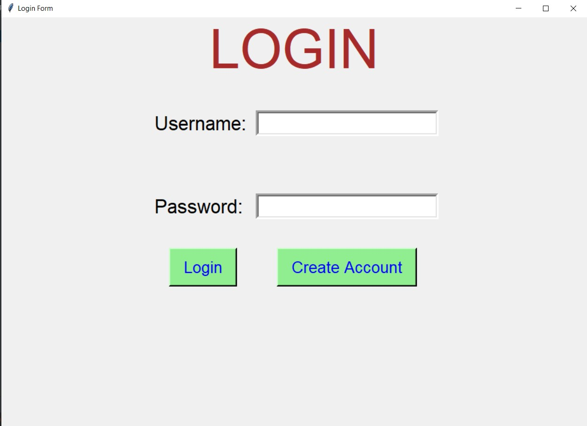 
  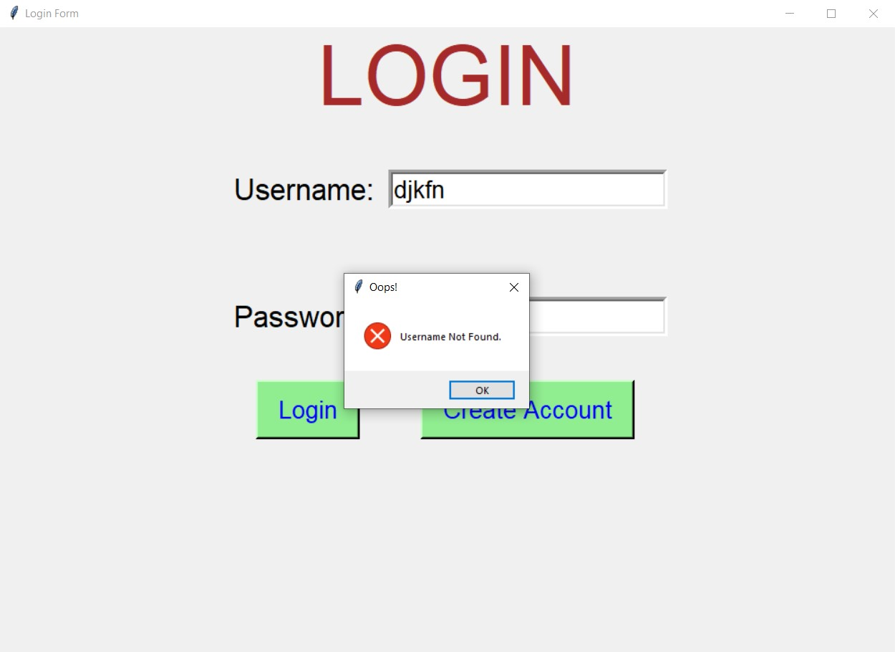 
  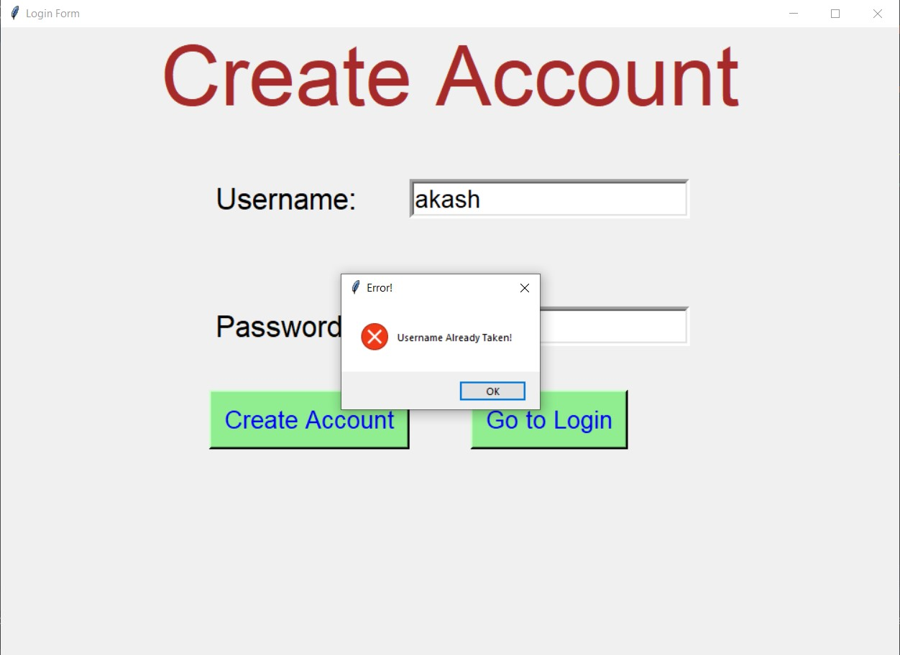 
  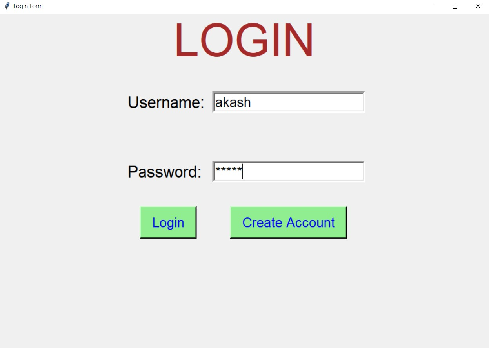 
  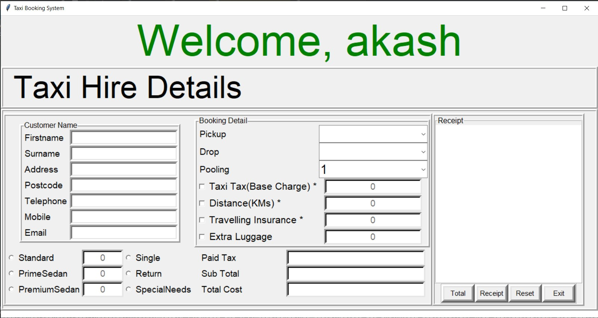 
  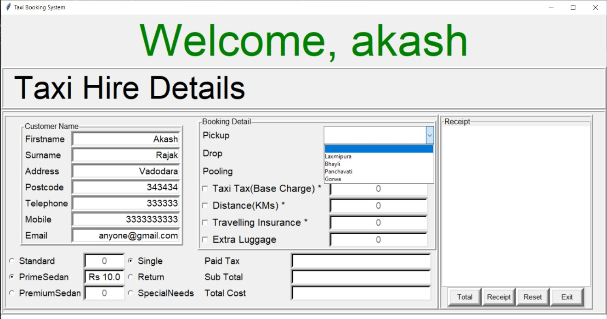 
  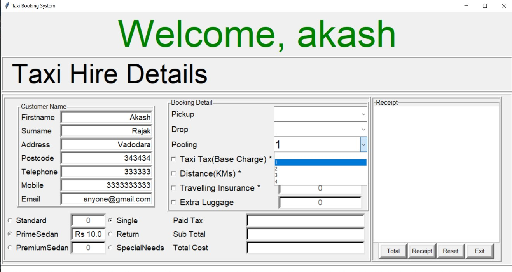 
   
  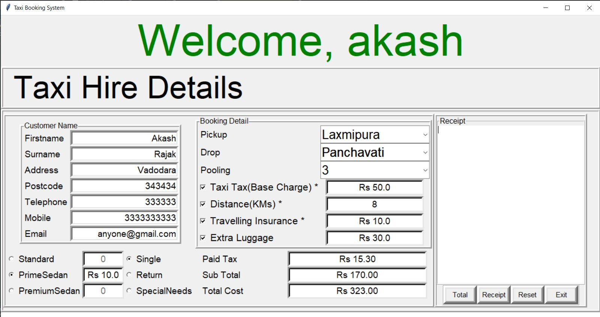 
  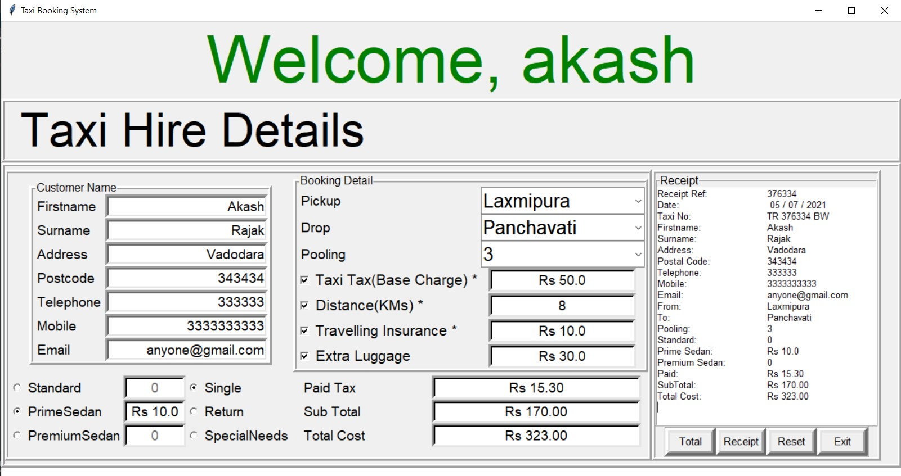 
  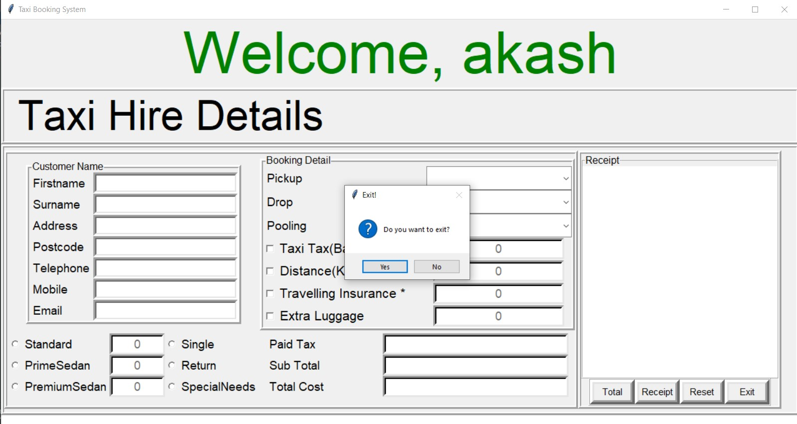 
  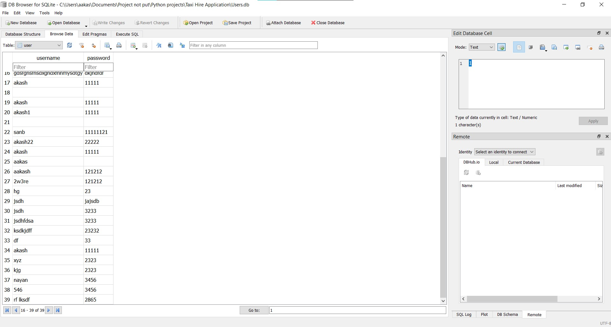 

****

# Below is sample video showing how the application works :

   

****
# Author :
- ### Akash Ramanand Rajak
