# ✔ TEXT EDITOR
- ### A "Text Editor" is an a simple text editor created in python with tkinter gui.
- ### In this application, user have many options like, can open new file, open existing file, can do cut, copy and paste, can do undo and redo operation, can also search any word or text in the file.
- ### There are also other options like highlighting the particular line or not, changing the theme of the notepad (there are given 7 different themes in theme option).
- ### Also while searching any text, the searched text is highlighted with yellow color.
- ### Also on the bottom right corner, user can see the position of current cursor, in terms of line no. and column no.

****

# REQUIREMENTS :
- ### python 3
- ### tkinter module
- ### from tkinter messagebox module
- ### filedialog
- ### os

****

# How this Script works :
- ### User just need to download the file and run the text_editor.py on their local system.
- ### Now on the main window of the application, user will be able to see a simple text editor.
- ### In this application, user have many options like, can open new file, open existing file, can do cut, copy and paste, can do undo and redo operation, can also search any word or text in the file.
- ### There are also other options like highlighting the particular line or not, changing the theme of the notepad (there are given 7 different themes in theme option).
- ### Also while searching any text, the searched text is highlighted with yellow color.
- ### Also there is an exit button, clicking on which exit dialog box appears asking for the permission of the user for closing the window.

# Purpose :
- ### This scripts helps us to easily explore the any text file.

# Compilation Steps :
- ### Install tkinter, python3, os
- ### After that download the code file, and run text_editor.py on local system.
- ### Then the script will start running and user can explore more and more about the text editor by seeing each option.

****

# SCREENSHOTS :

****

  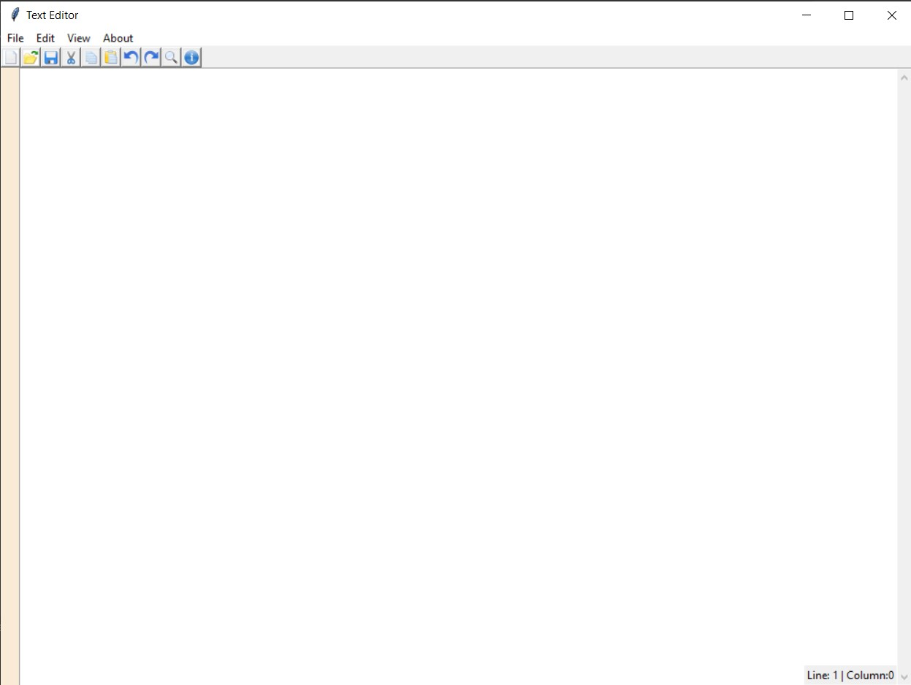 
  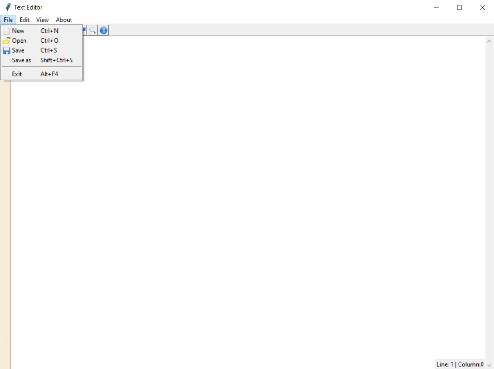 
  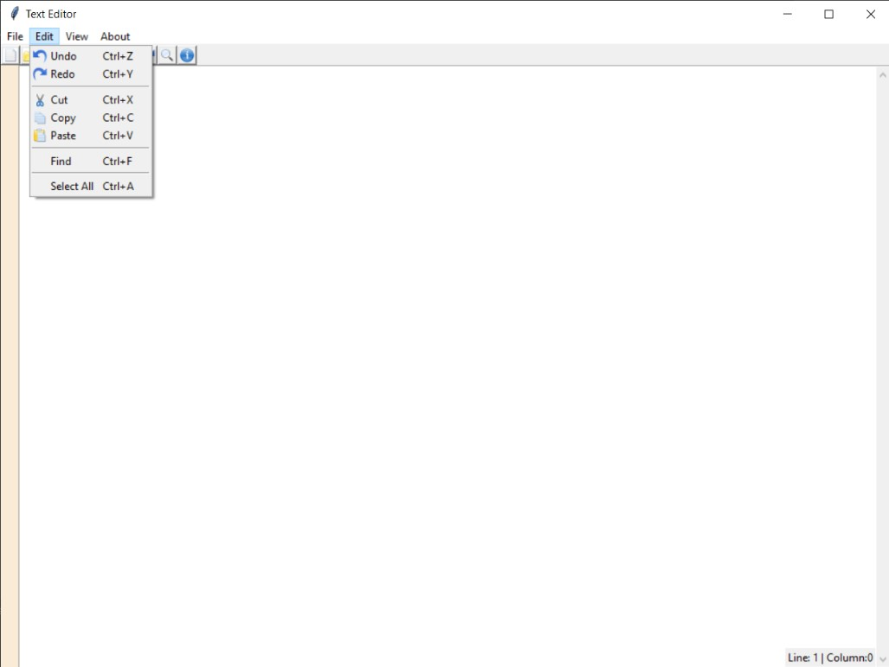 
  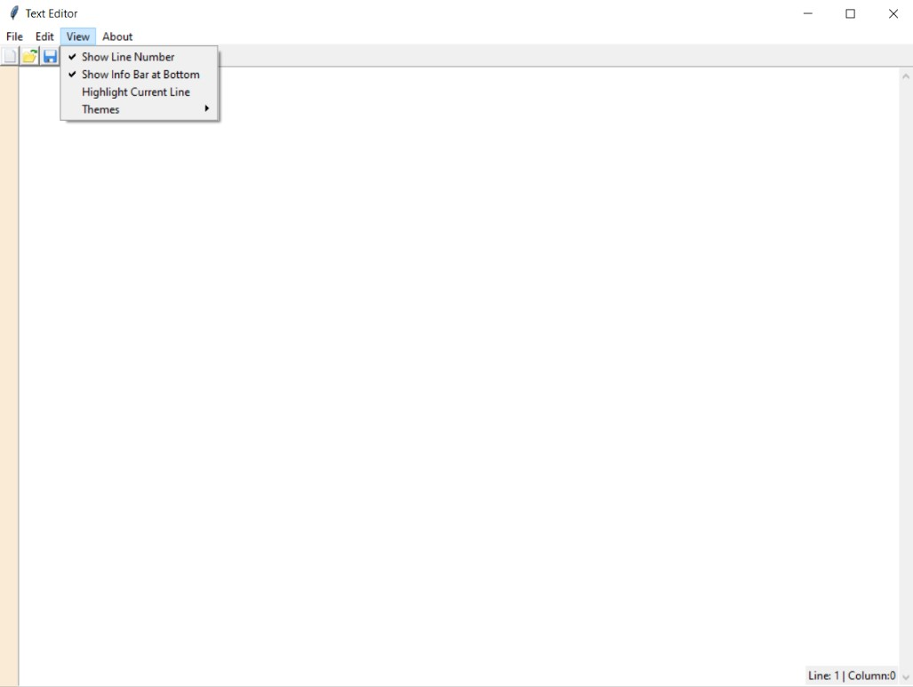 
  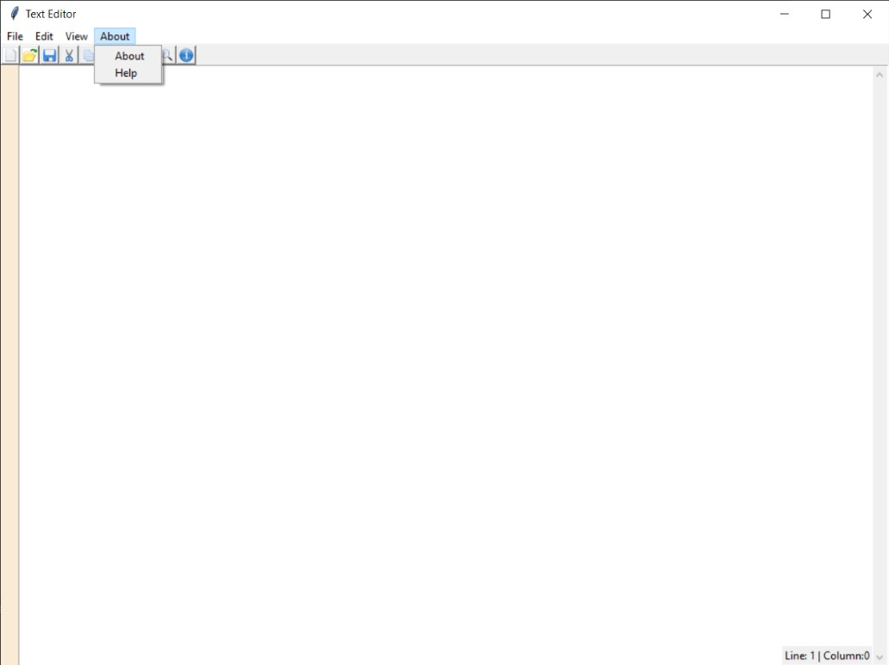 
  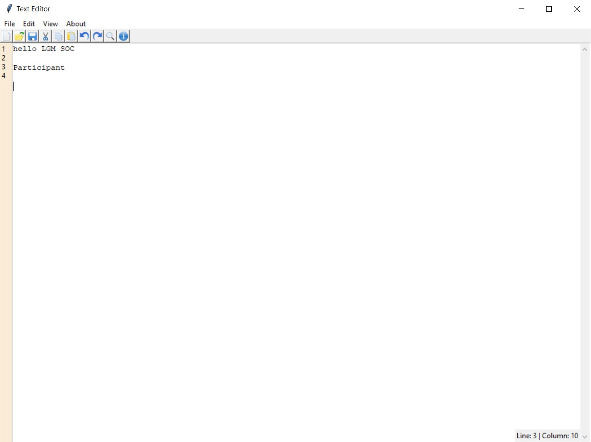 
  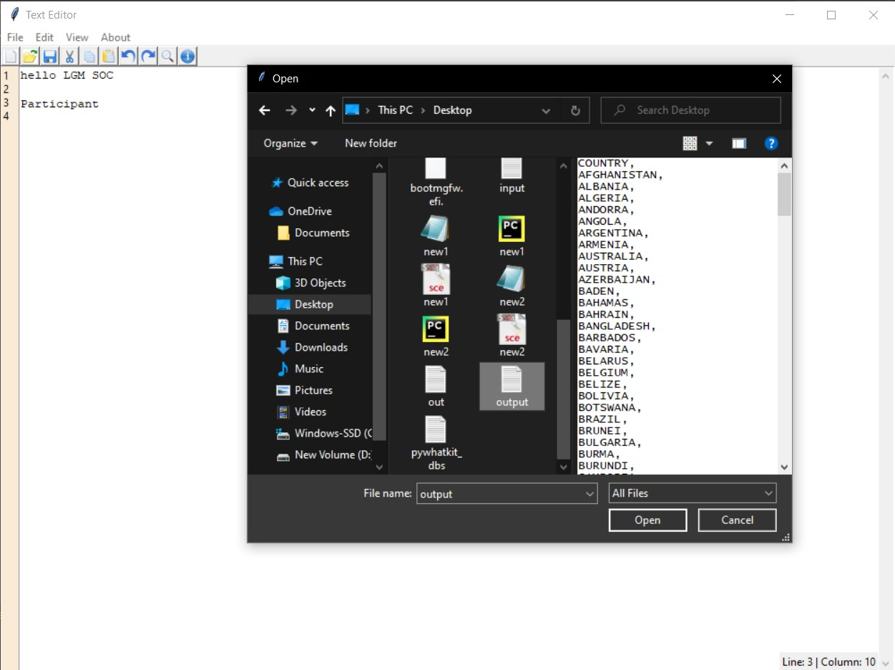 
  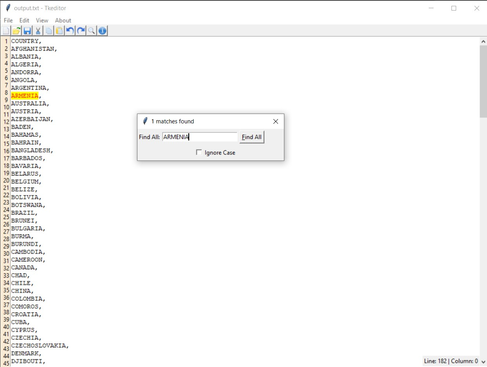 
  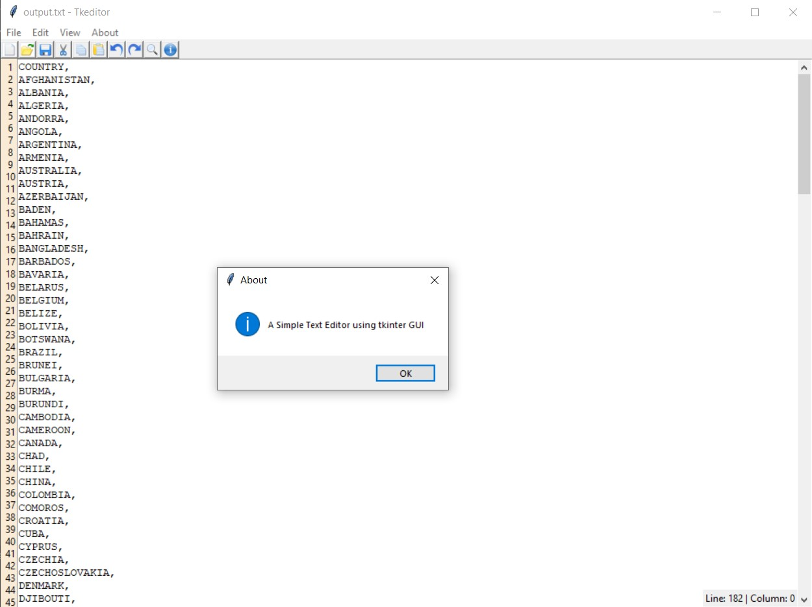 
  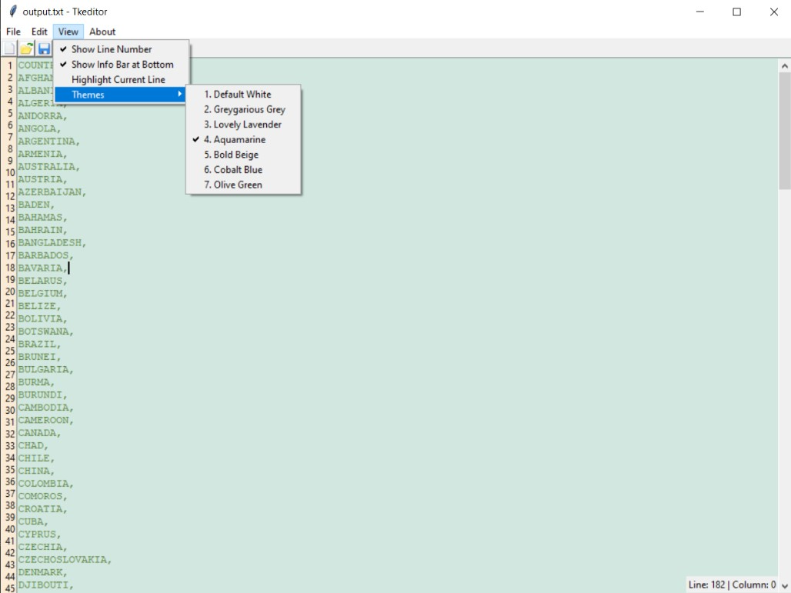 
  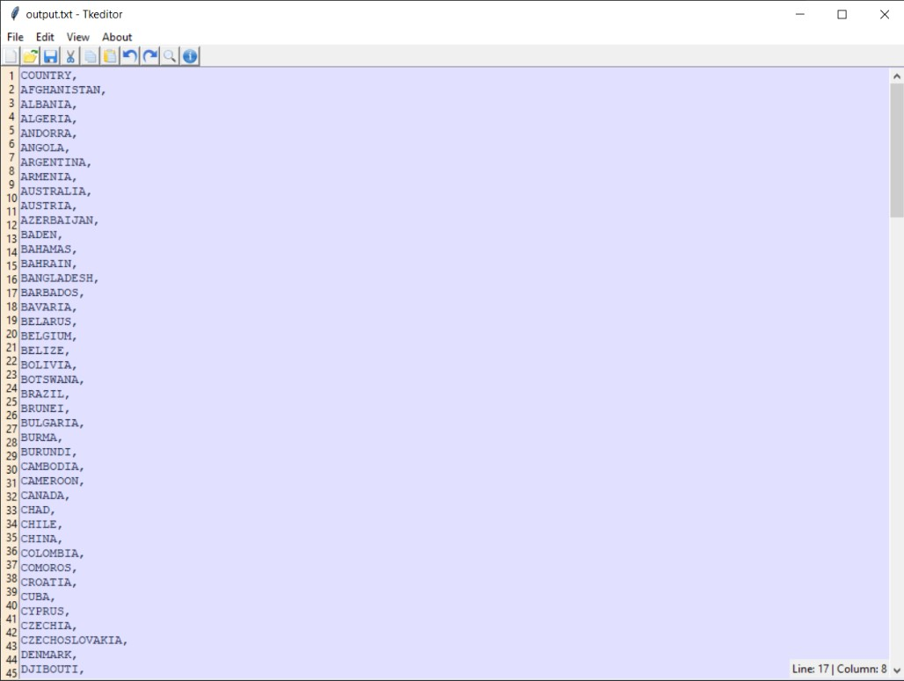 
  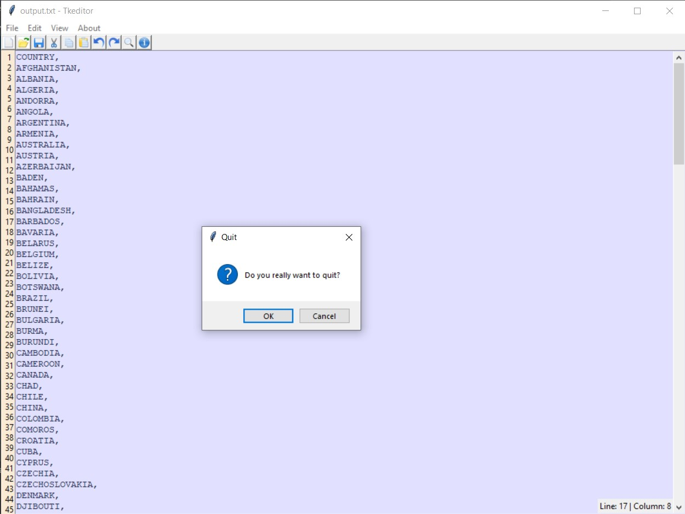 

****

# Name :
- ### Akash Ramanand Rajak

