# ✔ TEXT ON IMAGE
- ### An Text On Image is an application created in python with tkinter gui.
- ### In this application user can select any image from anywhere from the local system and can select the fonts of the text that user wants.
- ### And user will be able to enter any text on the image and can save it using save command.
- ### Also user will be specify  the position at which user wants to enter the text.

****

# REQUIREMENTS :
- ### python 3
- ### os module
- ### cv2 module
- ### tkinter module
- ### filedialog from tkinter
- ### messagebox
- ### from PIL import Image, ImageTk, ImageDraw

****

# HOW TO Use it :
- ### User just need to download the file, and run the text_on_image.py, on local system.
- ### After running a GUI window appears, where user will be asked to select any image from the local system using the SELECT button.
- ### After that user will be asked to select and enter the Text Styles like, positon of text, line width, Hershey Font, Line Types, and also the colour in rgb code.
- ### After entering the details, when user clicks on the ENTER button, he/she will get a message box, showing some instructions.
- ### Clicking on OK, user will be able to see the image and can start typing and can see that text getting typed on image at specified position.
- ### After user has completed entering text, user will be able to save that image with text using the save command.
- ### Also there is a RESET button, clicking on which resets the evrything to default one.
- ### Also there is exit button, clicking on which we get a exit dialog box asking the permission to exit.

# Purpose :
- ### This scripts helps user to easily add text on any image with any style and color and even save it.

# Compilation Steps :
- ### Install python3, tkinter, pandas, os, cv2, PIL
- ### After that download the code file, and run text_on_image.py on local system.
- ### Then the script will start running and user can explore it by selecting image, entering details and start typing text.

****

# SCREENSHOTS :

****

  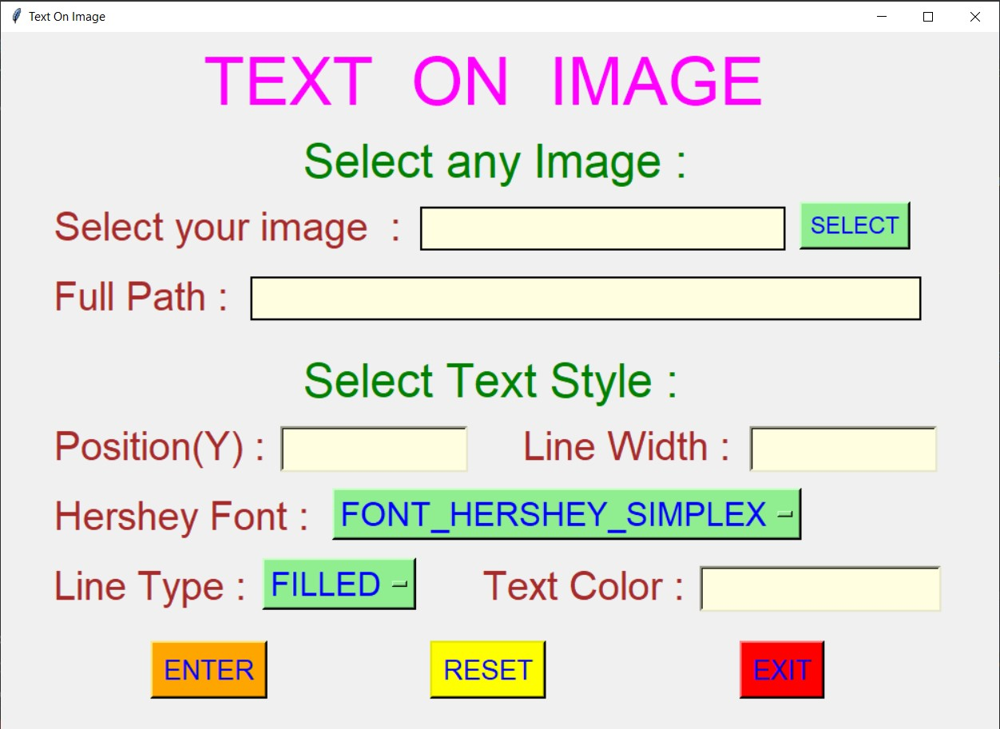 
  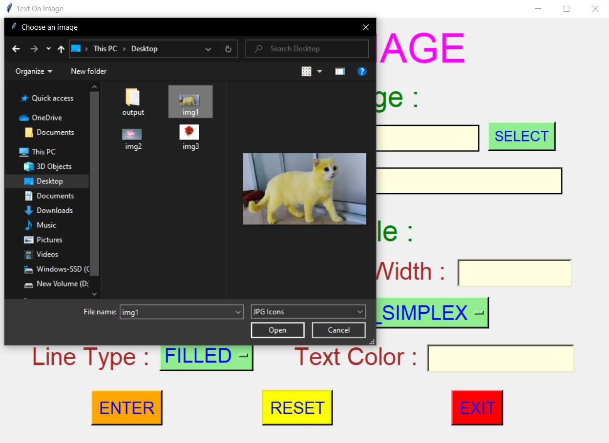 
  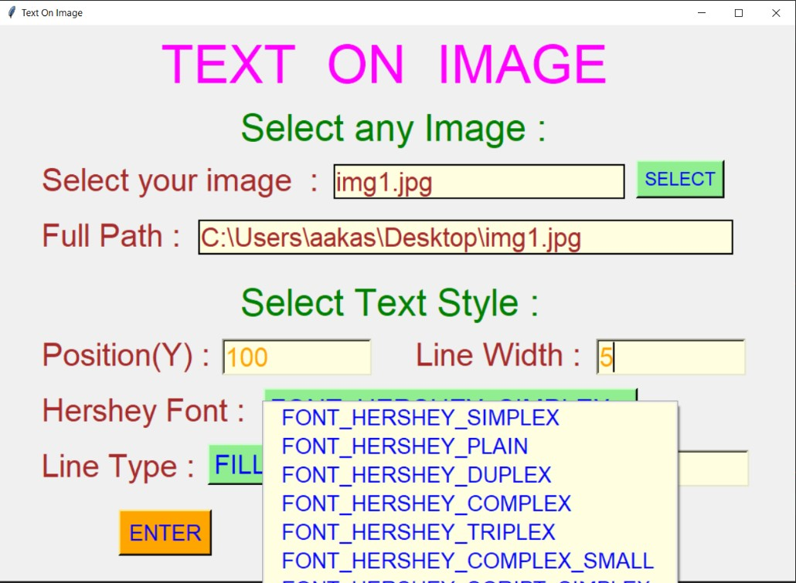 
  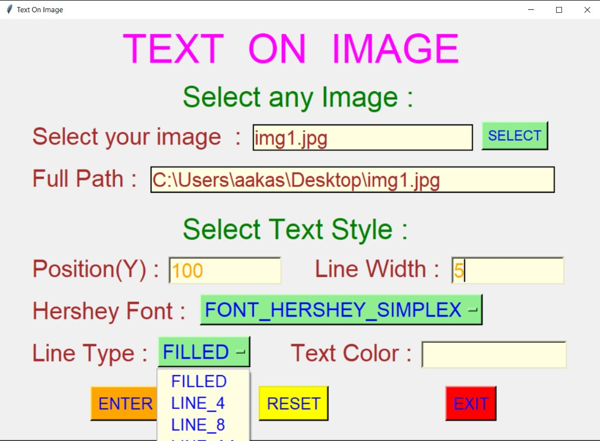 
  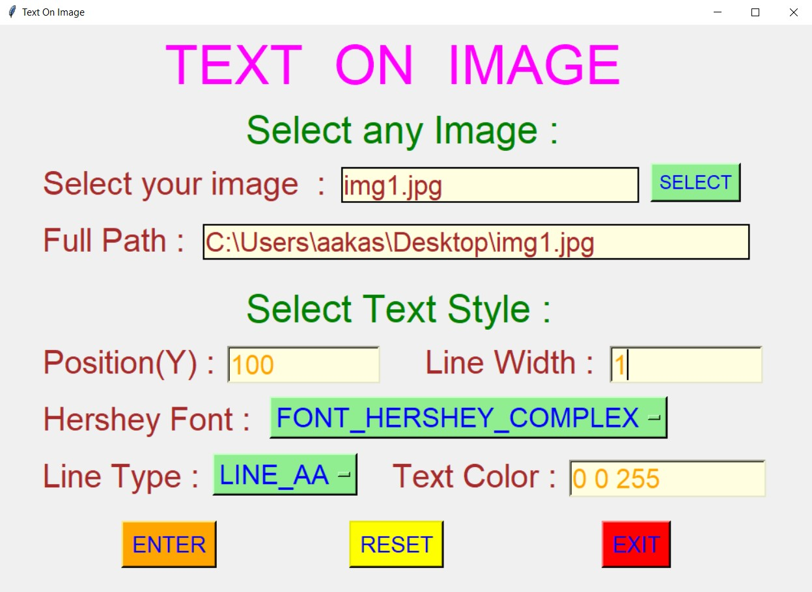 
  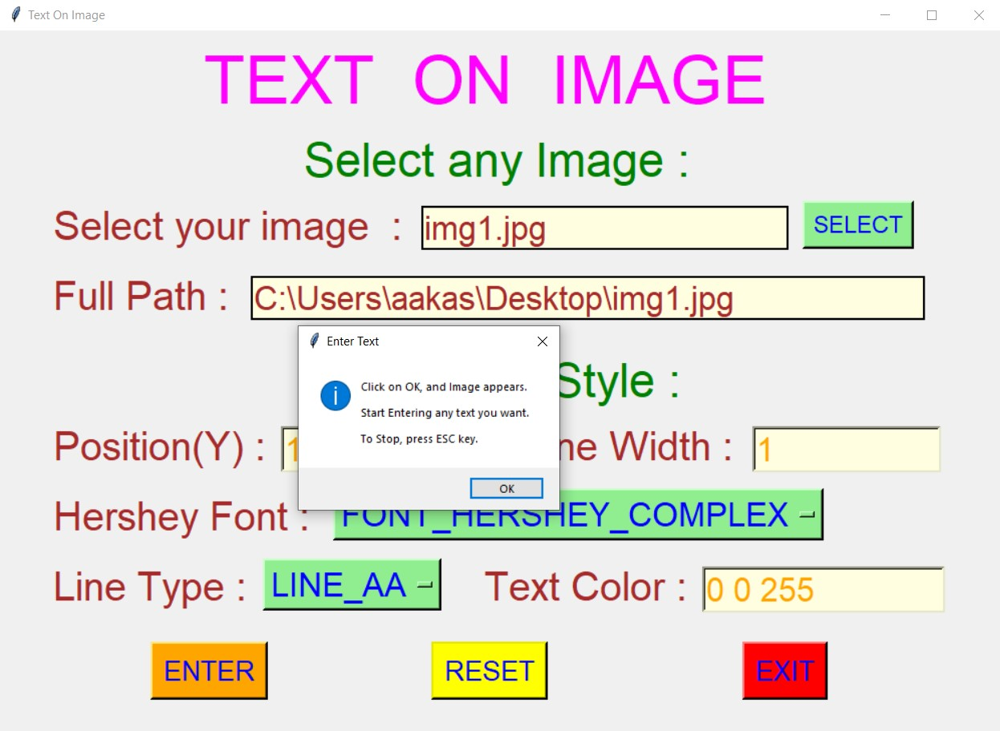 
  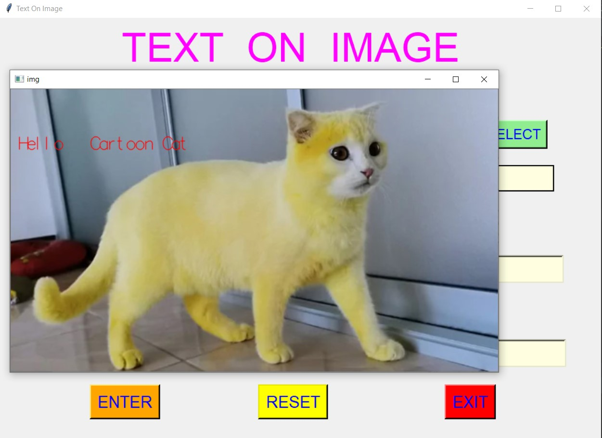 
  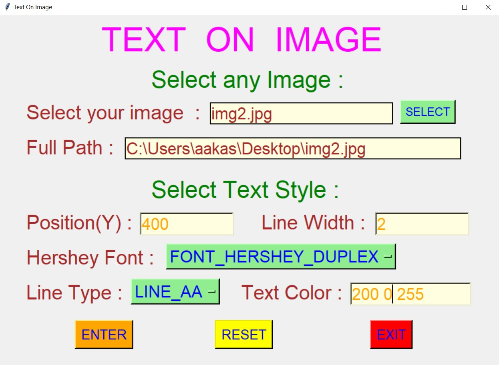 
  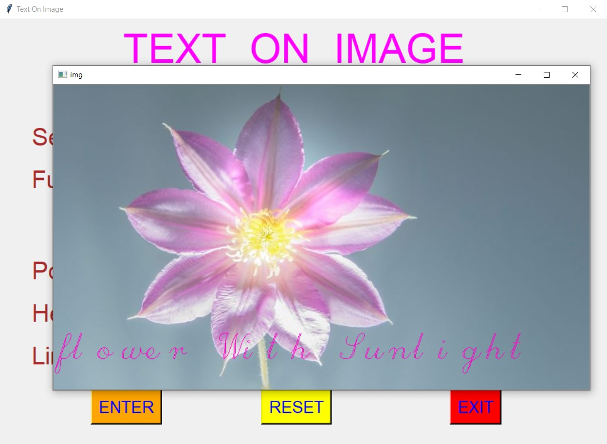 
  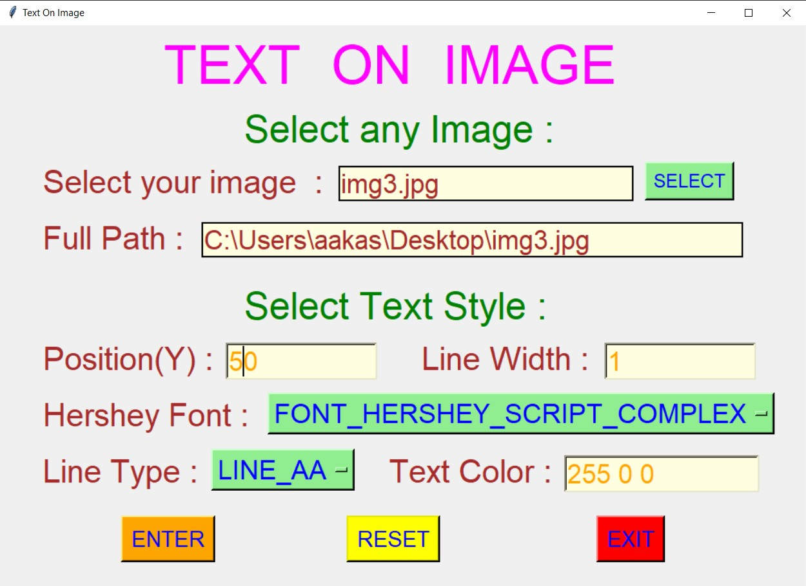 
  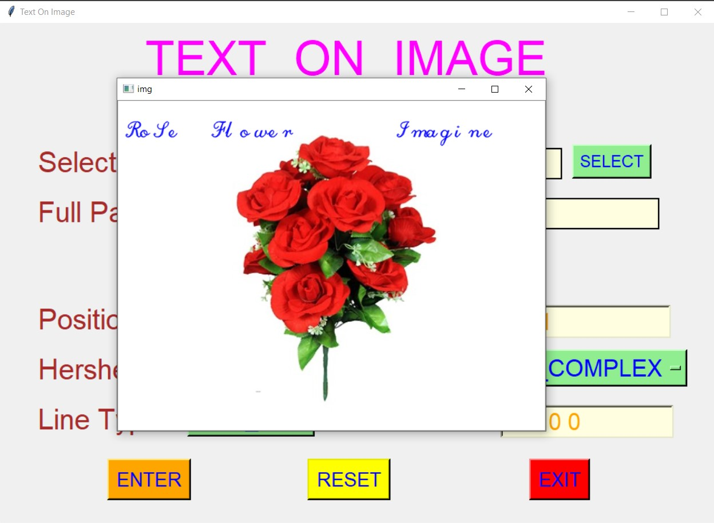 
  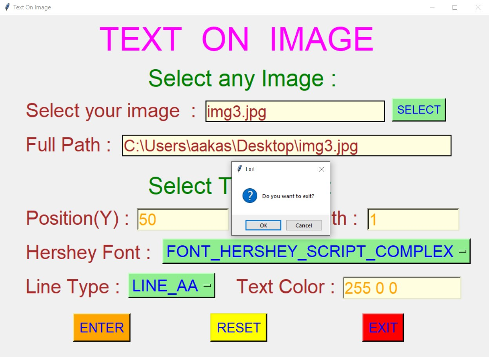 

****

# Author : 
- ### Akash Ramanand Rajak
