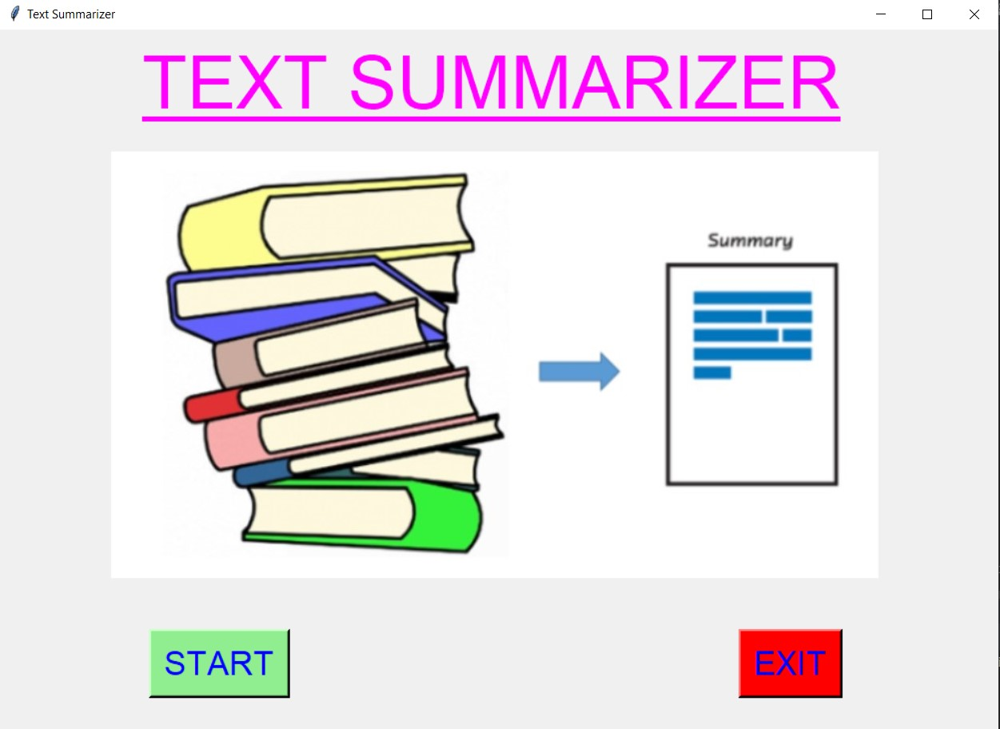
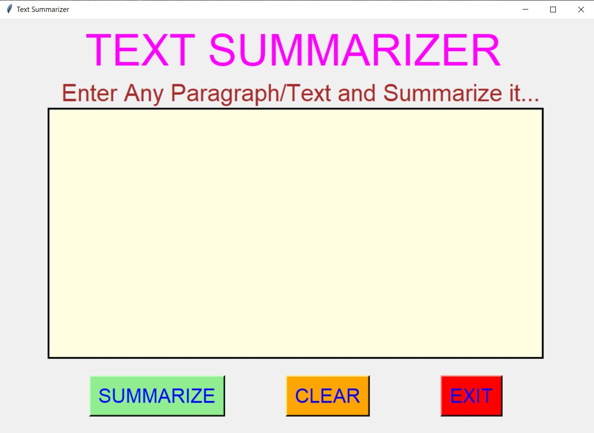
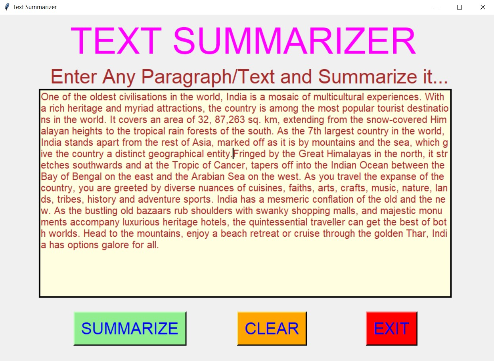
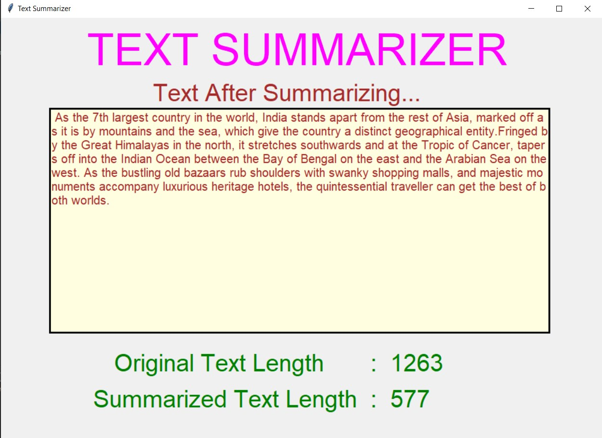
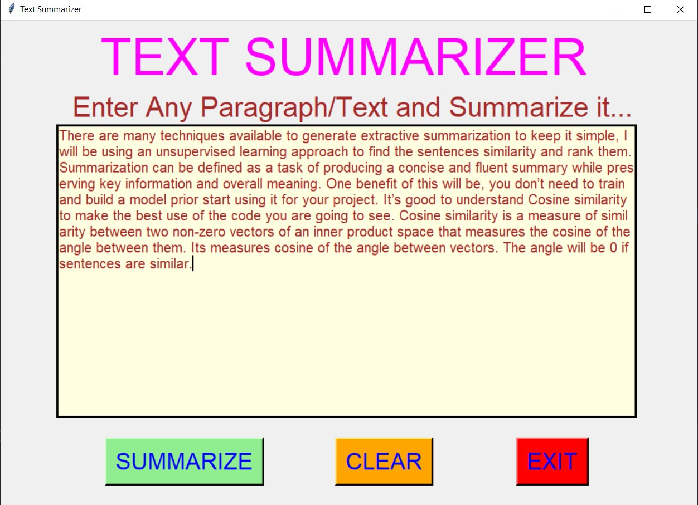
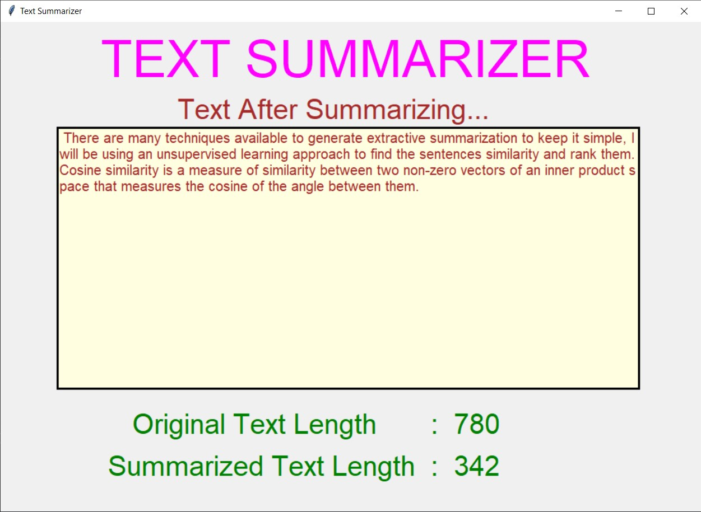
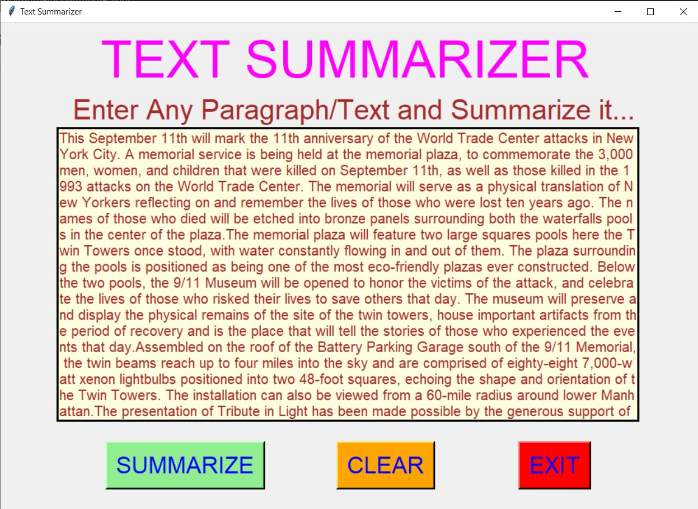
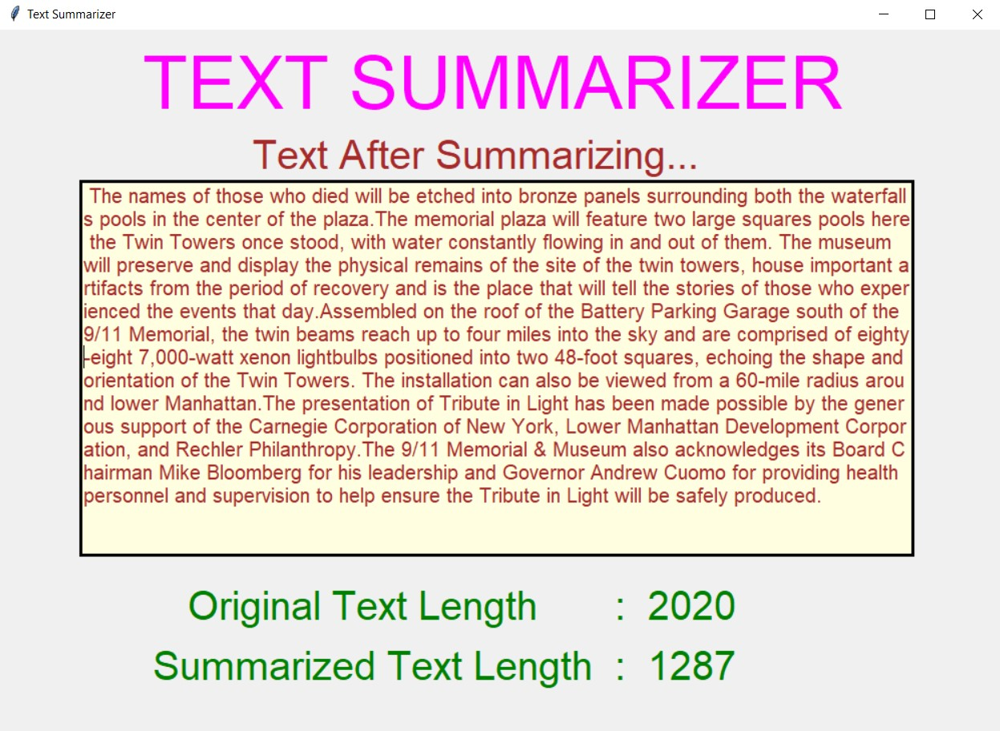
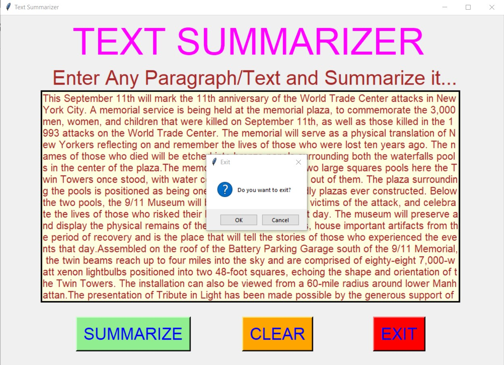

# ✔ TEXT SUMMARIZER
- ### A "Text Summarizer" is an application created in python with tkinter gui.
- ### In this application, user will be able summarize any big paragraph or text.
- ### We need this application because long paragraph and huge text are sometimes very tough to read and understand.
- ### So using TEXT SUMMARIZER, we summarize the paragraph in brief.
- ### for implementing this user nltk library in python.

****

# REQUIREMENTS :
- ### python 3
- ### tkinter module
- ### from tkinter messagebox module
- ### from PIL import Image, ImageTk
- ### nltk

****

# How this Script works :
- ### User just need to download the file and run the text_summarizer.py on their local system.
- ### Now a GUI window will appear, where user will be able to see START and EXIT button.
- ### When user clicks on the START button main text summarizing application will open, where user can enter any huge paragraph or text and can summarize it.
- ### Thus this script will segment the given paragraph into sentences which are easy to read and understand in real life.
- ### Also there is a CLEAR button, clicking on which user can clears the text area.
- ### Also there is an EXIT button, clicking on which exit dialog box appears asking for the permission of the user for closing the window.

# Purpose :
- ### This scripts helps user to easily summarize the huge paragraph or text for better readability.

# Compilation Steps :
- ### Install tkinter, PIL, nltk
- ### After that download the code file, and run text_summarizer.py on local system.
- ### Then the script will start running and user can explore by entering any huge paragraph or text and summarizing it.

****

# SCREENSHOTS :

****

   
   
   
   
   
   
   
   
   

****

# Author :
- ### Akash Ramanand Rajak
