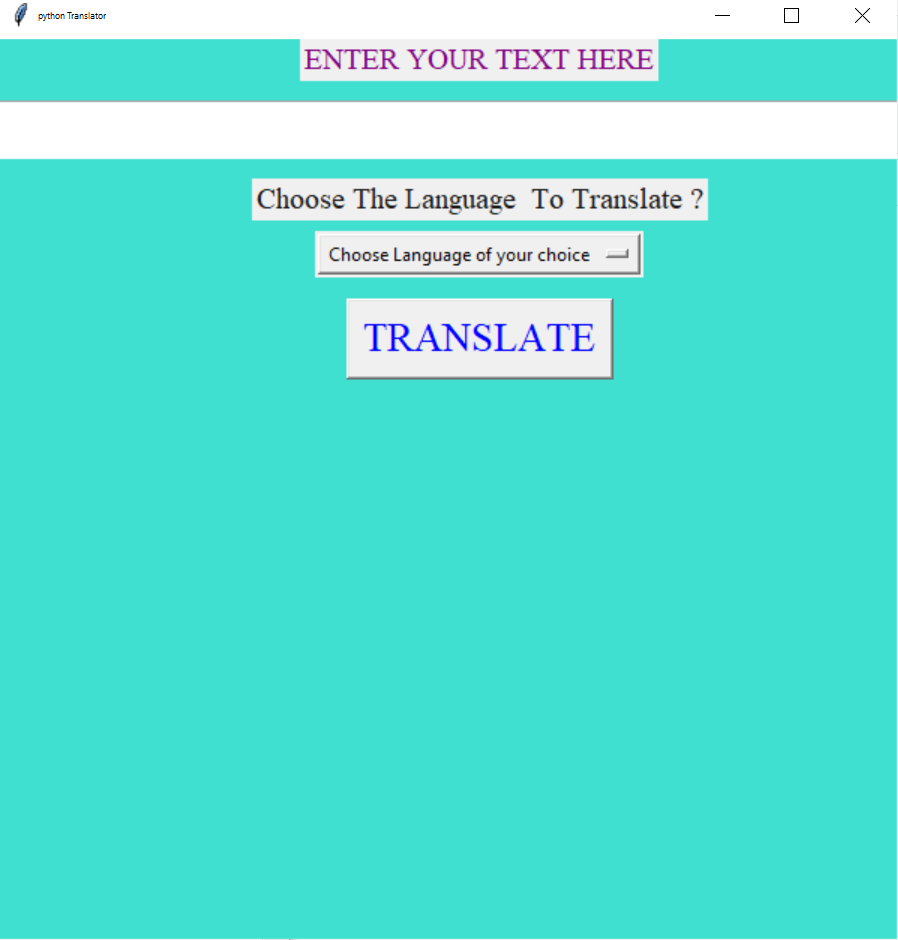
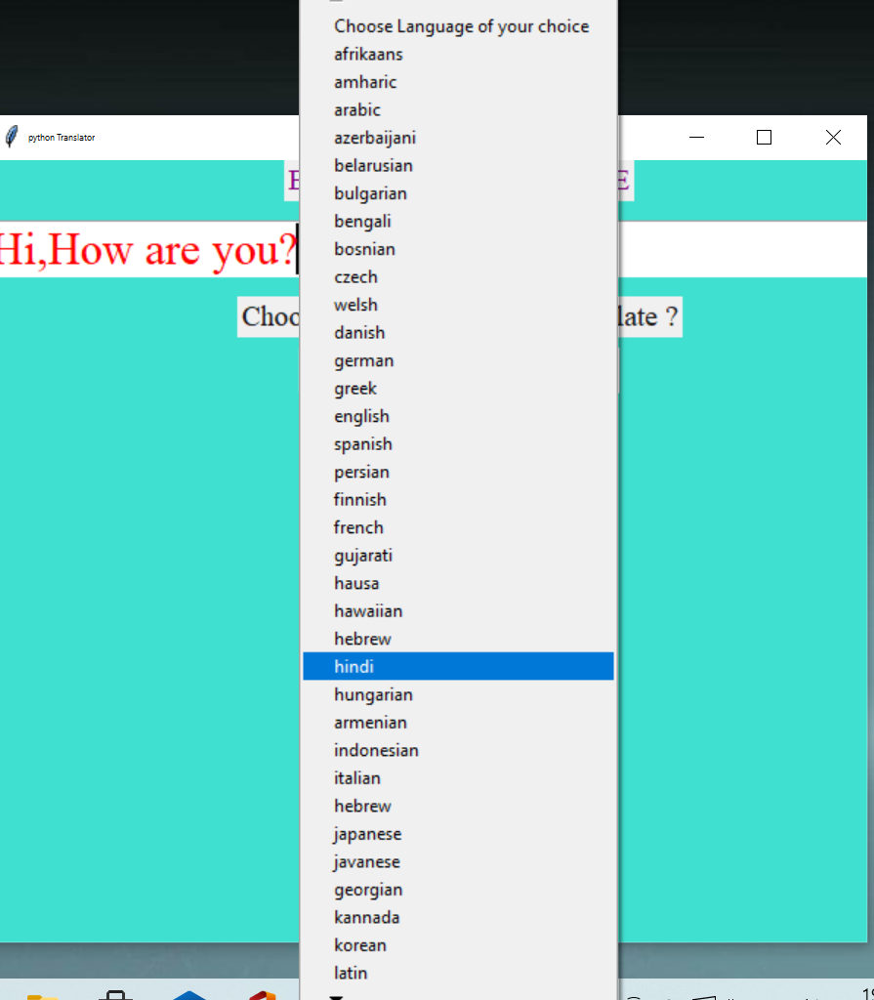
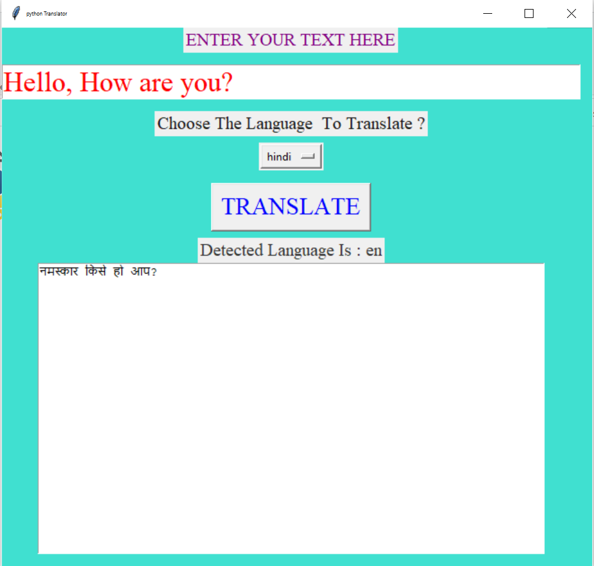

<h1>PYTHON TEXT TRANSLATOR</h1>

Its a basic text translator written in python language using gui, 
  where user can enter input of any language and get the desired output according to user's desire. 
  The gui has been created using tkinter library of python and translation of the input is done by googletrans library of python. 
  Googletrans is a free and unlimited python library that implemented Google Translate API. 
  This uses the Google Translate Ajax API to make calls to such methods as detect and translate.

  
  
<b>Install googletrans a new 'official' alpha version library using</b>
  <pre>pip install googletrans==3.1.0a0</pre>
  

  
  

  <h2>Below is the step wise workflow:</h2>
  <ul>
    <li> Enter any text that needs to be translated</li>
    <li>Choose any language that you want your text to be translated by clicking on <b>Choose Language of your choice</b></li>
    <li>Once you click on the <b>Choose Language of your choice</b> button, a set of language option menu will display where you can choose your desire language in which you wish your text to be translated</li>
    <li>After choosing the language, click on <b>TRANSLATE button</b> to see the desired translated text in below display box</li>
    <li> Along with translation, it also detects the current text language which will get displayed as <b>Detected Language Is:</b></li>
  </ul>
  
  

  

  <h2> SAMPLE DEMO SANPSHOTS OF THE TEXT TRANSLATOR</h2>
  
  
  
  

  
 
