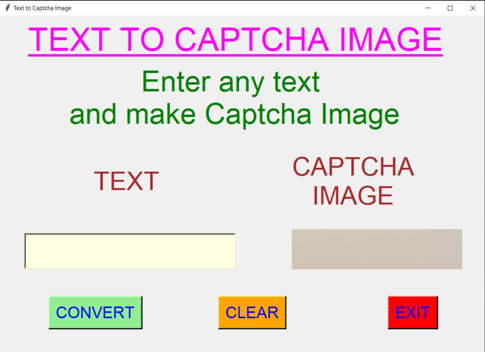
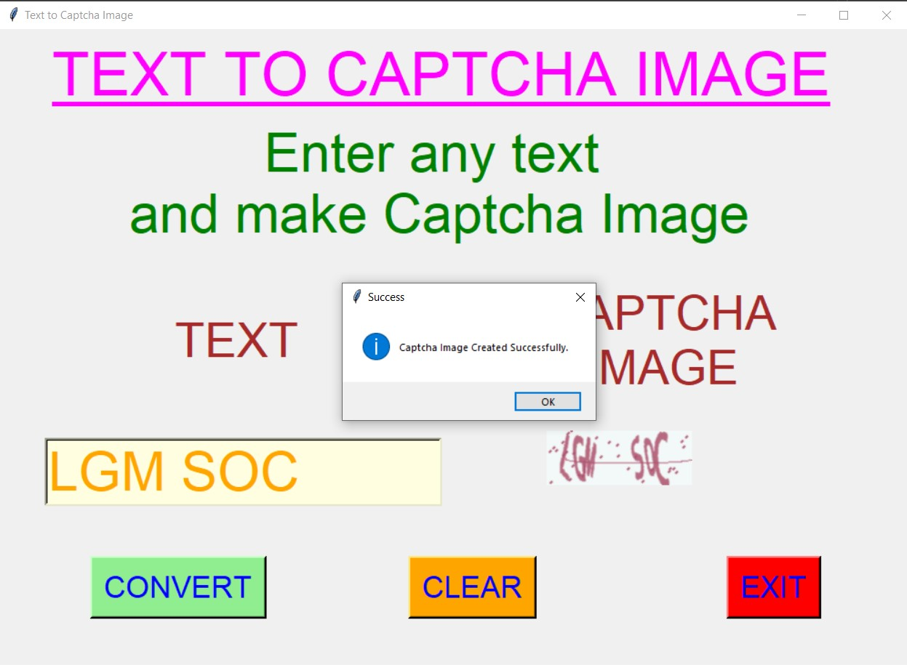
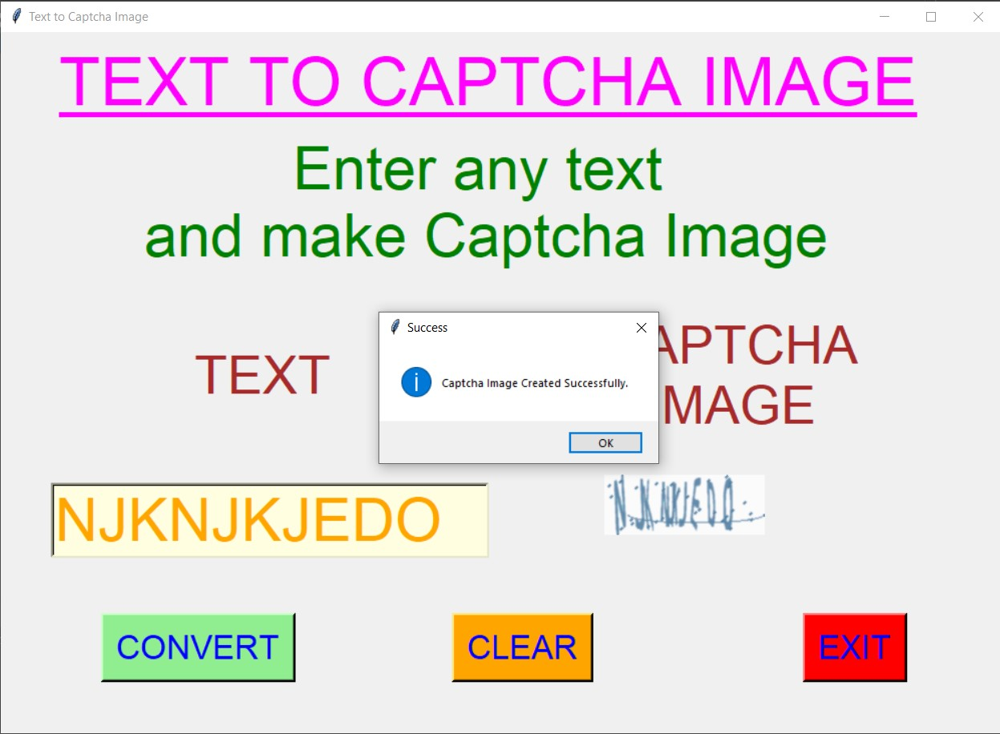
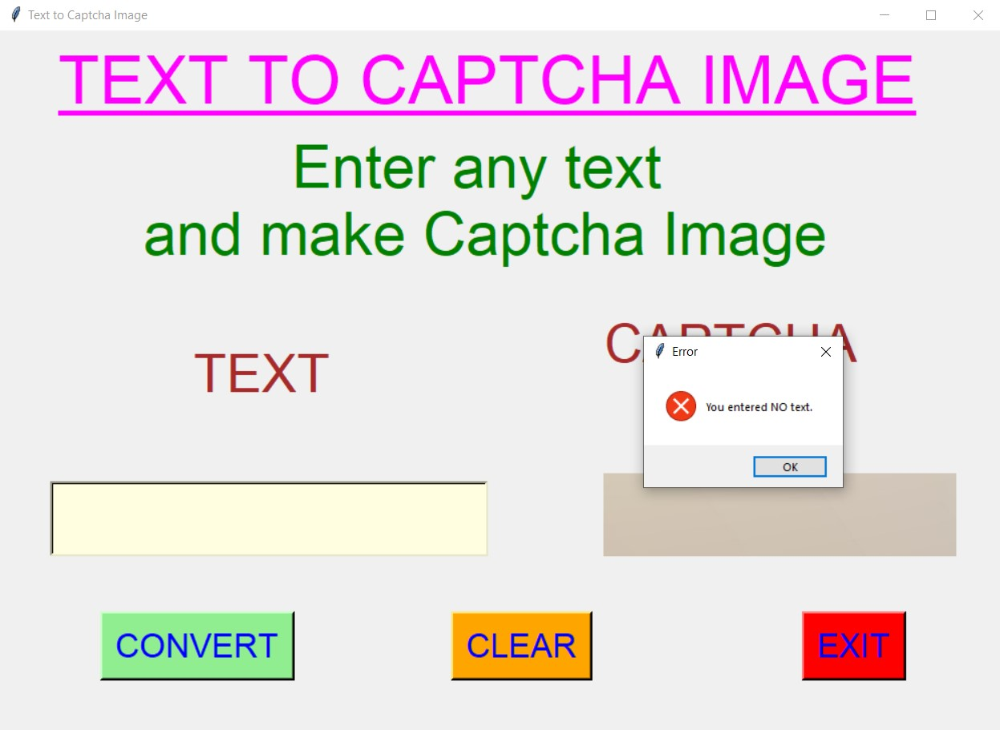
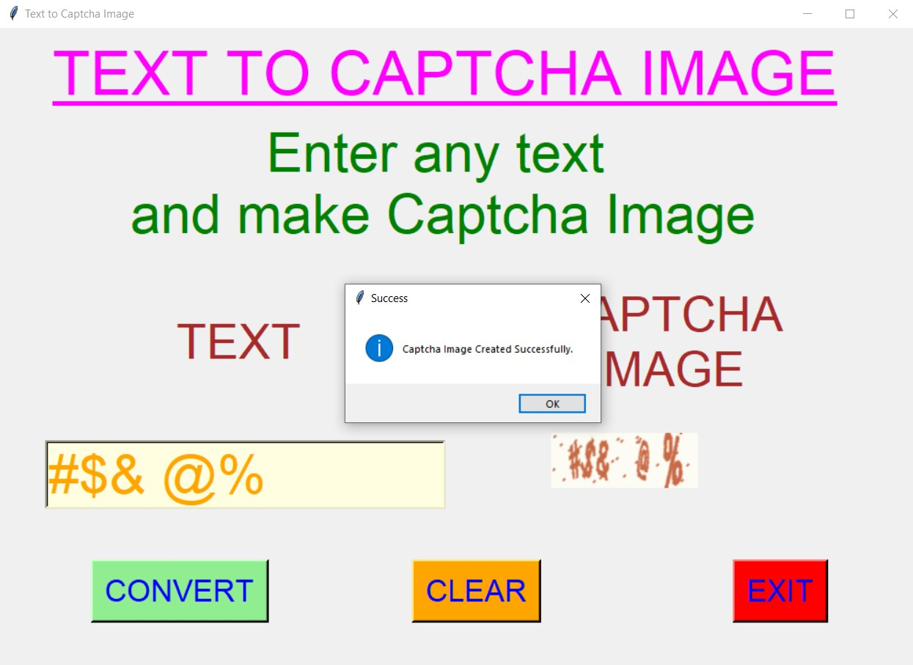
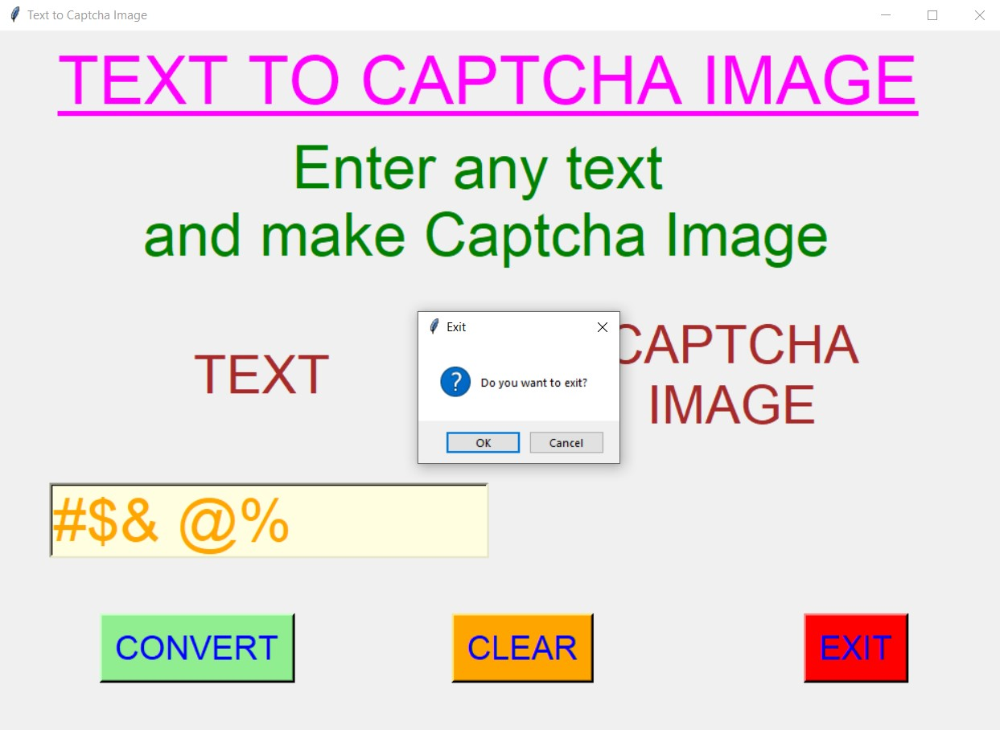

# ✔ TEXT TO CAPTCHA IMAGE
- ### A Text to Captcha Image is an image processing application created in python with tkinter gui.
- ### In this application user can select enter any text in the entry text area.
- ### And then will be able to convert that text to corresponding captcha image in different color and background.

****

# REQUIREMENTS :
- ### python 3
- ### cv2 module
- ### tkinter module
- ### messagebox
- ### from PIL import Image, ImageTk, ImageDraw
- ### from captcha.image import ImageCaptcha

****

# HOW TO Use it :
- ### User just need to download the file, and run the text_to_captcha_image.py, on local system.
- ### After running a GUI window appears, here user can see the option to enter text in the text area.
- ### After user has entered any text in the text area, when user clicks on the convert button, the corresponding captcha image with that text will be shown in the right side of window.
- ### Also for different time we get different color of captcha image.
- ### Als there is a clear button, clicking on which clears the text entered in the entry box.
- ### Also there is exit button, clicking on which we get a exit dialog box asking the permission to exit.

# Purpose :
- ### This scripts helps us to easily get the captcha image for any text and see the preview.

# Compilation Steps :
- ### Install python3, tkinter, cv2, PIL, captcha.image
- ### After that download the code file, and run text_to_captcha_image.py.py on local system.
- ### Then the script will start running and user can explore more by entering any text and converting it to the Captcha image.

****

# SCREENSHOTS :

****

   
   
   
   
   
   
   

****

# Author : 
- ### Akash Ramanand Rajak
