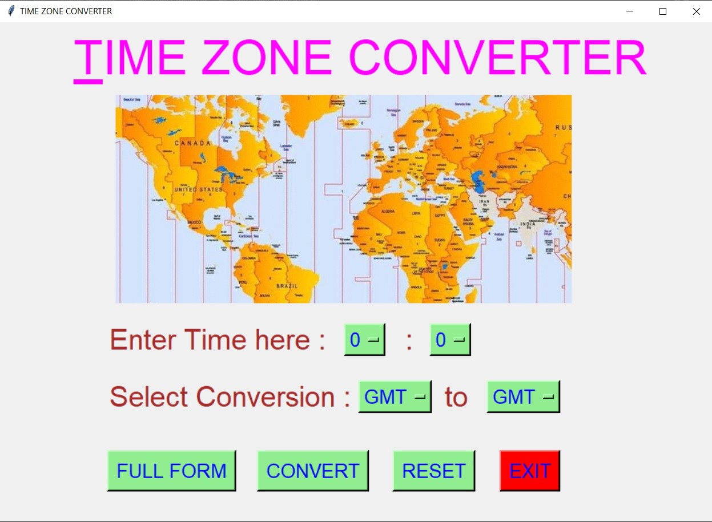
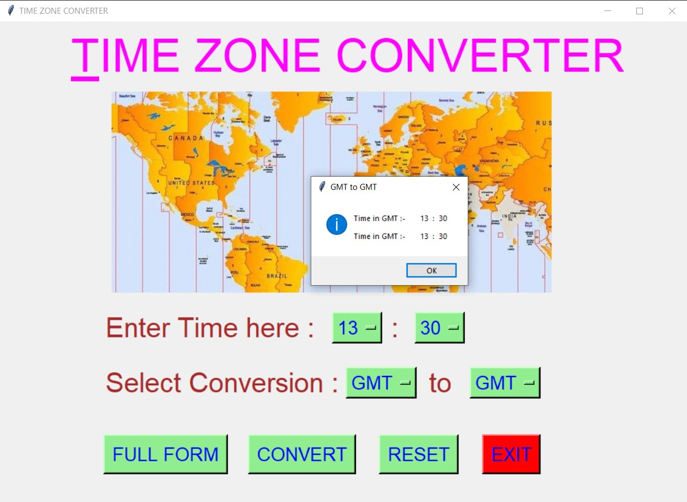
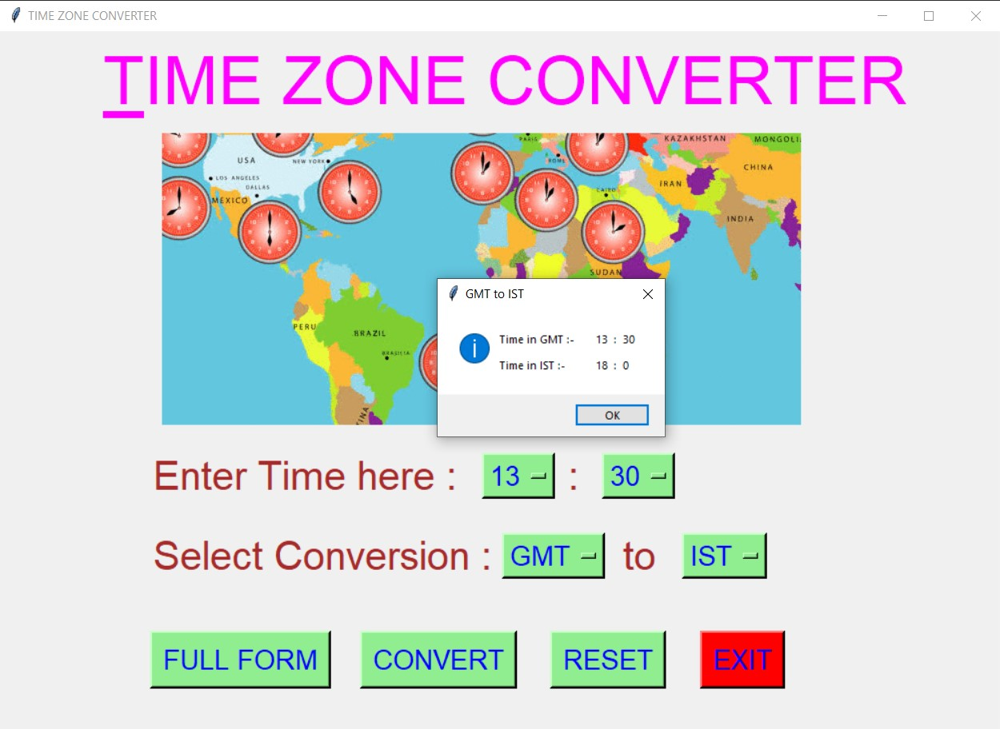
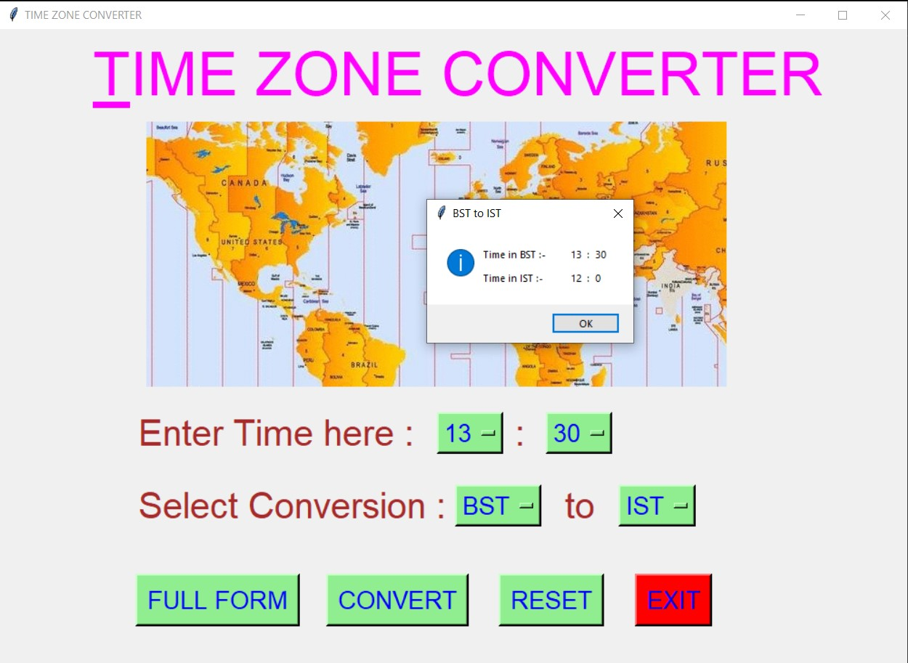
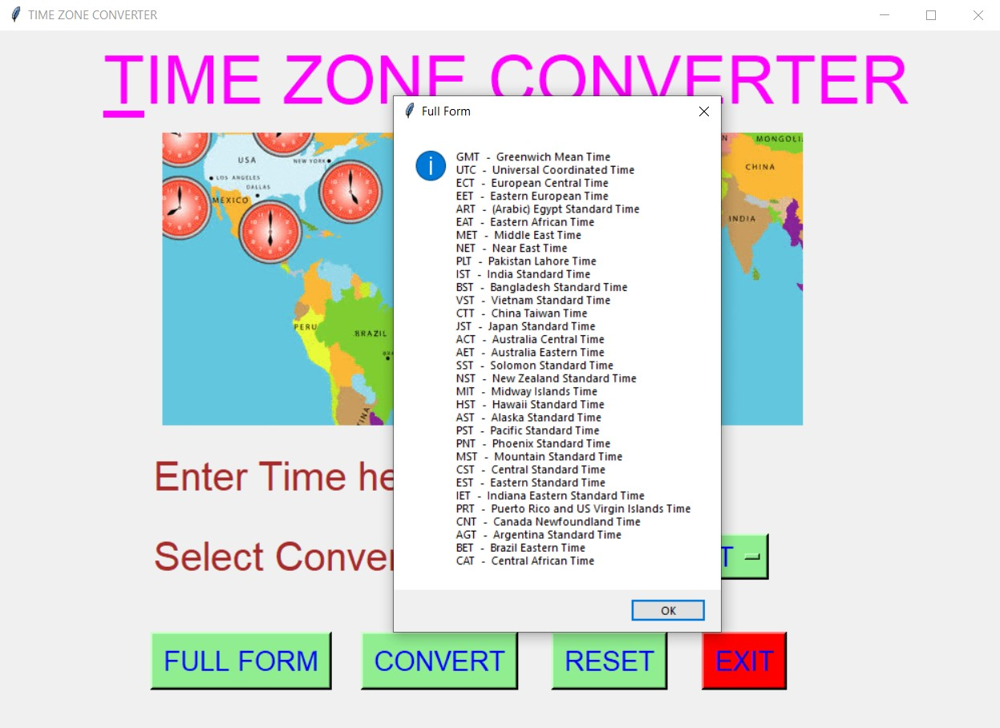
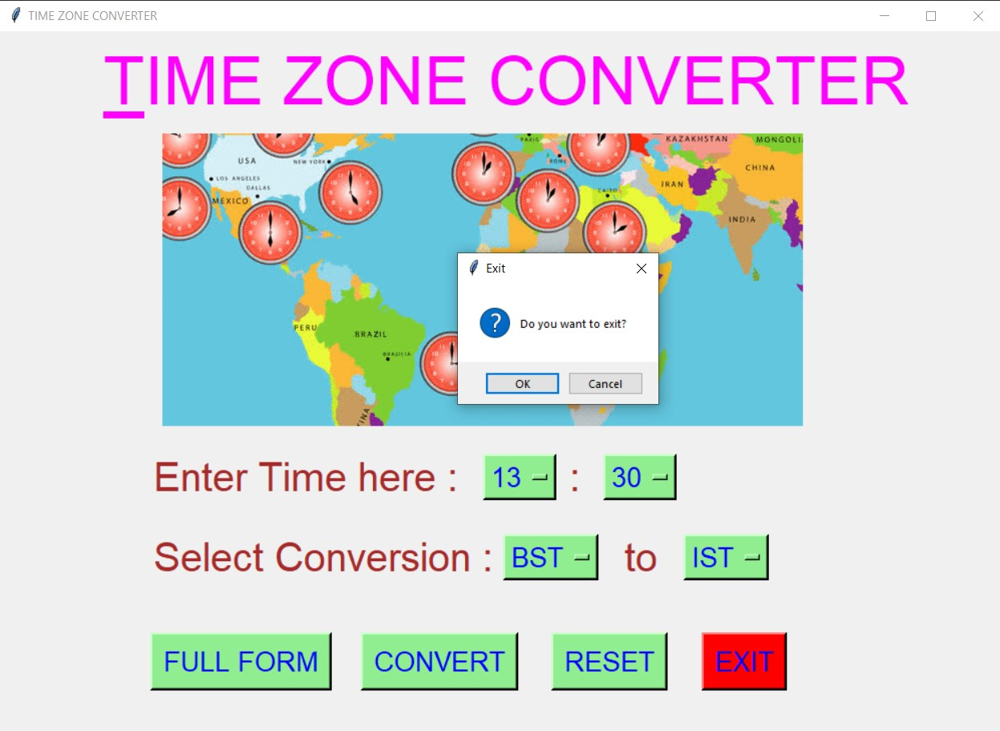

# ✔ TIME ZONE CONVERTER
- ### A Time Zone Converter application created in python with tkinter gui.
- ### In this game, the user can input any time in 24 - format, and convert between any of the 32 time zones mentioned in Option Menu.
- ### for the data for all time zones and its conversion, i have used the conversion.csv data and read from there.

****

# REQUIREMENTS :
- ### python 3
- ### tkinter module
- ### from tkinter messagebox module
- ### PIL module
- ### pandas

****

# How this Script works :
- ### User just need to download the file and run the time_zone_converter.py on their local system.
- ### Now on the main window of the application the user need to input the time in 24 - hr format, and select the two zone between which he/she needs to convert.
- ### After that, when user click on convert button, he will get the messagebox showing the time in both the format that user has selected.
- ### Also there is a full form button, clicking on which player can see the full form of each time zone.
- ### Also there is a reset button, clicking on which user can resets the Option Menu to default character ot integer.
- ### Also there is an exit button, clicking on which exit dialog box appears asking for the permission of the user for closing the window.

****

# SCREENSHOTS :

****

   
   
   
   
   
   

****

# Below is the video links of how appliation works :
https://user-images.githubusercontent.com/57003737/122768341-223ee380-d2c1-11eb-86b6-b60ec4fa52b5.mp4