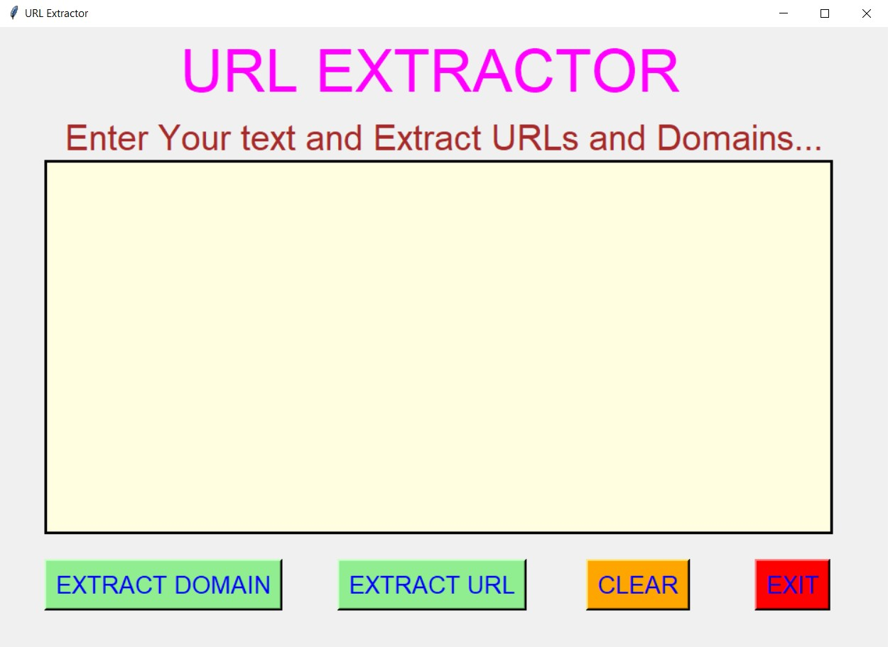
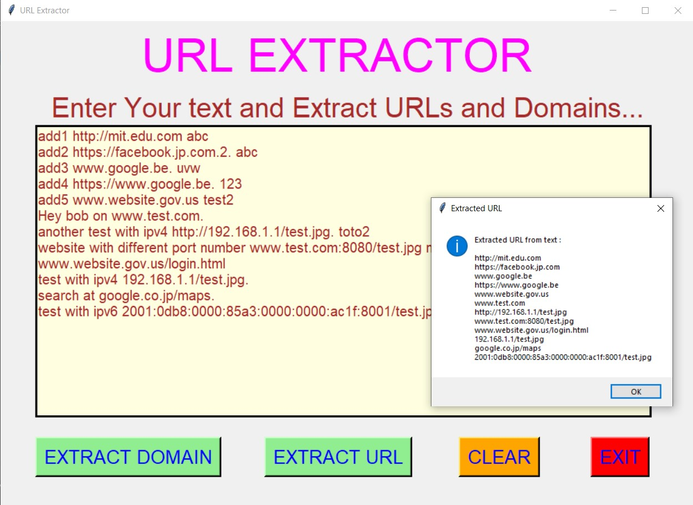
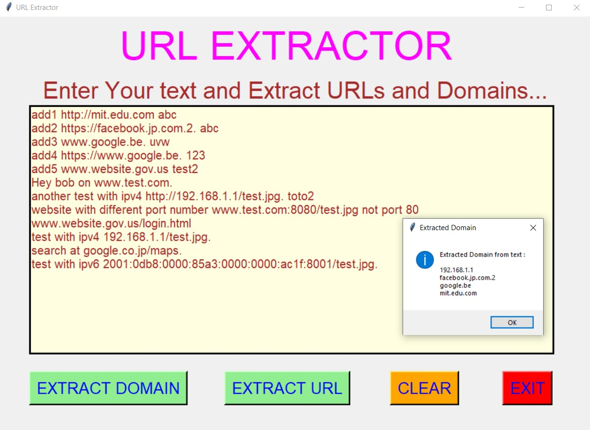
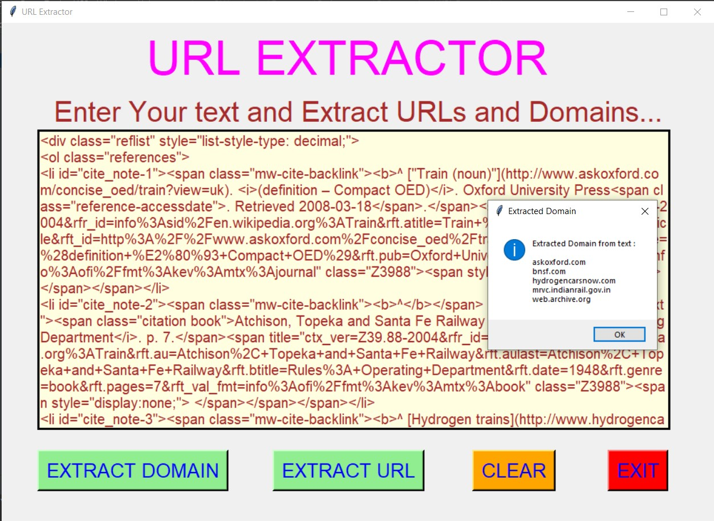
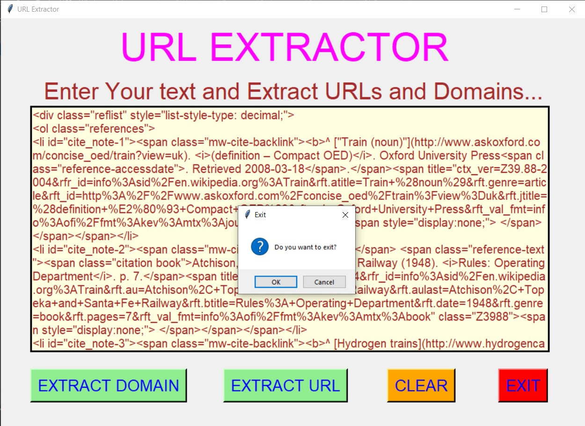

# ✔ URL EXTRACTOR
- #### A "URL Extractor" is an application created in python with tkinter gui.
- #### In this application, user will be allowed to first enter any text or paragraph in the given text area.
- #### After entering the text, user can extract all the urls and domains present in the entered text.
- #### And for implementing this, used the re and intertools library of python.

****

# REQUIREMENTS :
- #### python 3
- #### tkinter module
- #### from tkinter messagebox module
- #### re
- #### from itertools import chain

****

# How this Script works :
- #### User just need to download the file and run the url_extractor.py on their local system.
- #### Now on the main window of the application the user will be allowed to first enter any text or paragraph in the given text area.
- #### After entering the text, when user clicks on the EXTRACT URL button, user will be able to see all the URLs present in the text.
- #### In the same way user can also extract all the domains present in the text.
- #### Also there is a clear button, clicking on which user can clears the text or paragraph entered in the given text area.
- #### Also there is an exit button, clicking on which exit dialog box appears asking for the permission of the user for closing the window.

# Purpose :
- ### This scripts helps us to easily extract URLs and Domains from any text or paragraph.

# Compilation Steps :
- ### Install tkinter, re, intertools
- ### After that download the code file, and run url_extractor.py on local system.
- ### Then the script will start running and user can explore it by entering text and extracting URLs and Domains from it.

****

# SCREENSHOTS :

****

   
   
   
   
   
   

****

# Author :
- ### Akash Ramanand Rajak
