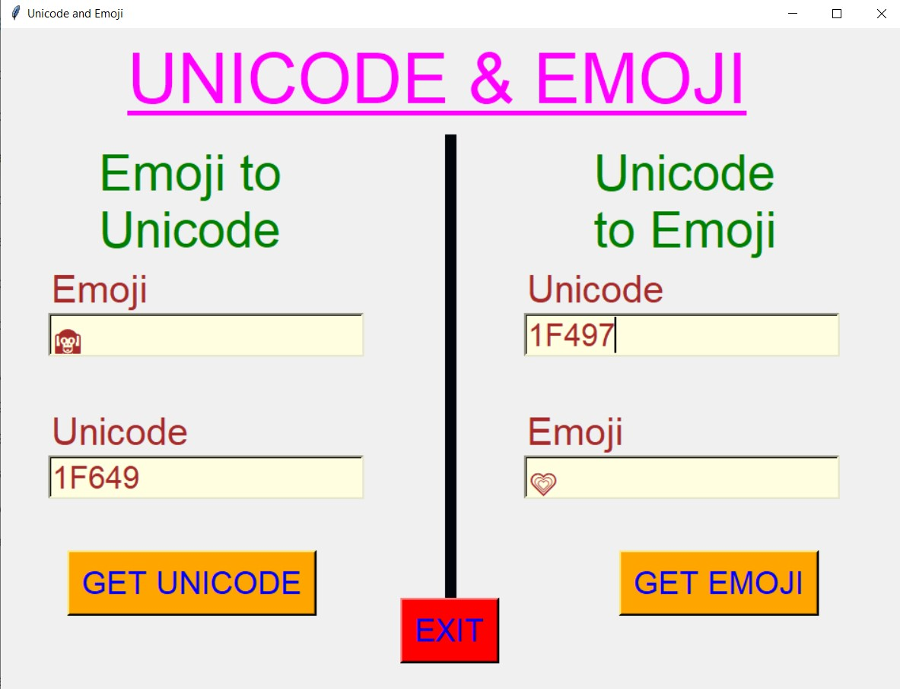
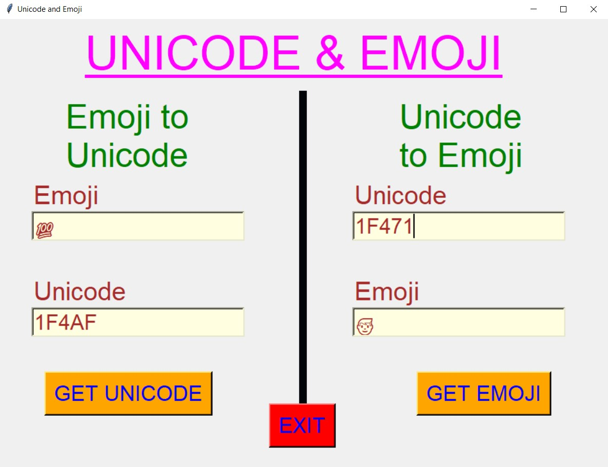
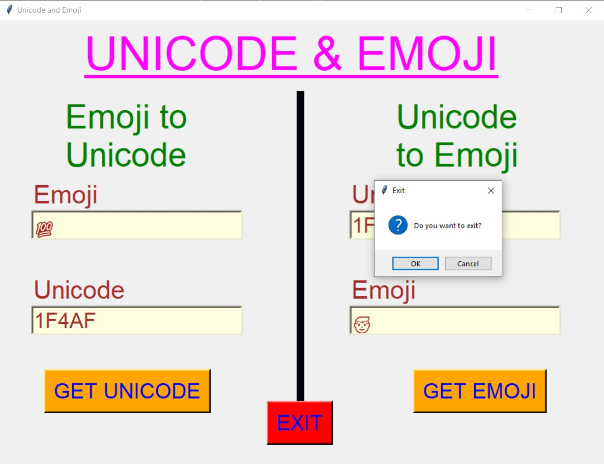

# ✔ UNICODE AND EMOJI
- ### An Unicode and Emoji created in python with tkinter gui.
- ### Using this user will be convert any emoji to its unicode code and also unicode code to its corresponding emoji.
- ### for implementing this user emoji library in python.

****

# REQUIREMENTS :
- ### python 3
- ### tkinter module
- ### from PIL import Image, ImageTk
- ### import tkinter.messagebox as mbox
- ### pandas
- ### emoji

****

# HOW TO Use it :
- ### User just need to download the file, and run the unicode_and_emoji.py, on local system.
- ### After running a GUI window appears, here user can see buttons like START and EXIT.
- ### When user clicks on the start button, the main application will open, and user can see the option to convert from unicode to emoji and emoji to unicode.
- ### Here user just need to enter the unicode of any emoji, and can get that emoji using GET EMOJI, nd vice versa.
- ### Also there is exit button, clicking on which we get a exit dialog box asking the permission to exit.

# Purpose :
- ### This scripts helps user to easily convert between unicode to emoji and emoji to unicode.

# Compilation Steps :
- ### Install tkinter, PIL, pandas, emoji
- ### After that download the code file, and run unicode_and_emoji.py on local system.
- ### Then the script will start running and user can explore it by converting between unicode to emoji and emoji to unicode.

****

# SCREENSHOTS :

****

   
   
   
   
   
   

****

# Author : 
- ### Akash Ramanand Rajak
