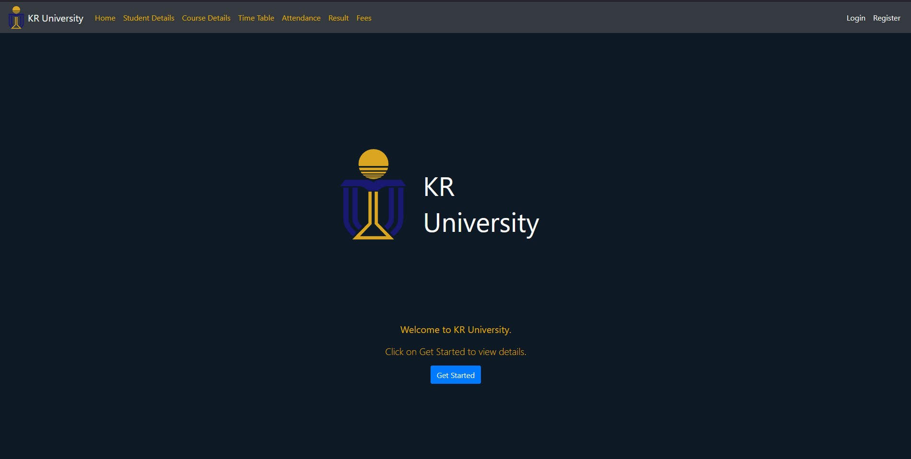
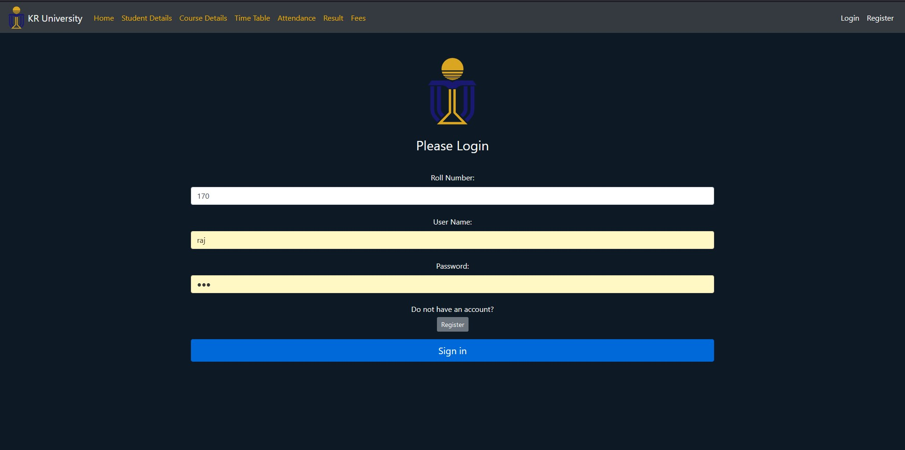
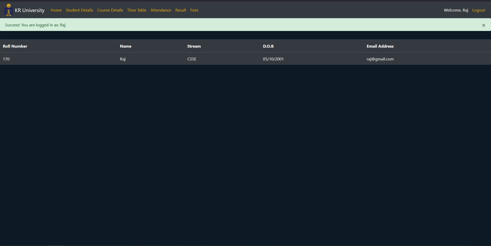
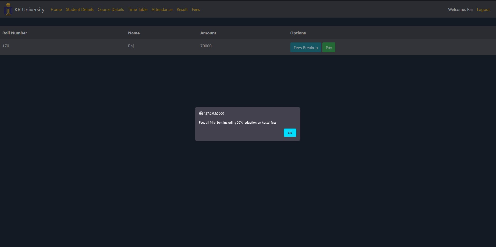
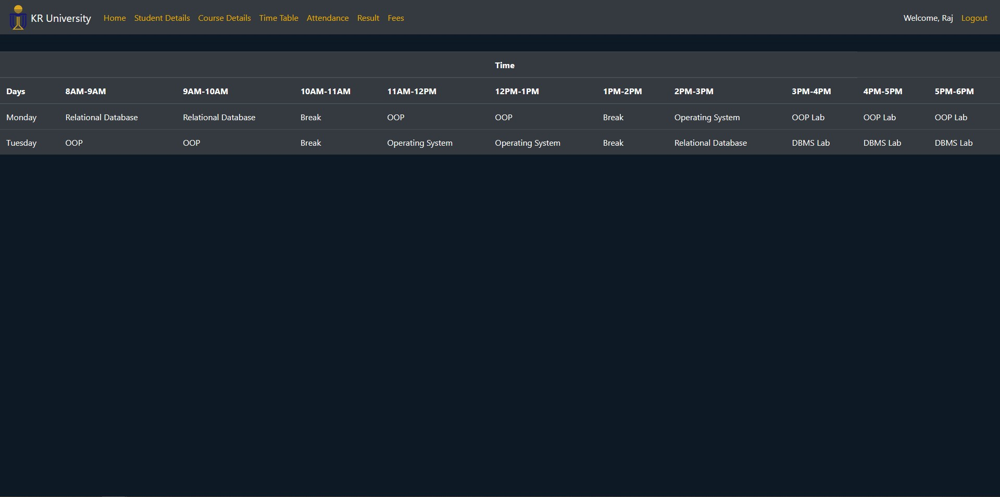
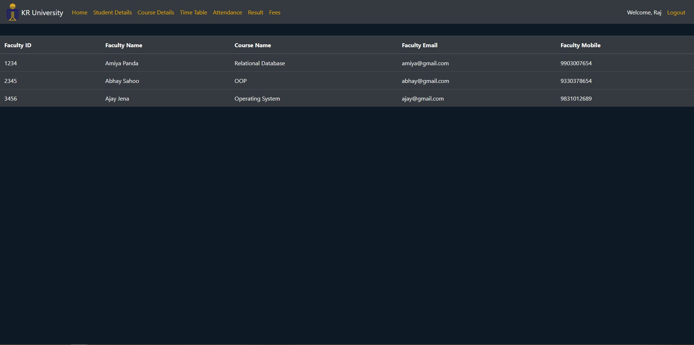

# Package/Script Name: University Website
# AIM: To make a full stack website for students of a university to access their details.
# Purpose: For students to access their details comfortably while in their homes.
## Short description of package/script

- A full stack website for students to access their details
- It is implemented using Flask and SqlAlchemy

## Setup instructions/ Compilation Process

- Need to install both SqlAlchemy and Flask through the terminal
- Then use set FLASK_APP=application
- flask run

## Detailed explanation of script, if needed
- The script is divided into many parts
- First is the market application
	- It contains the database tables and renders the html templates
- Second is the routes
	- It contains the routes to the different webpages and creates teh different users
- Third is the forms
	- It contains registration and login forms  
- Fourth are the various html files like base, home page, login, details, register, attendance, courses, time table and fees 
		- The base file contains the base proforma of the website, which the rest of the webpages extends
		- The home file is used for designing the home page
		- The login file is used for designing the login page
		- The register file is used for designing the register page
		- The details file is used for showing the details of the student
		- The attendance file is used for showing the attendance of the student
		- The course file is used for showing the courses of the student
		- The time table is used for showing the courses of the student
		- The fees is used for showing the fees of the student

## Output

## Author(s)

Kumarjeet Ray

## Disclaimers, if any

N/A
