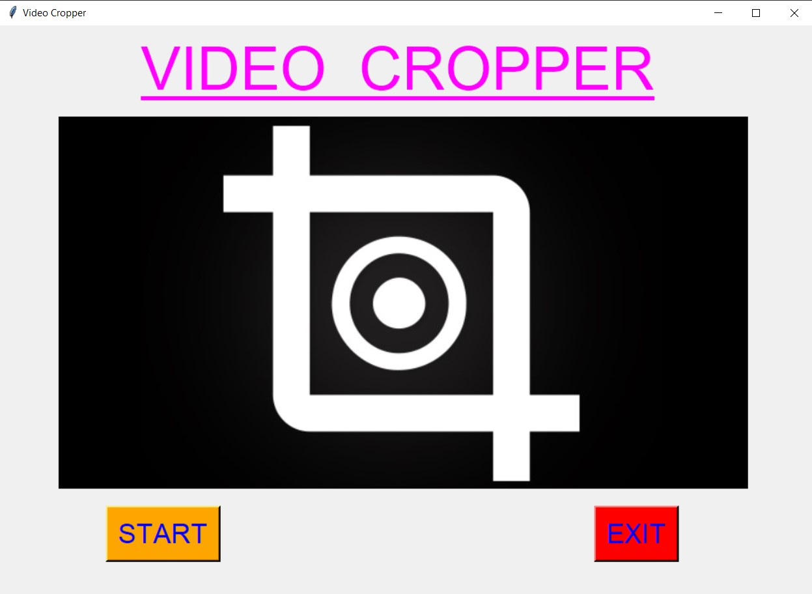
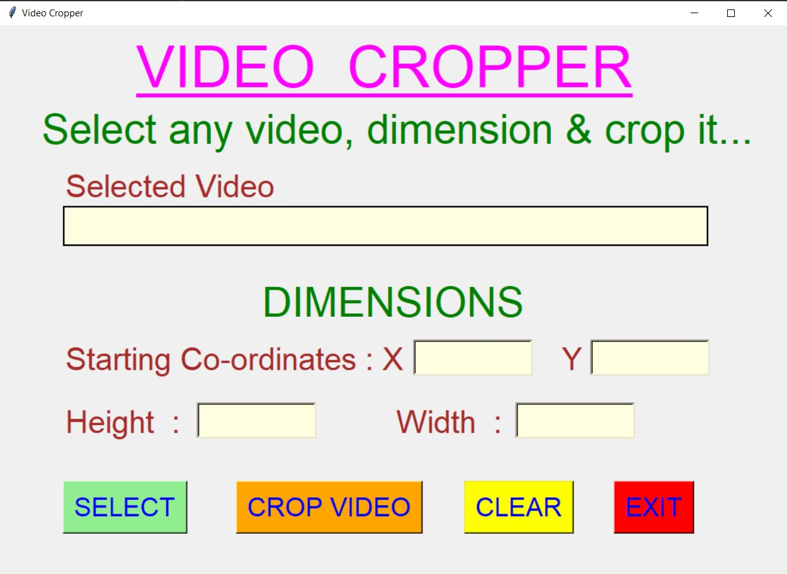
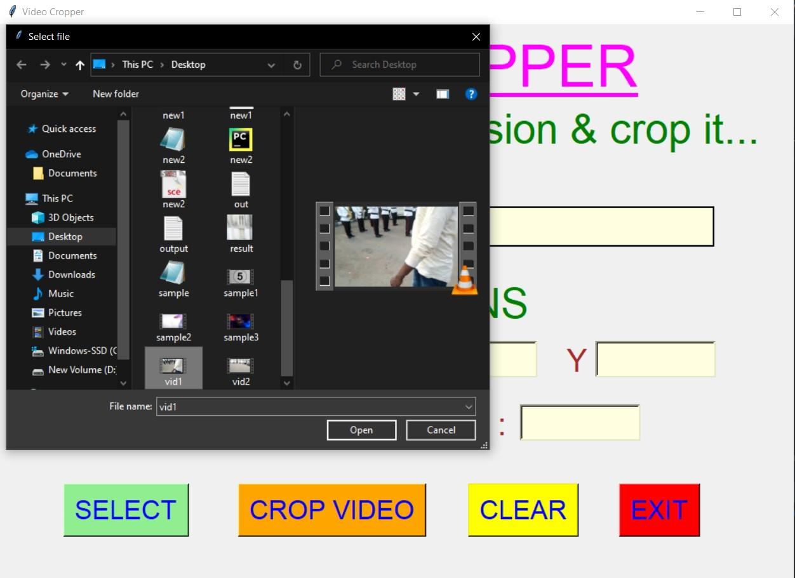
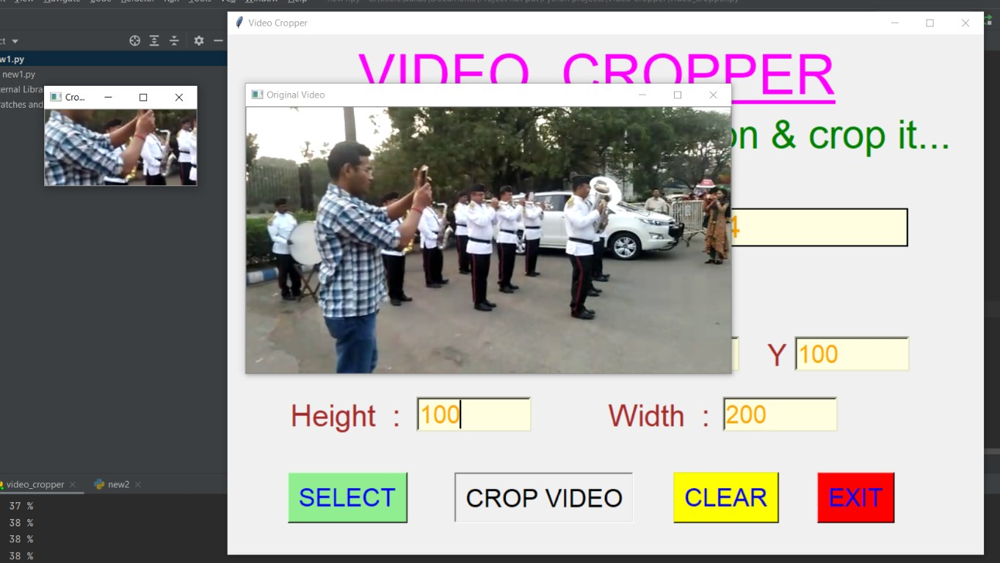
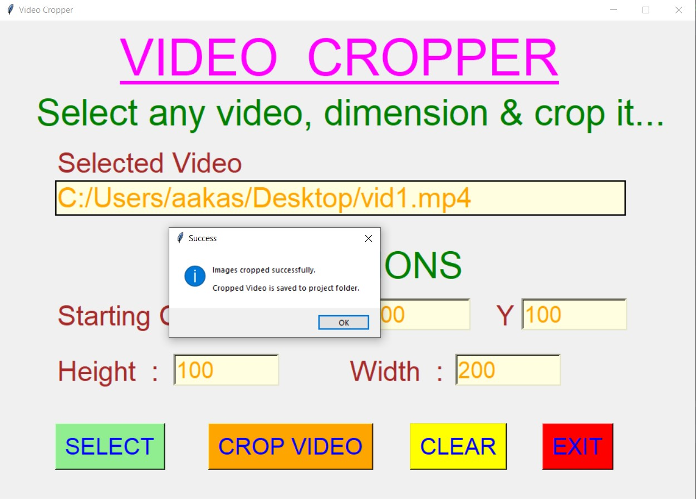
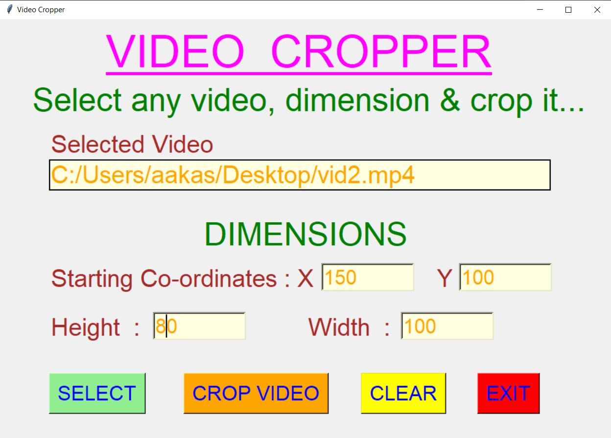
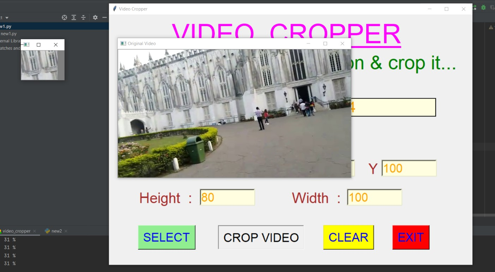
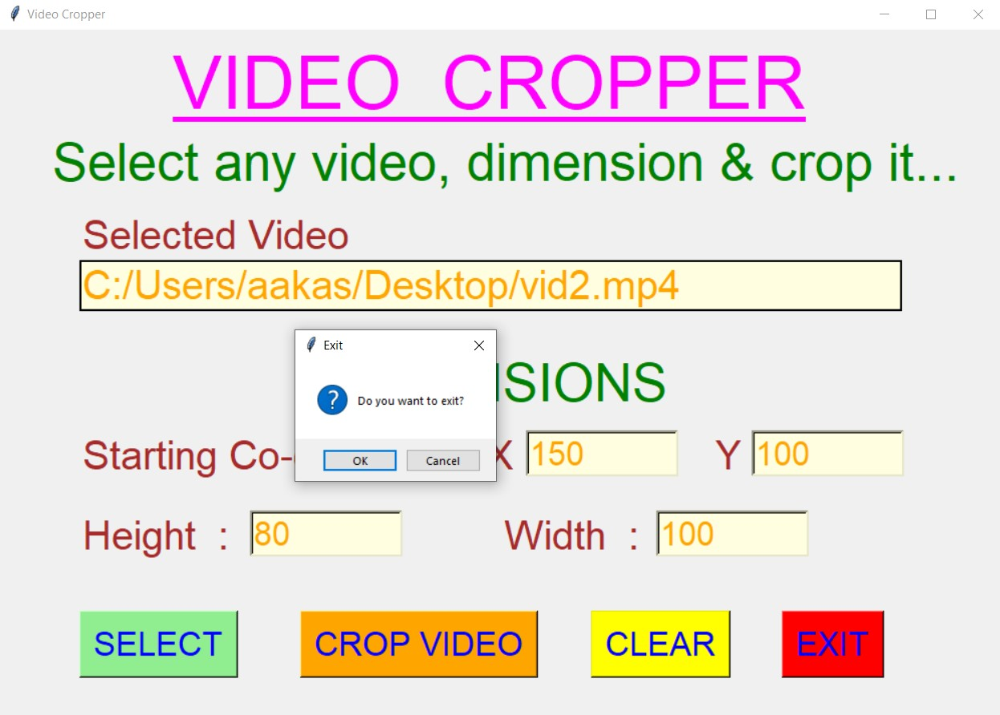

# ✔ VIDEO CROPPER
- ### An Video Cropper is an application created in python with tkinter gui and OpenCv library.
- ### In this application user can select any videos (either mpy, mkv, avi, or any other extension of video) and can crop it by entering the required dimension.
- ### User will be able to crop the video according to his/her choice of height and width.
- ### User will also be able to see the preview of both the original video and the cropped video while cropping process is going on.
- ### After completion of cropping, the cropped video will be saved automatically to the Project folder with name "cropped_video.mp4".

****

# REQUIREMENTS :
- ### python 3
- ### tkinter module
- ### filedialog from tkinter
- ### messagebox
- ### from PIL import Image, ImageTk
- ### import cv2
- ### import numpy

****

# HOW TO Use it :
- ### User just need to download the file, and run the video_cropper.py, on local system.
- ### After running a GUI window appears, where user can start the video cropper by clicking on the START button.
- ### After that a new GUI window will open, in which user will have buttons like SELECT, CROP VIDEO, CLEAR and EXIT.
- ### User can select any video file (either mpy, mkv, avi, or any other extension of video) from the local system, using SELECT button.
- ### After user has selected video, user will be able to see the path of the video selected in the text area.
- ### After that user will also need to enter the dimesions of cropped video like Starting X,Y co-ordinates, height and width.
- ### After this, when user clicks on the CROP VIDEO button, the cropping process will start and user will be previewed both the cropped video and the original video.
- ### After the cropping process get completed, user will get a success message, and the cropped video will be saved automatically to the project folder with name "cropped_video.mp4".
- ### Also there is a CLEAR button, clicking on which user can clear the dimension entry that user has entered previously.
- ### Also there is an EXIT button clicking opn which user can exit from the application.

# Purpose :
- ### This scripts helps user to easily to crop the any video according to user's dimension choice.

# Compilation Steps :
- ### Install tkinter, PIL, cv2, numpy
- ### After that download the code file, and run video_cropper.py on local system.
- ### Then the script will start running and user can explore selecting any video and cropping that video by entering the dimension of his/her choice.

****

# SCREENSHOTS :
****

   
   
   
   
   
   
   
   
   

****

# Name : 
- ### Akash Ramanand Rajak
