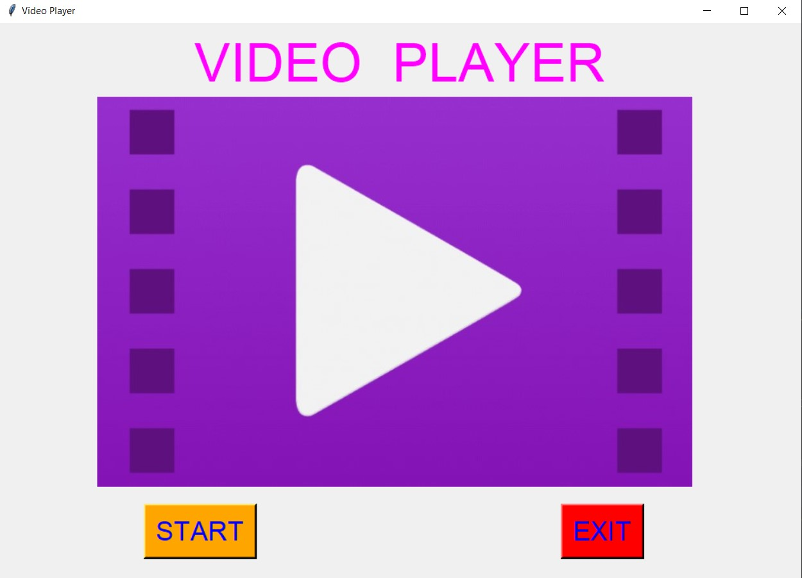
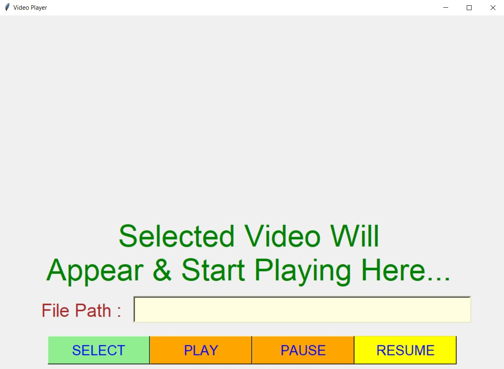
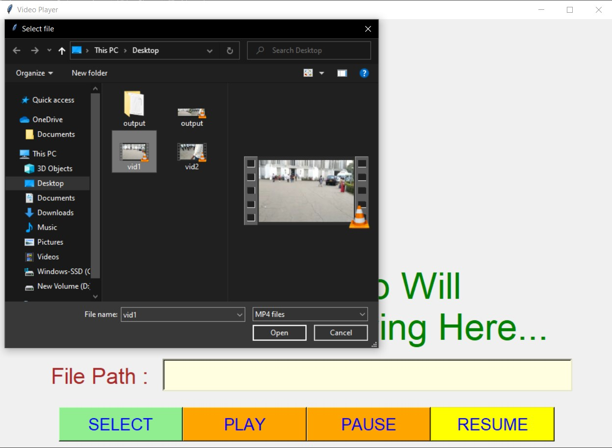
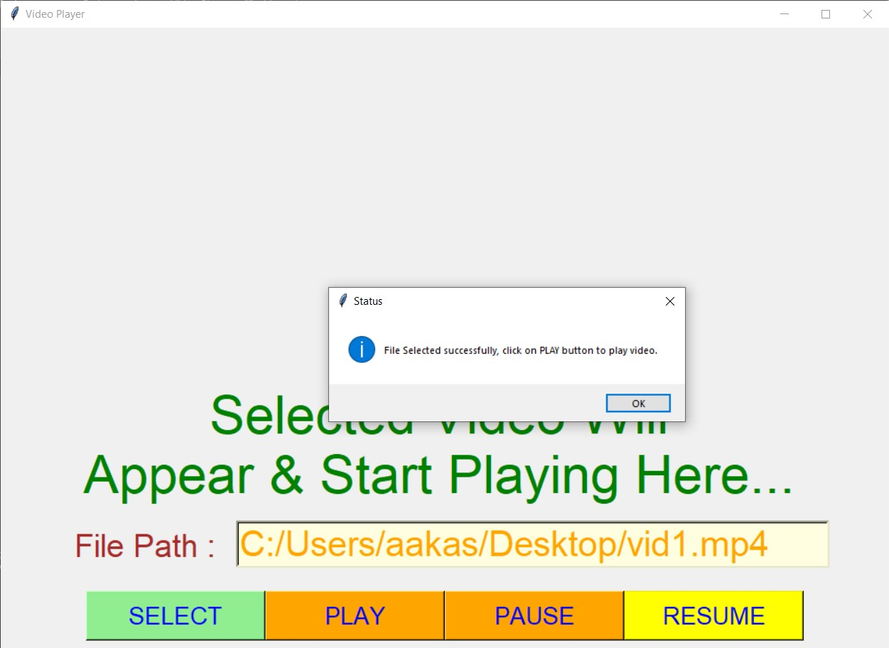
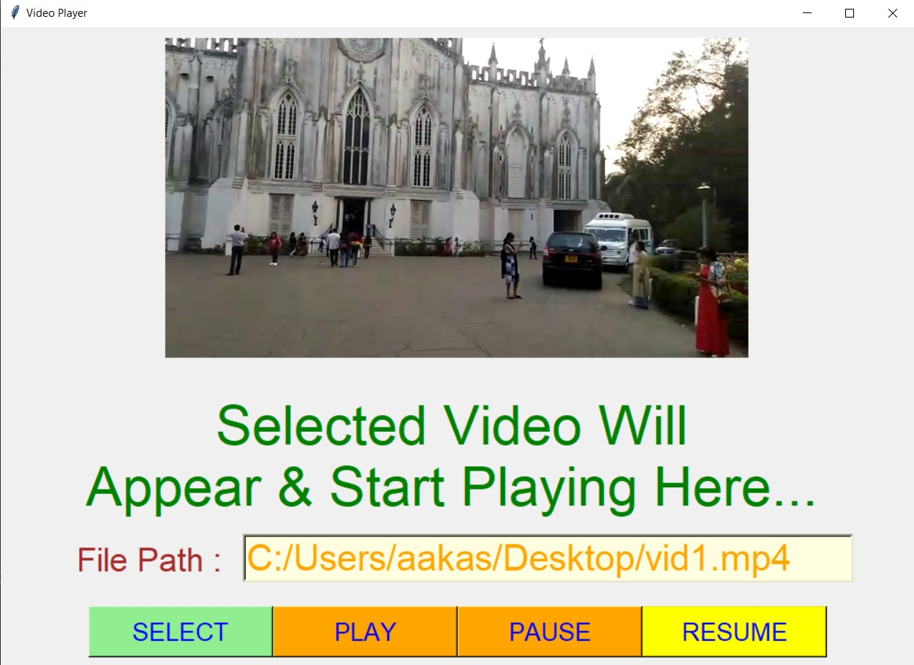
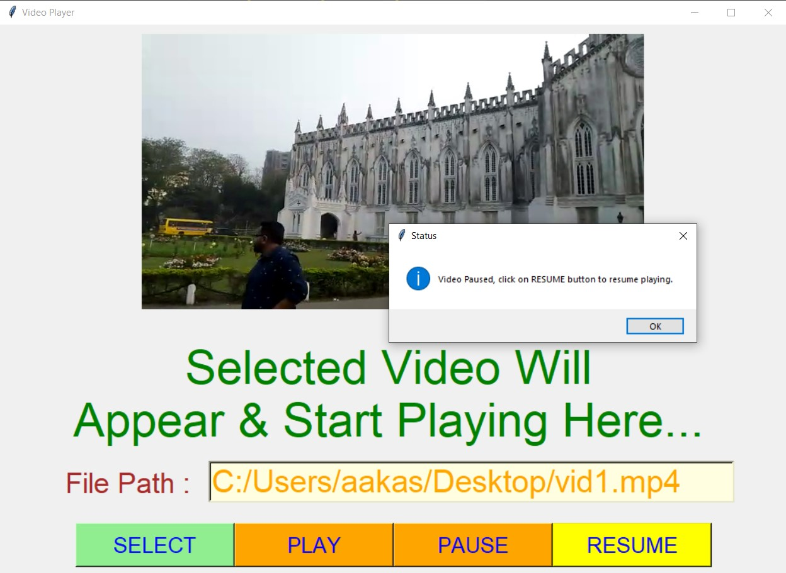
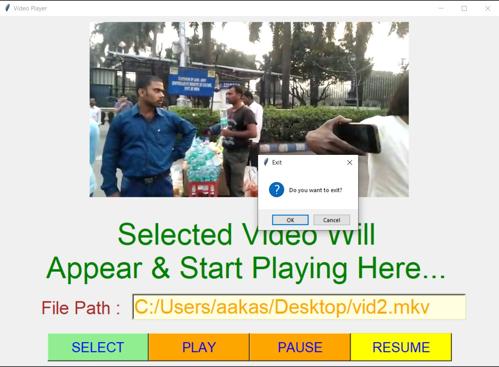

# ✔ VIDEO PLAYER
- #### An Video Player is an application created in python with tkinter gui and OpenCv library.
- #### In this application user can select any video (mp4, mkv, wmv, or any other format) and can play that video.
- #### Along with that user will also get option to pause the video and also can resume the video from where paused.
- #### For implementing this used OpenCv library.

****

# REQUIREMENTS :
- #### python 3
- #### cv2 module
- #### tkinter module
- #### filedialog from tkinter
- #### messagebox
- #### from PIL import Image, ImageTk

****

# HOW TO Use it :
- #### User just need to download the file, and run the video_player.py, on local system.
- #### After running a GUI window appears, where user can start the video player by clicking on the START button.
- #### After that a new GUI window will open, in which user will have buttons like SELECT, PLAY, PAUSE, RESUME.
- #### User can select any video file from the local system, using SELECT button.
- #### After that when user clicks on the PLAY button, user will be able to see the playing video on the screen of the GUI window.
- #### User can also pause the video using PAUSE button and again resume video from that point using RESUME button.

# Purpose :
- #### This scripts helps us to easily play any kind of video from the local system, with operation like play, pause and resume.

# Compilation Steps :
- #### Install tkinter, PIL, cv2
- #### After that download the code file, and run video_player.py on local system.
- #### Then the script will start running and user can explore selecting any video and start playing along with pausing and resuming.

****

# SCREENSHOTS :
****

   
   
   
   
   
   
   
   

****

# Sample Video :

   

# Name : 
- ### Akash Ramanand Rajak
