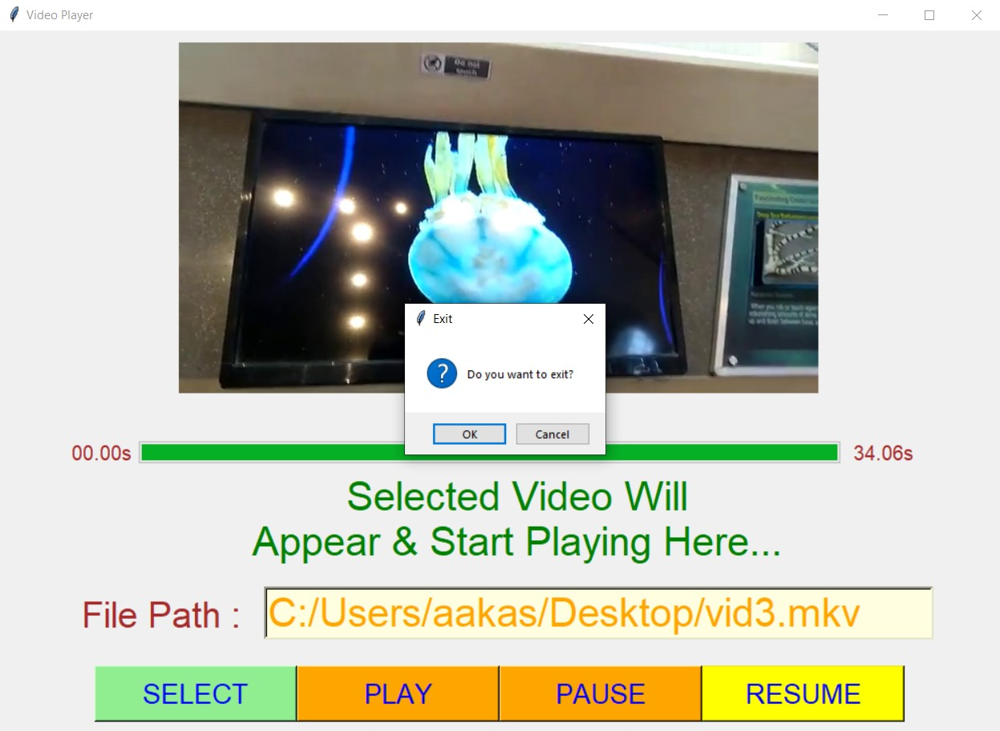

# ✔ VIDEO PLAYER
- ### An Video Player is an application created in python with tkinter gui and OpenCv library.
- ### In this application user can select any video (mp4, mkv, wmv, or any other format) and can play that video.
- ### Along with that user will also get option to pause the video and also can resume the video from where paused.
- ### For implementing this used OpenCv library.
- ### Here user can also see the progress of the video in the progress bar just below the video.

****

# Changes Done :
- ### Added progress par, where the progress of video will be shown, just below the video, when video playing starts.
- ### Also user will be able see the duration of video in seconds just right to the progress bar.

****

# SCREENSHOTS :

****

   
   
   
   
   
   
   
   
   

****

# Author : 
- ### Akash Ramanand Rajak

