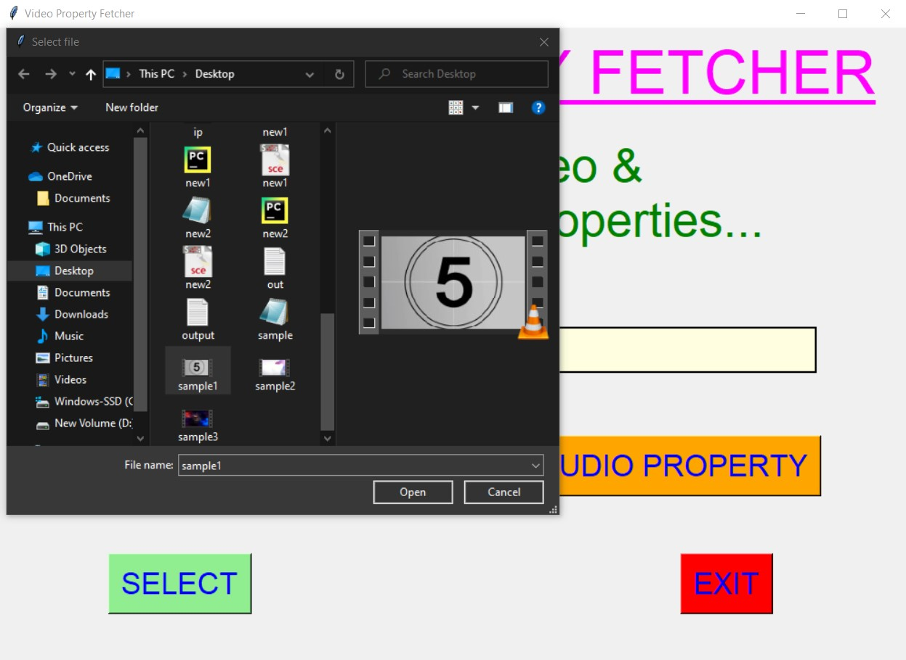
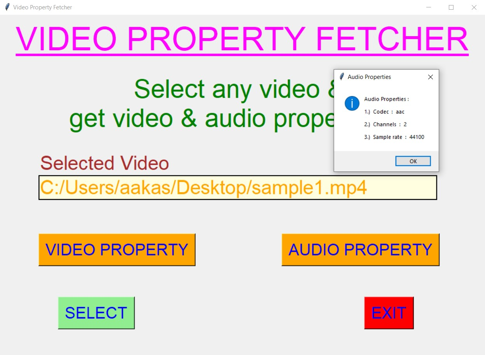
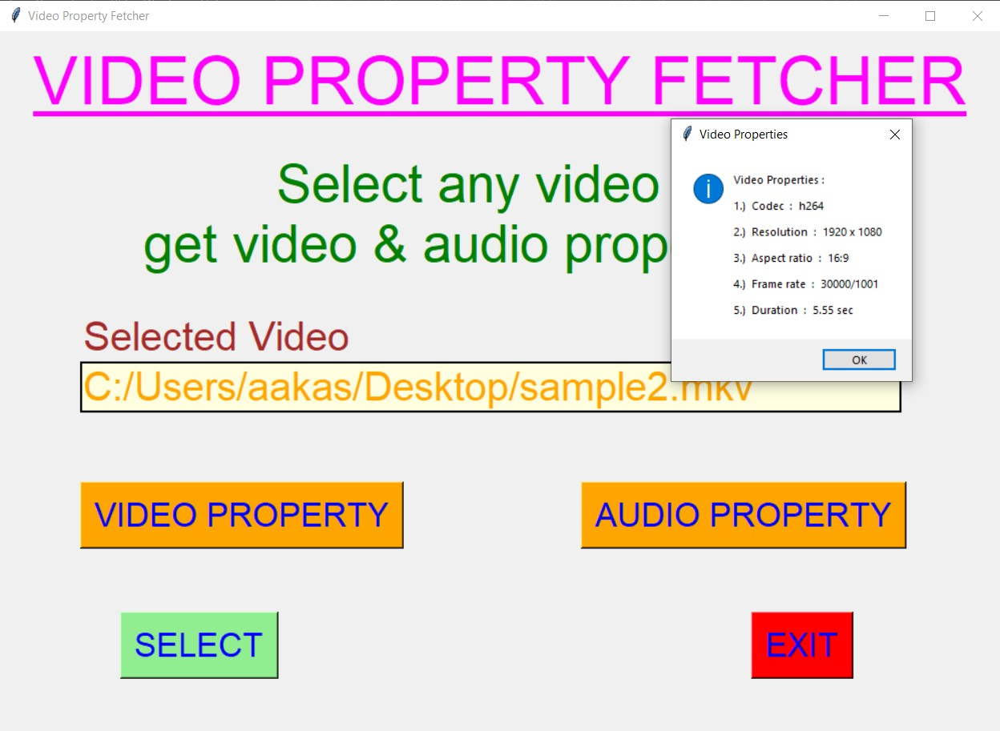
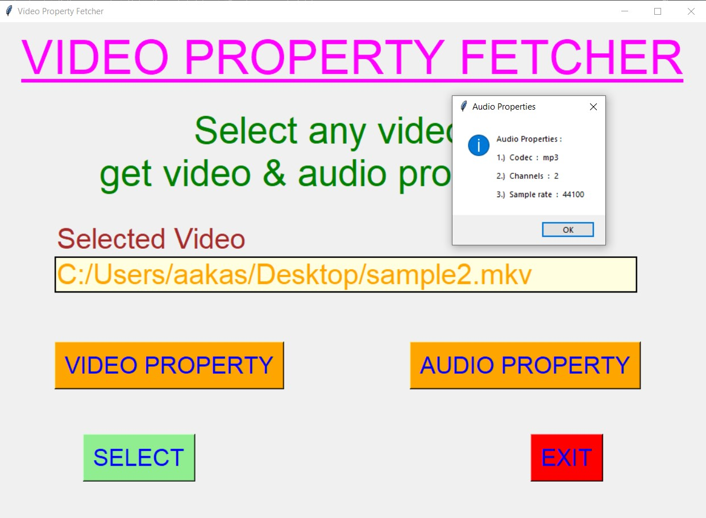
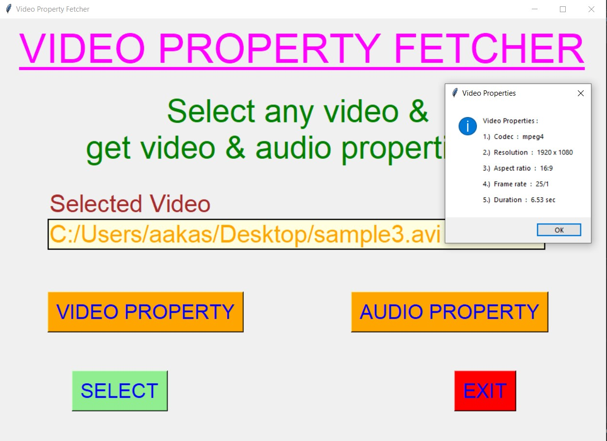
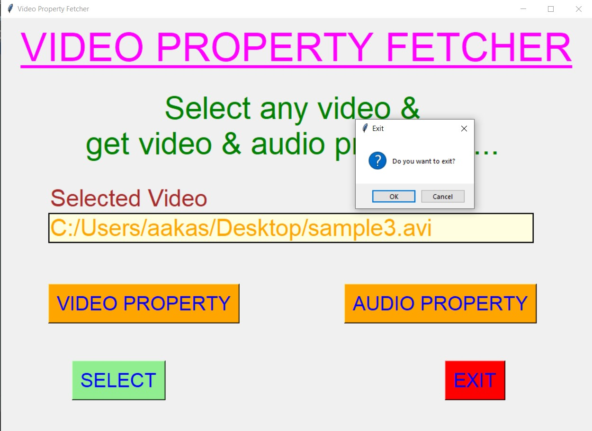

# ✔ VIDEO PROPERTY FETCHER
- ### An Video Property Fetcher is an application created in python with tkinter gui.
- ### In this application user can select any videos (either mpy, mkv, avi, or any other extension of video) and can get the video and audio properties that selected video.
- ### Video properties will be in terms of Codec, Resolution, Aspect ratio, Frame rate and Duration of Video.
- ### And Audio property will be in terms of Codec, Channels and Sample Rate.

****

# REQUIREMENTS :
- ### python 3
- ### tkinter module
- ### filedialog from tkinter
- ### messagebox
- ### from PIL import Image, ImageTk
- ### from videoprops import get_video_properties
- ### from videoprops import get_audio_properties
- ### from moviepy.editor import VideoFileClip

****

# HOW TO Use it :
- ### User just need to download the file, and run the video_property_fetcher.py, on local system.
- ### After running a GUI window appears, where user can start the video and audio property fetching by clicking on the START button.
- ### After that a new GUI window will open, in which user will have buttons like SELECT, VIDEO PROPERTY, AUDIO PROPERTY and EXIT.
- ### User can select any video file (either mpy, mkv, avi, or any other extension of video) from the local system, using SELECT button.
- ### After user has selected video, when user clicks on the VIDEO PROPERTY and AUDIO PROPERTY, he/she will be able to see the video properties and audio prperties respectively in pop-up message box.
- ### Video properties will be in terms of Codec, Resolution, Aspect ratio, Frame rate and Duration of Video.
- ### And Audio property will be in terms of Codec, Channels and Sample Rate.
- ### Also there is an EXIT button clicking opn which user can exit from the application.

# Purpose :
- ### This scripts helps user to easily get the video and audio properties of any video from local system.

# Compilation Steps :
- ### Install tkinter, PIL, get-video-properties, get-audio-properties, VideoFileClip
- ### After that download the code file, and run video_property_fetcher.py on local system.
- ### Then the script will start running and user can explore selecting any video and getting video and audio property of that video.

****

# SCREENSHOTS :
****

   
   
   
   
   
   
   
   
   
   

****

# Name : 
- ### Akash Ramanand Rajak
