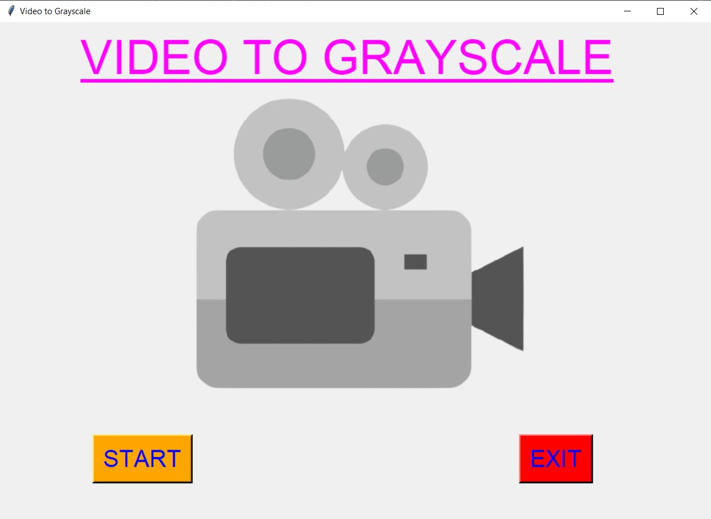
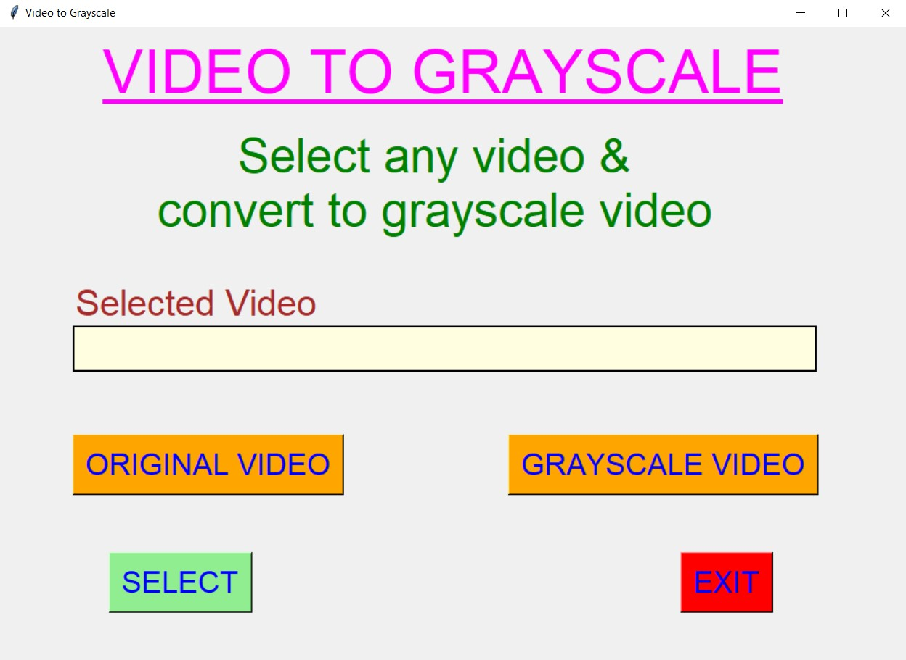
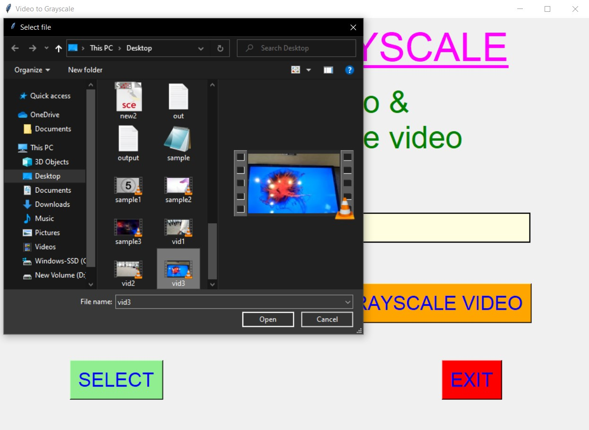
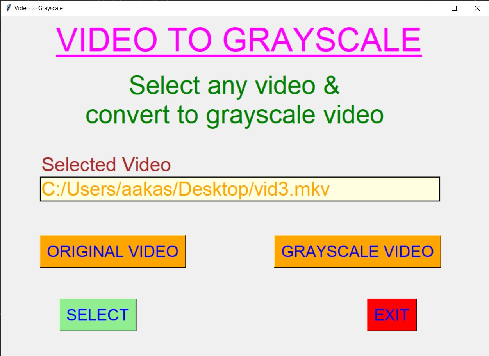
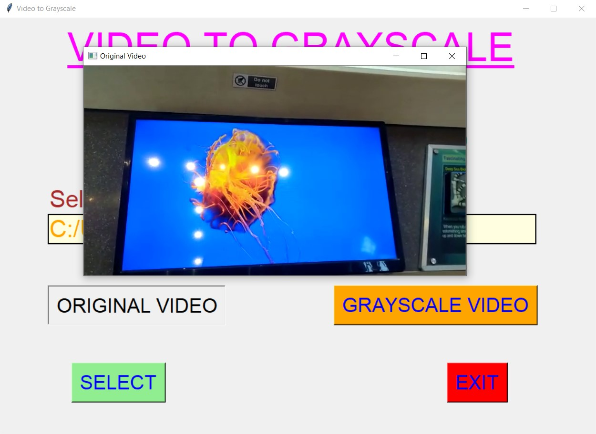
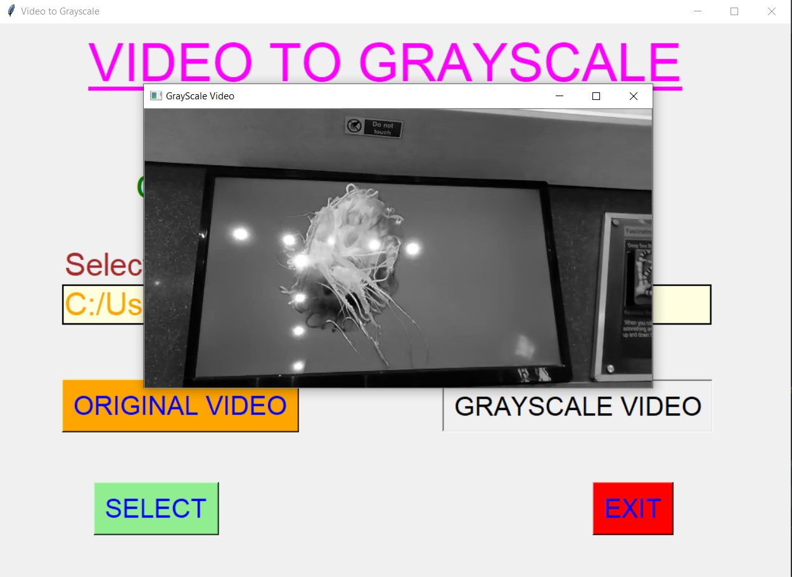
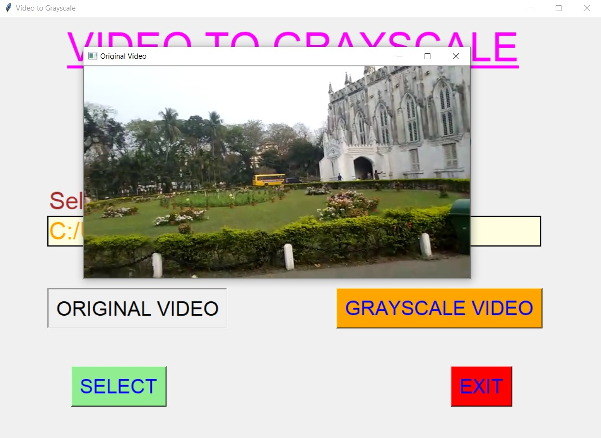
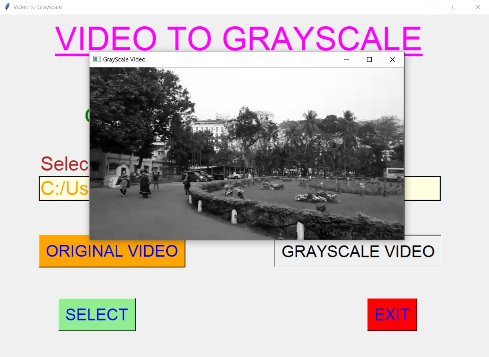
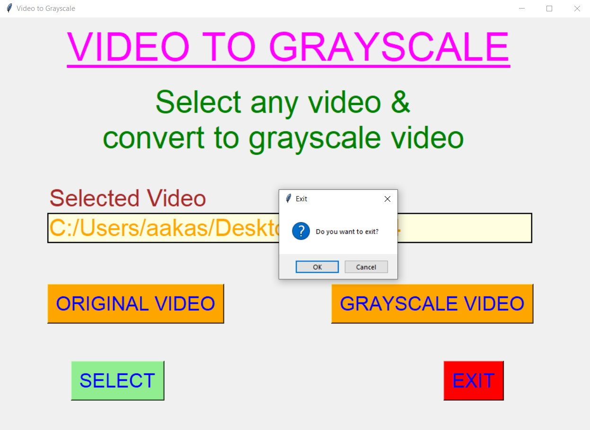

# ✔ VIDEO TO GRAYSCALE
- ### An Video to Grayscale is an application created in python with tkinter gui and OpenCv library.
- ### In this application user can select any videos (either mpy, mkv, avi, or any other extension of video) and can get the grayscale video of it.
- ### Also user will be able to see the preview of both original video and the grayscale video.

****

# REQUIREMENTS :
- ### python 3
- ### tkinter module
- ### filedialog from tkinter
- ### messagebox
- ### from PIL import Image, ImageTk
- ### cv2

****

# HOW TO Use it :
- ### User just need to download the file, and run the video_to_grayscale.py, on local system.
- ### After running a GUI window appears, where user can start the video grayscaling application by clicking on the START button.
- ### After that a new GUI window will open, in which user will have buttons like SELECT, ORIGINAL VIDEO, GRAYSCALE VIDEO and EXIT.
- ### User can select any video file (either mpy, mkv, avi, or any other extension of video) from the local system, using SELECT button.
- ### After user has selected video, when user clicks on the ORIGINAL VIDEO and GRAYSCALE VIDEO, he/she will be able to see the preview of original video and grayscale video respectively.
- ### Also there is an EXIT button clicking opn which user can exit from the application.

# Purpose :
- ### This scripts helps user to easily get the grayscale format of any video from local system.

# Compilation Steps :
- ### Install tkinter, PIL, cv2
- ### After that download the code file, and run video_to_grayscale.py on local system.
- ### Then the script will start running and user can explore selecting any video and converting it to grayscale video and seeing the preview for the same.

****

# SCREENSHOTS :
****

   
   
   
   
   
   
   
   
   

****

# Name : 
- ### Akash Ramanand Rajak
