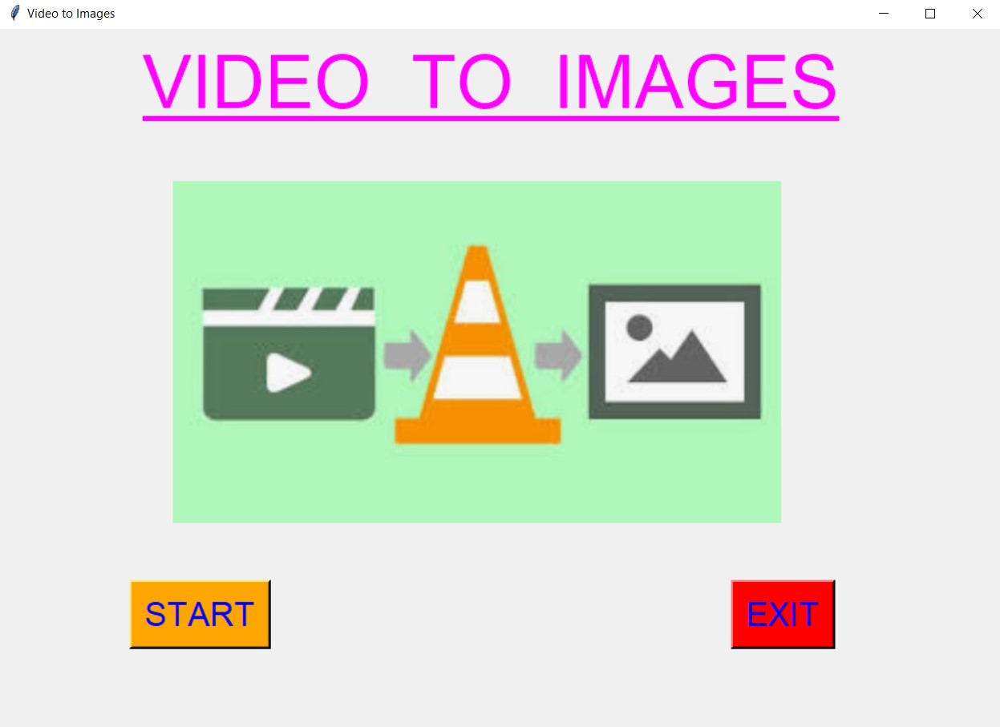
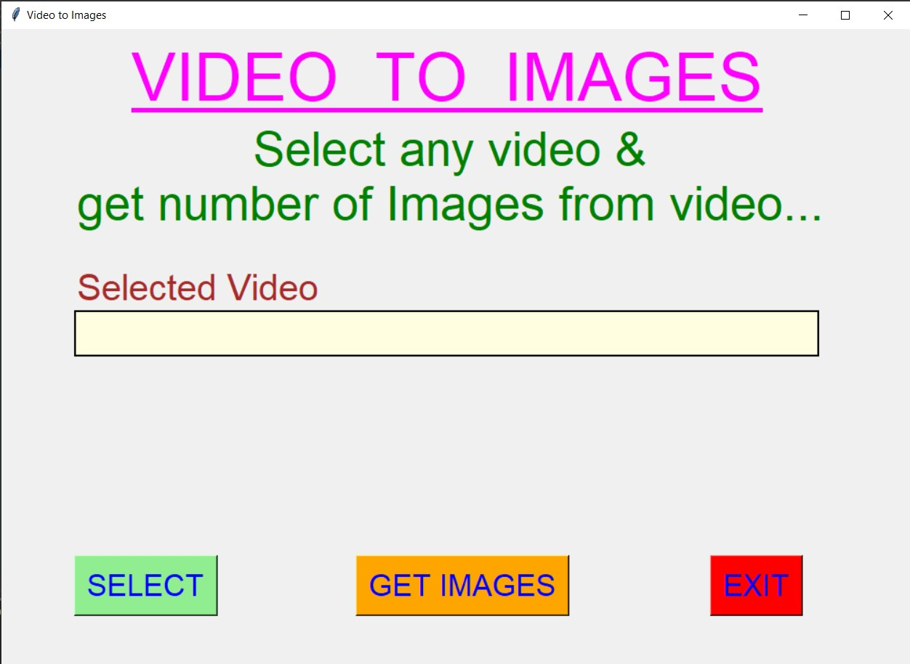
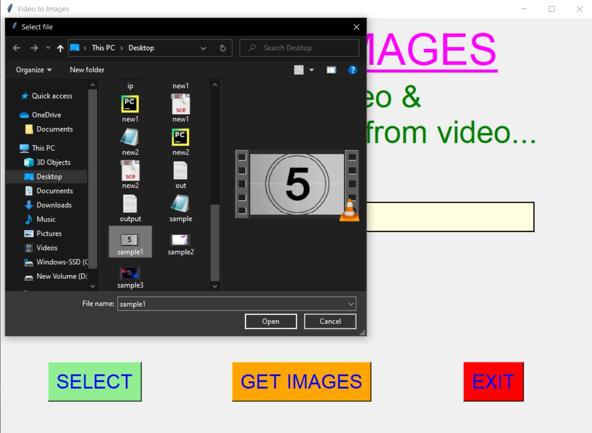
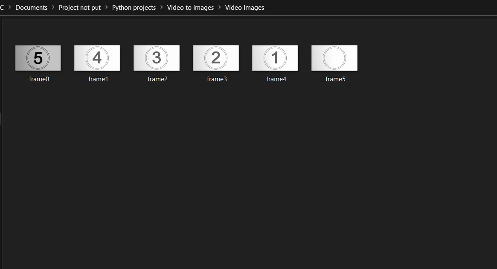
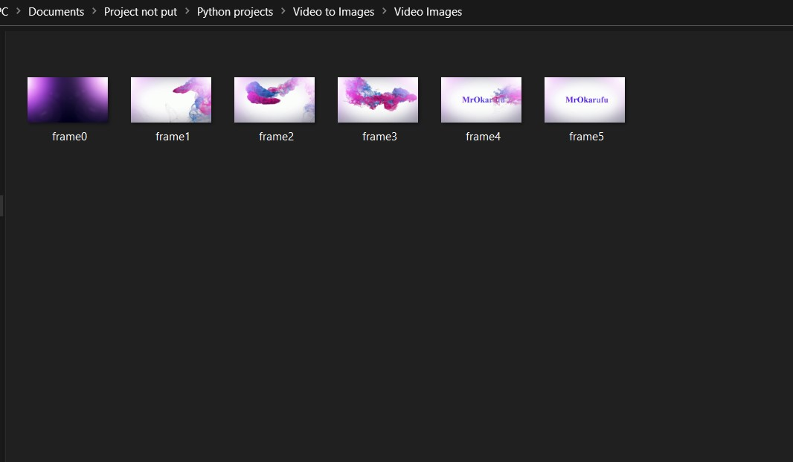
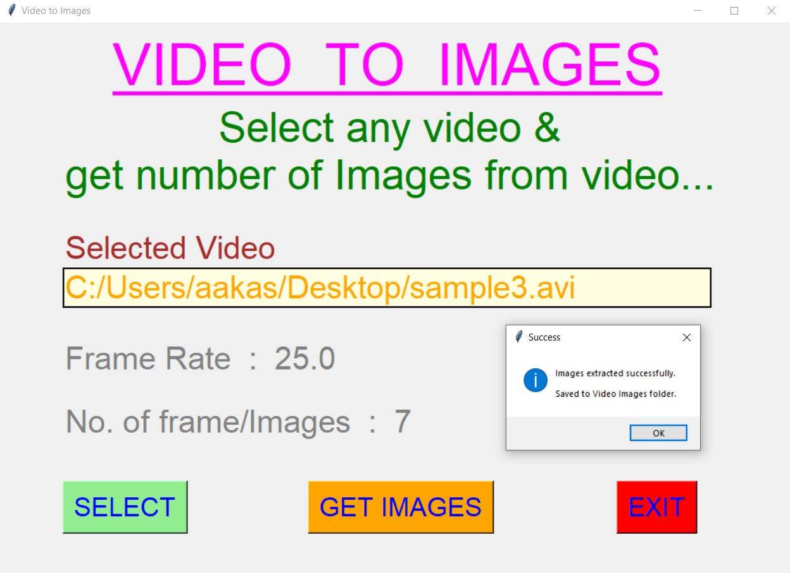
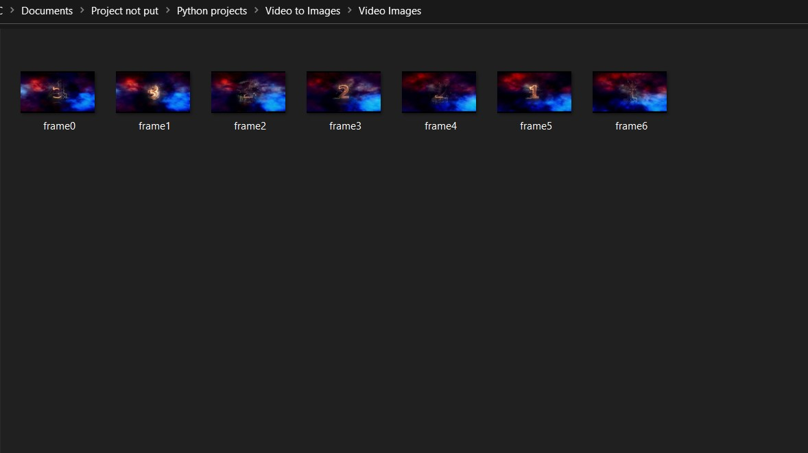
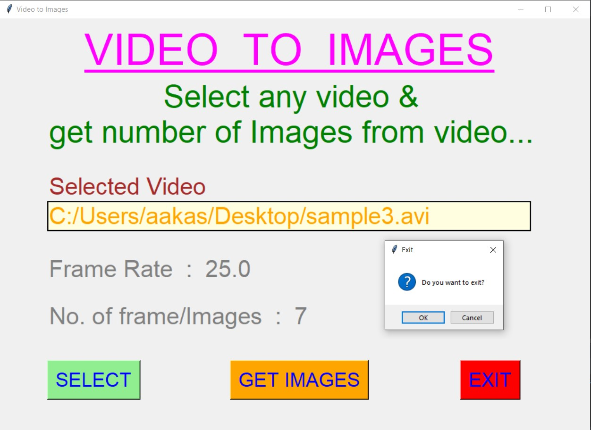

# ✔ VIDEO TO IMAGES
- ### An Video to Images is an application created in python with tkinter gui and OpenCv library.
- ### In this application user can select any videos (either mpy, mkv, avi, or any other extension of video) and can extract the images from that selected video.
- ### Along with it user will also be able to see the Frame Rate and No of images/frame created.
- ### The output folder file with Images in that will be saved automatically to the project directory with folder name "Video Images".

****

# REQUIREMENTS :
- ### python 3
- ### tkinter module
- ### filedialog from tkinter
- ### messagebox
- ### from PIL import Image, ImageTk
- ### import cv2
- ### import os

****

# HOW TO Use it :
- ### User just need to download the file, and run the video_to_images.py, on local system.
- ### After running a GUI window appears, where user can start the video Stitching by clicking on the START button.
- ### After that a new GUI window will open, in which user will have buttons like SELECT, GET IMAGES and EXIT.
- ### User can select any video file (either mpy, mkv, avi, or any other extension of video) from the local system, using SELECT button.
- ### After user has selected video, user will be able to see the path of the video selected in the text area.
- ### After that when user clicks on the GET IMAGES button, the process of extracting images wil start and after completion user will be shown the Frame Rate, No. of Images Extracted and along with that a success message.
- ### Also there is an EXIT button clicking opn which user can exit from the application.

# Purpose :
- ### This scripts helps us to easily to extract number of images/frames from any video in present local system.

# Compilation Steps :
- ### Install tkinter, PIL, cv2, os
- ### After that download the code file, and run video_to_images.py on local system.
- ### Then the script will start running and user can explore selecting any video and getting images for that video.

****

# SCREENSHOTS :
****

   
   
   
   
   
   
   
   
   
   

****

# Name : 
- ### Akash Ramanand Rajak
