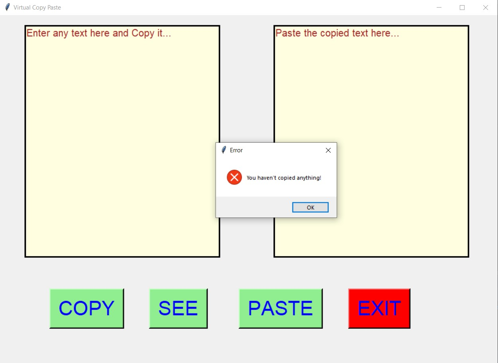
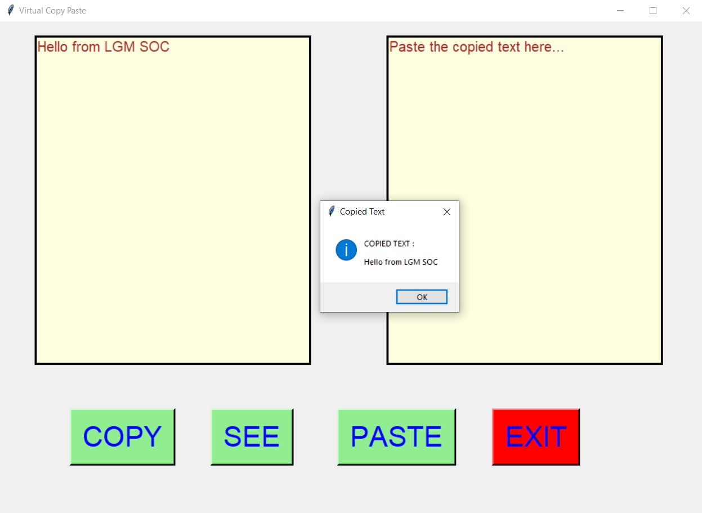
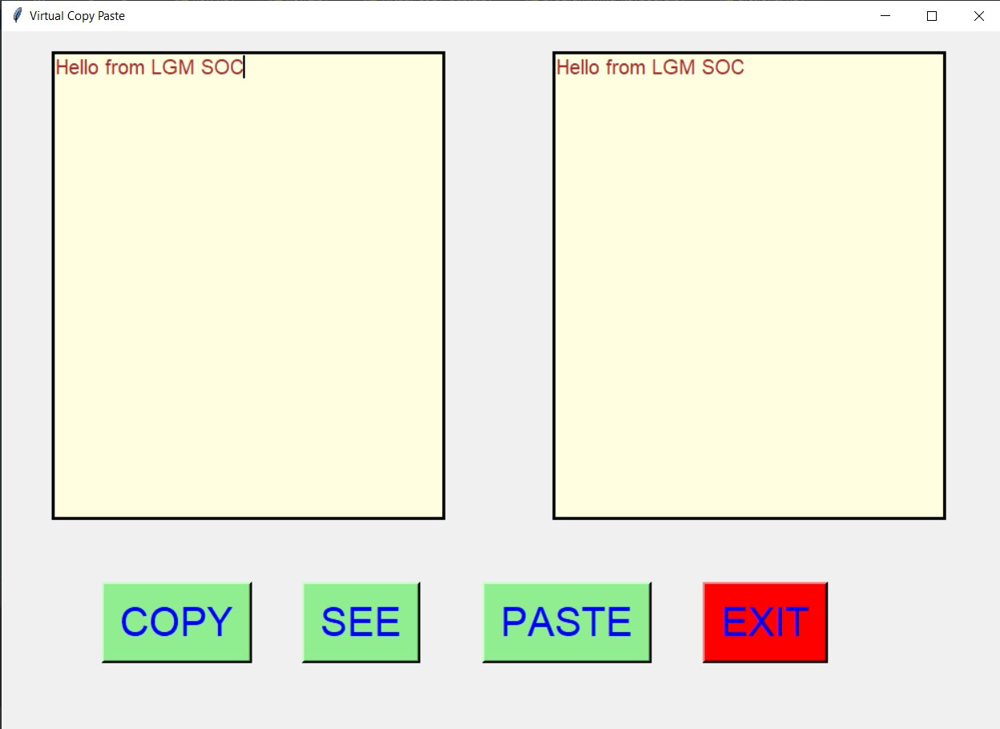
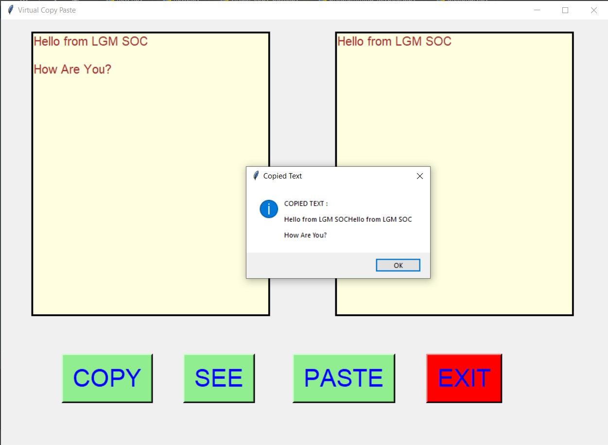
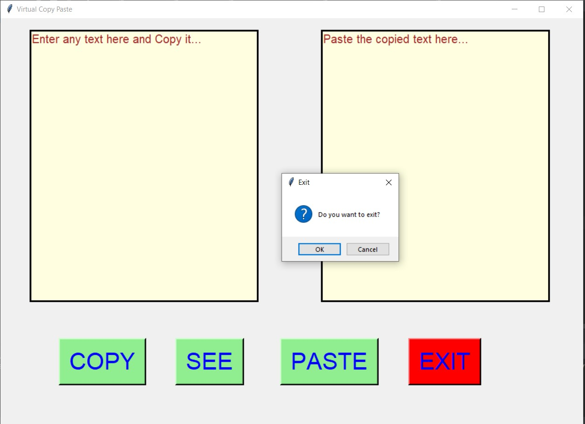

# ✔ VIRTUAL COPY PASTE
- ### A Virtual Copy Paste is an application created in python with tkinter gui.
- ### In this application user will be given two text area one for entering the text and other for pasting the entered text after copying it.
- ### This process of copying and pasting of text can be done using COPY and PASTE button.
- ### It also allows us to see the copied text using the SEE button.
- ### It also give us an error message like "You haven't copied anything!", when we try to SEE or PASTE without copying the text.

****

# REQUIREMENTS :
- ### python 3
- ### tkinter module
- ### from tkinter messagebox module

****

# How this Script works :
- ### User just need to download the file and run the virtual_copy_paste.py on their local system.
- ### Now on the main window of the application, there will be a START button, clicking on which the workspace of the application opens.
- ### In this window of workspace there are two textarea given to us, one for entering the text and other for pasting the copied text from firat text area.
- ### There is a COPY button, clicking on which we can copy the entered text.
- ### There is a SEE button clicking on which a message box will open showing the copied text.
- ### There is also a PASTE button, clicking on which user can paste the copied text to another text area.
- ### It also give us an error message like "You haven't copied anything!", when we try to SEE or PASTE without copying the text.
- ### Also there is an exit button, clicking on which exit dialog box appears asking for the permission of the user for closing the window.

# Purpose :
- ### This scripts helps us to easily copy and paste text from one textarea to another textarea using COPY and PASTE button respectively, instead of using CTRL+C and CTRL+V from keyboard.

# Compilation Steps :
- ### Install tkinter, pandas
- ### After that download the code file, and run virtual_copy_paste.py on local system.
- ### Then the script will start running and user can explore it by copying and pasting the text.

****

# SCREENSHOTS :

****

   
   
   
   
   
   
   

****

