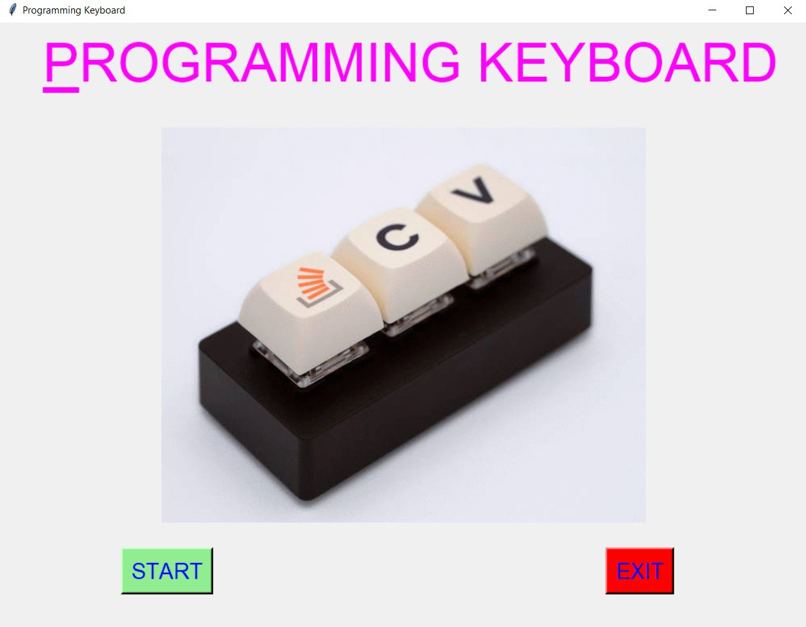
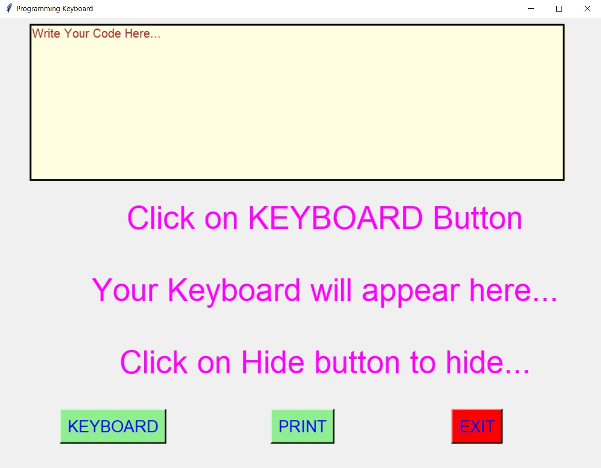
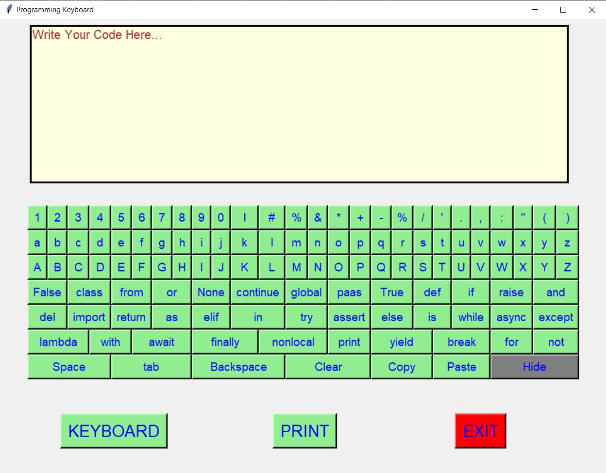
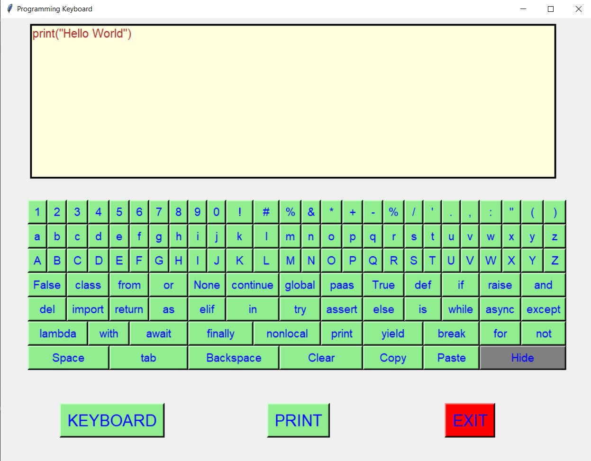
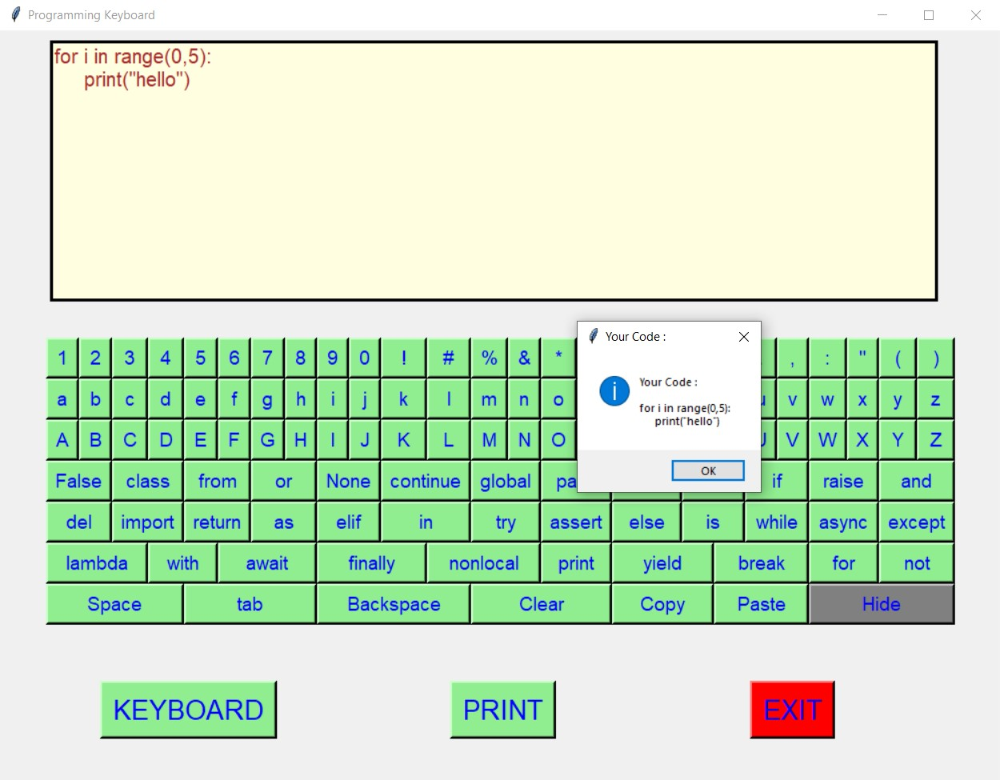
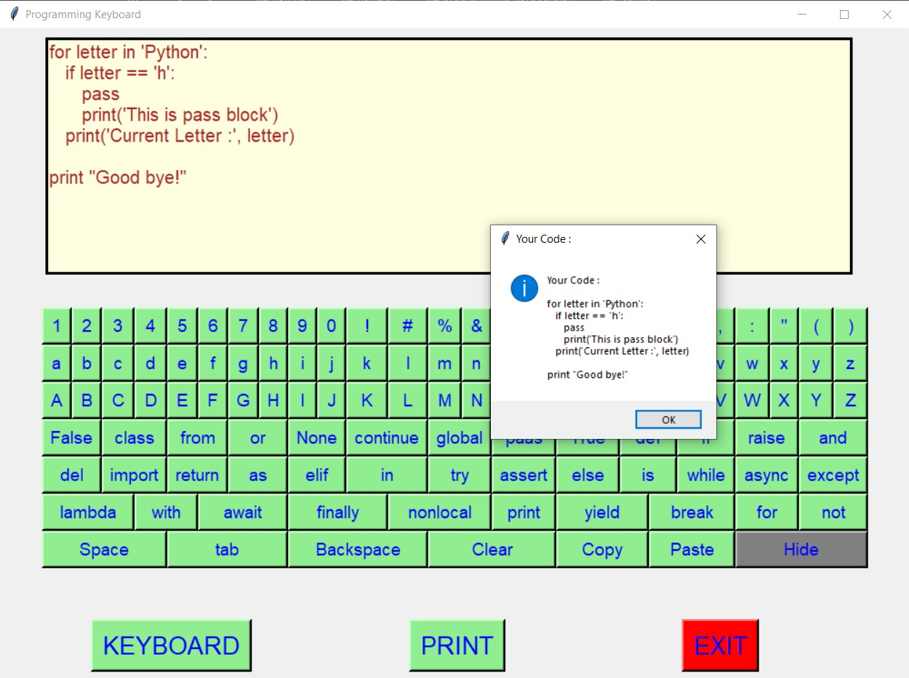
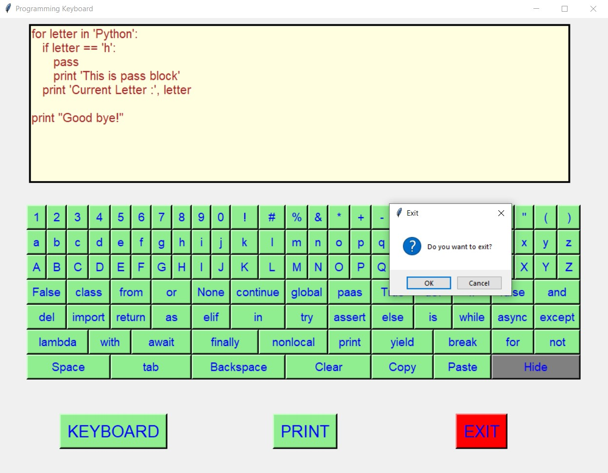
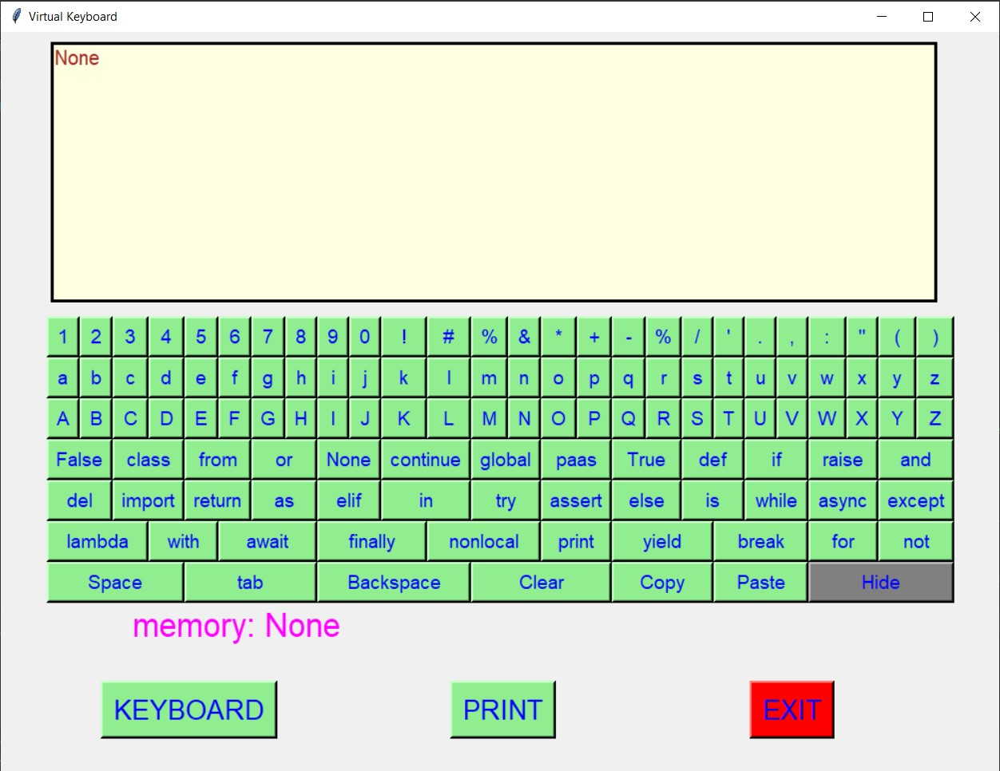

# Programming Keyboard

### Changes Done :

1. Added additional keys related to all the keywords python.
2. These additonal keys are : False, class, from, or, None, continue, global, pass, True, def, if, raise, and, del, import, return, as, elif, in, try, assert, else, is, while, async, except, lambda, with,await, finally, nonlocal, yield,break, for, not
3.) This helps to write code fastly by clicking only some keys in the keyword.
4.) Also implemented the copy and paste button, such that when we click on copy, it will store all the text in textarea in memory label which will be shown below the keyboard. Which can be pasted in textarea using paste key.

### Output :

   
   
   
   
   
   
   
   
   

### Author :
Akash Ramanand Rajak
