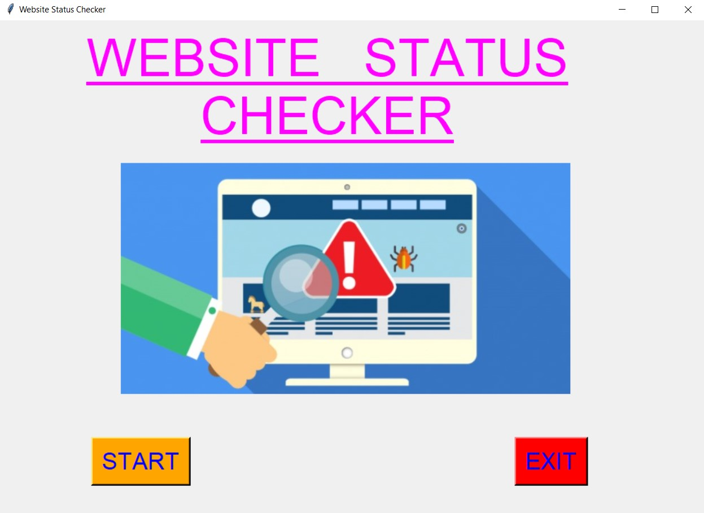
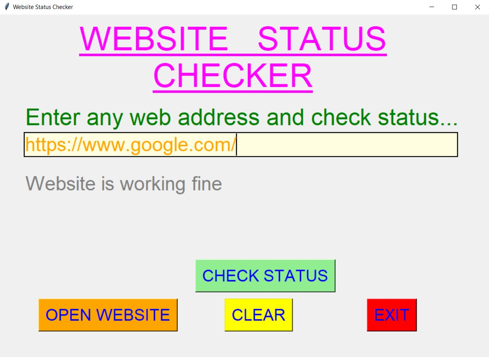
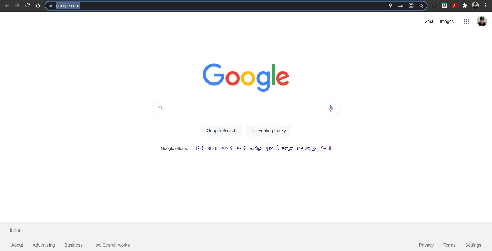
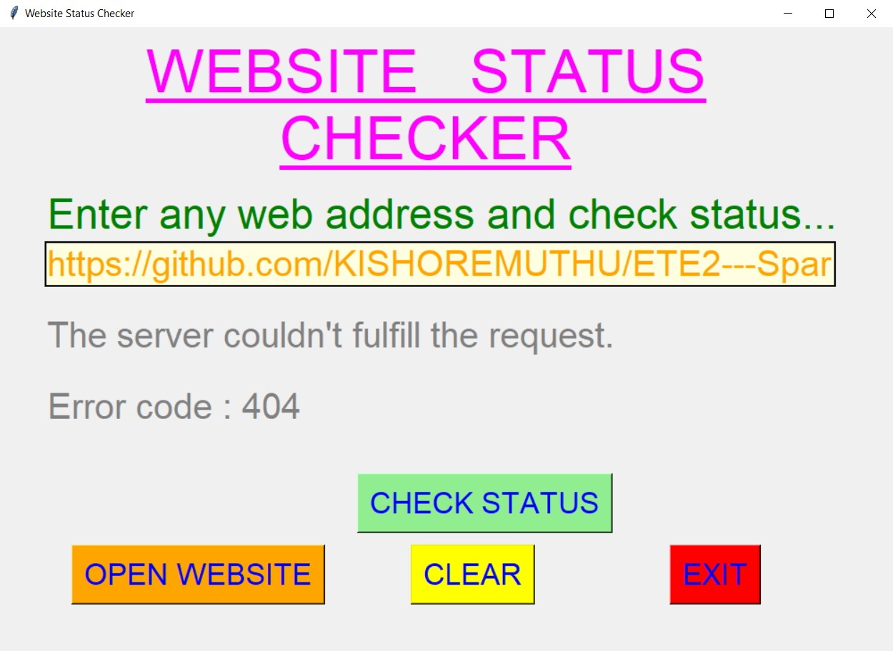
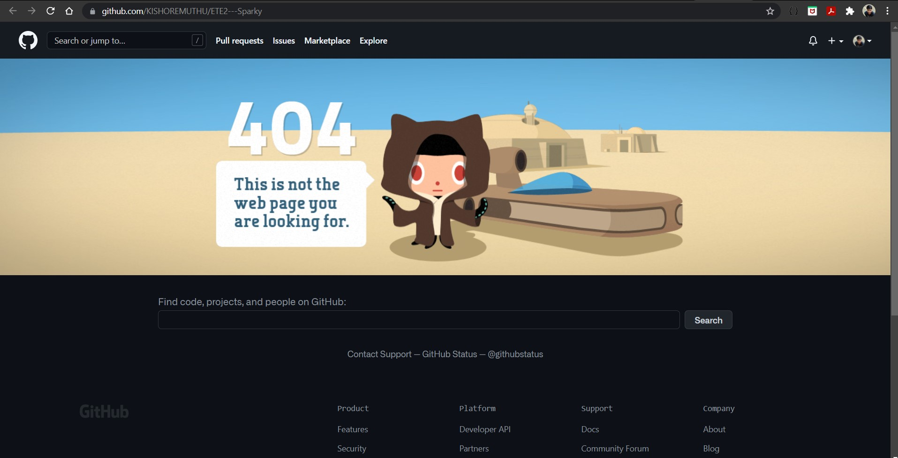
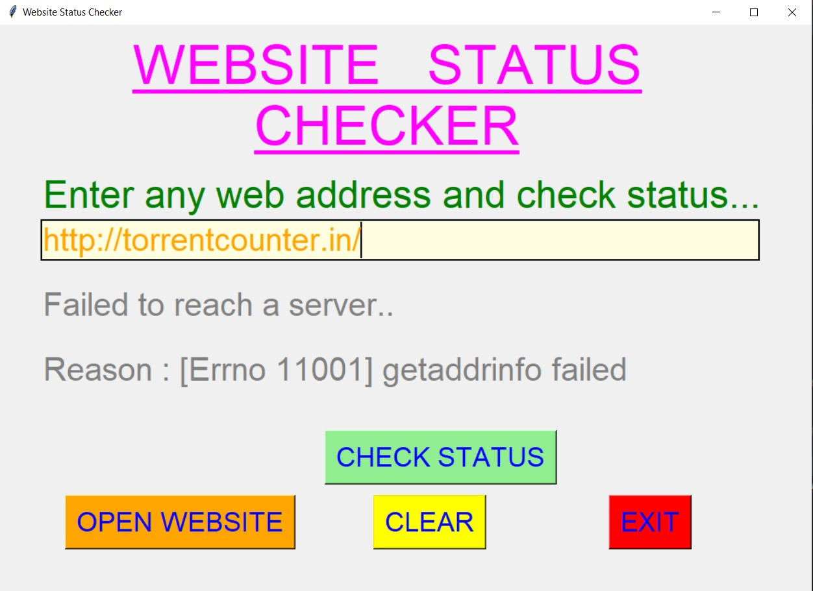
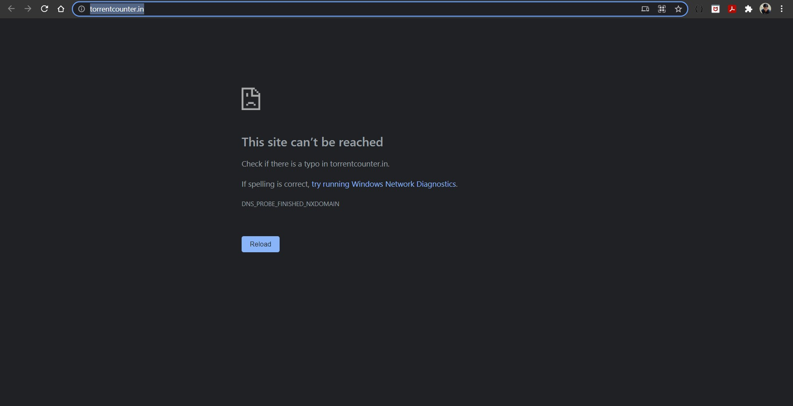
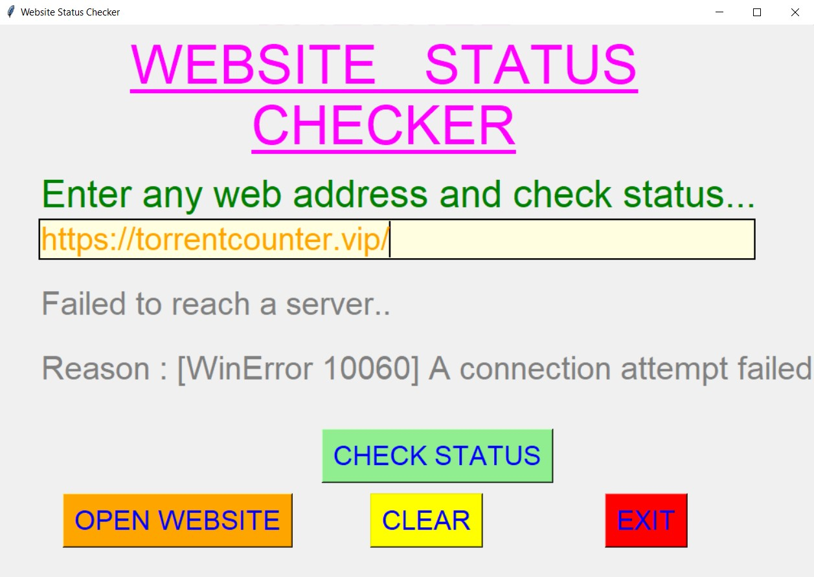
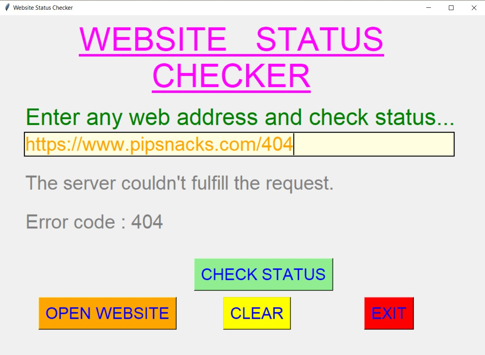
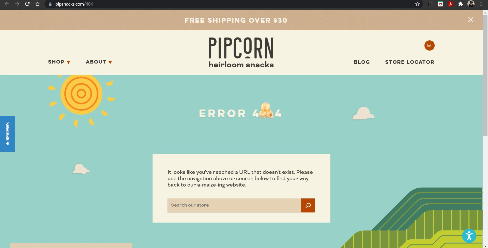

# ✔ WEBSITE STATUS CHECKER
- ### An Website Status Checker is an application created in python with tkinter gui.
- ### In this application user can enter any web address, and will be able to get that status of that website.
- ### The status will be in terms of whether website is working fine or not, any error codes and if error in website, and will also show the reason or error code for that error.
- ### Also user will be able to see the website the opening it.

****

# REQUIREMENTS :
- ### python 3
- ### tkinter module
- ### from pil import Image, ImageTk
- ### from urllib.request import Request, urlopen
- ### from urllib.error import URLError, HTTPError
- ### webbrowser

****

# HOW TO Use it :
- ### User just need to download the file, and run the website_status_checker.py, on local system.
- ### After running a GUI window appears, where user can start the application by clicking on the START button.
- ### After that a new GUI window will open, in which user will have buttons like CHECK STATUS, OPEN WEBSITE, CLEAR and EXIT.
- ### Now user need to enter any web address in the text area provided and check the status using the CHECK STATUS button.
- ### The status will be in terms of whether website is working fine or not, any error codes and if error in website, and will also show the reason or error code for that error.
- ### Also user will be able to see the website the opening it, using OPEN WEBSITE button.
- ### Also there is a CLEAR button, clicking on which user can clear the web address that user has entered previously.
- ### Also there is an EXIT button clicking opn which user can exit from the application.

# Purpose :
- ### This scripts helps user to easily to check the status of any website by just entering web address.

# Compilation Steps :
- ### Install tkinter, pil, urllib, webbrowser
- ### After that download the code file, and run website_status_checker.py on local system.
- ### Then the script will start running and user can explore it by entering any web address and checking the status for same.

****

# SCREENSHOTS :
****

   
   
   
   
   
   
   
   
   
   
   

****

# Name : 
- ### Akash Ramanand Rajak
