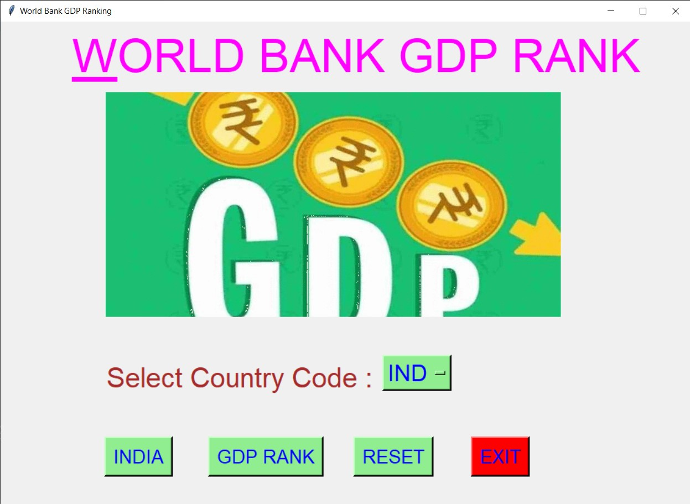
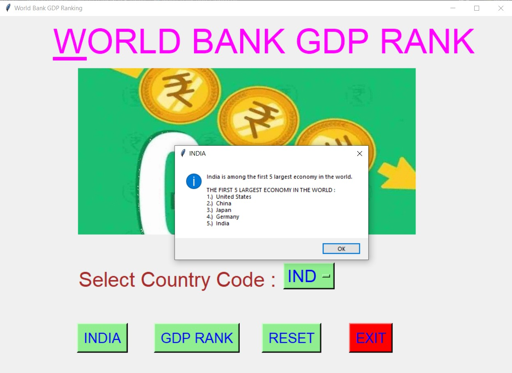
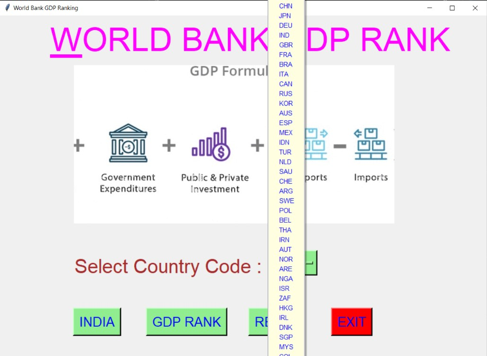
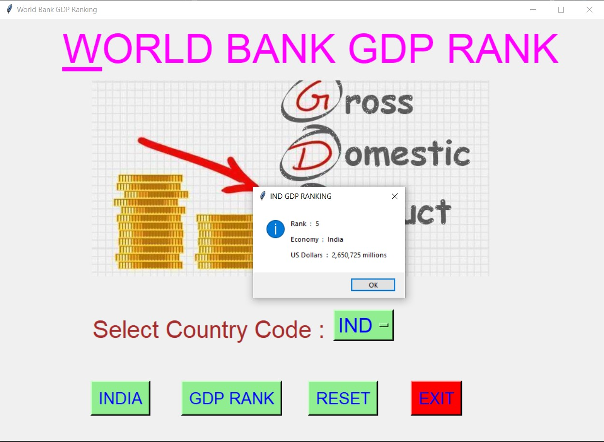
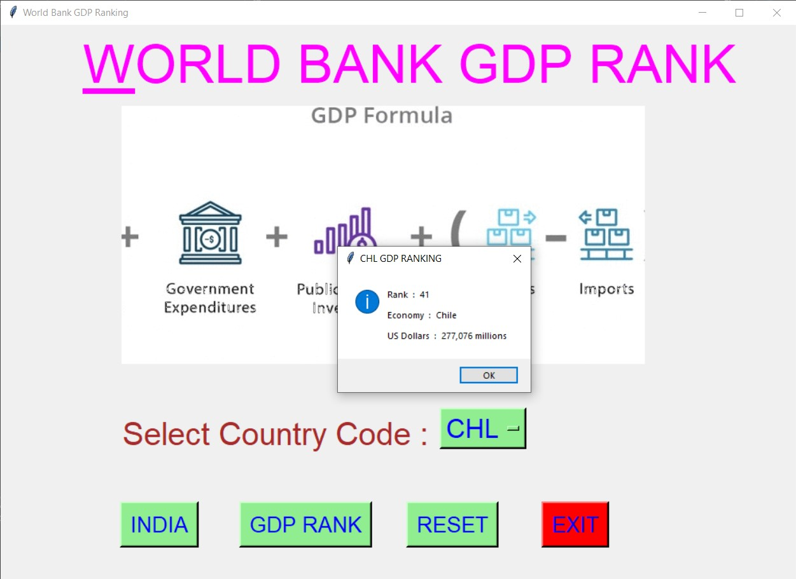
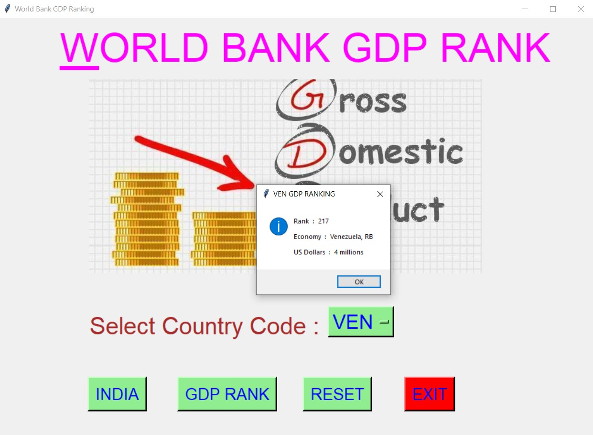
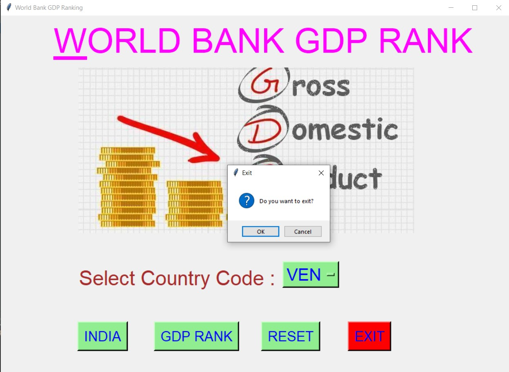

# ✔ WORLD BANK GDP RANKING
- ### A "World Bank GDP Ranking" is an application created in python with tkinter gui.
- ### In this application, user can find the GDP Ranking of any country entring just country code.
- ### The information can be like Ranking , Economy, and how many US Dollars.
- ### for the data, used the gdp.csv data, and read using pandas library.

****

# REQUIREMENTS :
- ### python 3
- ### tkinter module
- ### from tkinter messagebox module
- ### pandas

****

# How this Script works :
- ### User just need to download the file and run the world_bank_gdp_ranking.py on their local system.
- ### Now on the main window of the application the user needs to select the country code from the drop down OptionMenu.
- ### After user has chosen the country code, when user clicks on the BY GDP RANK button, he/she will be able to see that Selected Country code GDP Ranking in the message box.
- ### Also there is a INDIA button, clicking on which shows where India stands among other countries of the world in terms of GDP Ranking of Bank.
- ### Also there is a reset button, clicking on which user can resets both the Option Menu to default character ot integer.
- ### Also there is an exit button, clicking on which exit dialog box appears asking for the permission of the user for closing the window.

# Purrpose :
- ### By getting the GDP of any country country, we can use that data to measure living standards, economic growth, and business cycle conditions.
- ### Basically we can analyze the financial and economic condition of that country.

# Compilation Steps :
- ### Install tkinter, pandas
- ### After that download the code file, and run world_bank_gdp_ranking.py  on local system.
- ### Then the script will start running and you can get GDP Ranking of any country selecting just country code.

****

# SCREENSHOTS :

****

   
   
   
   
   
   
   

****

# Author :
- ### Akash Ramanand Rajak
