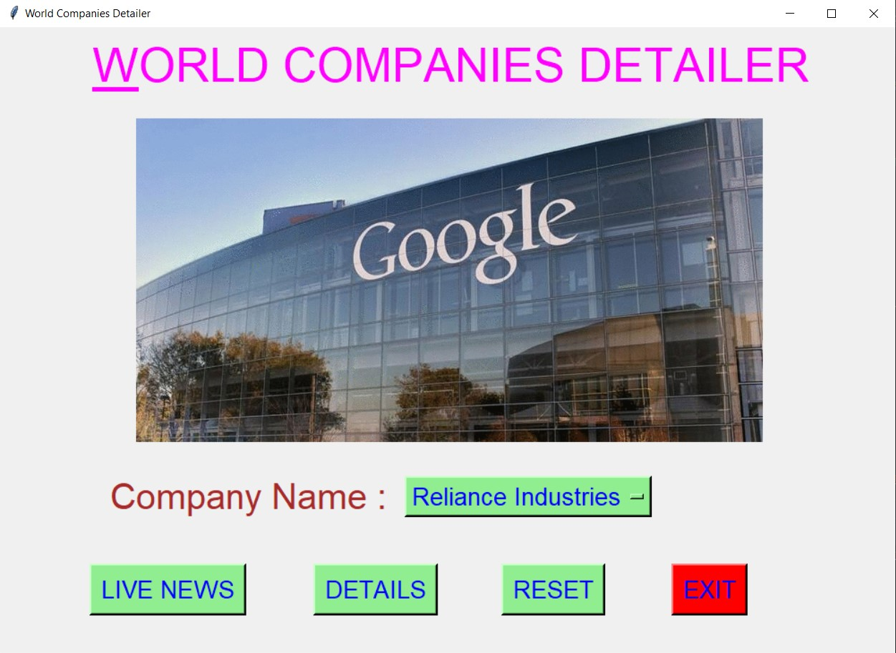
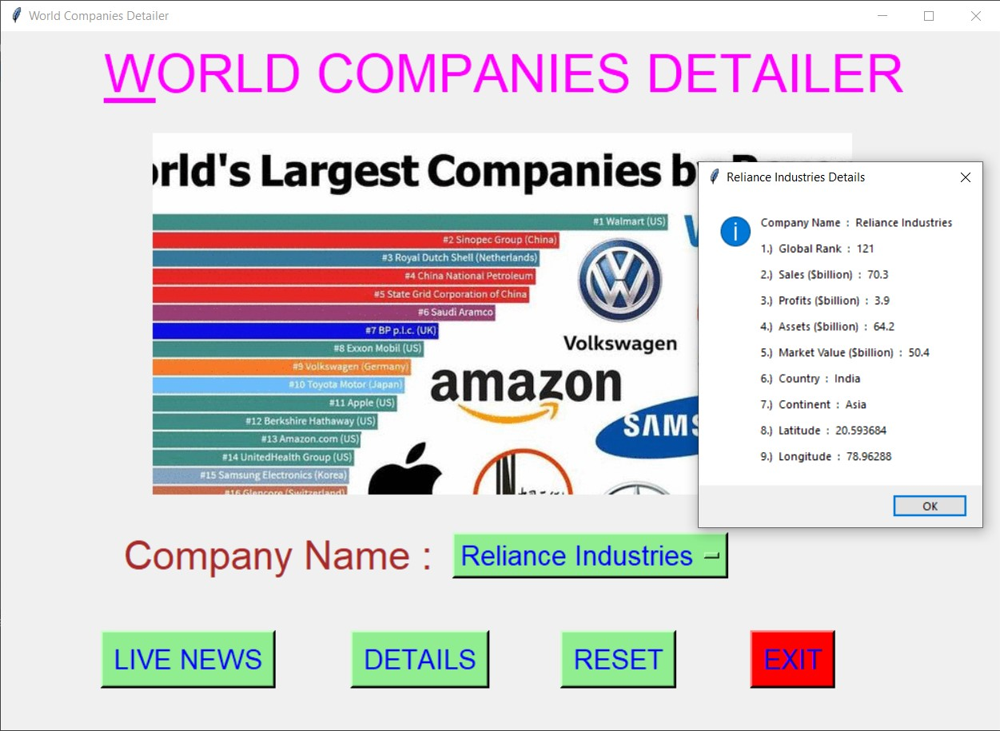
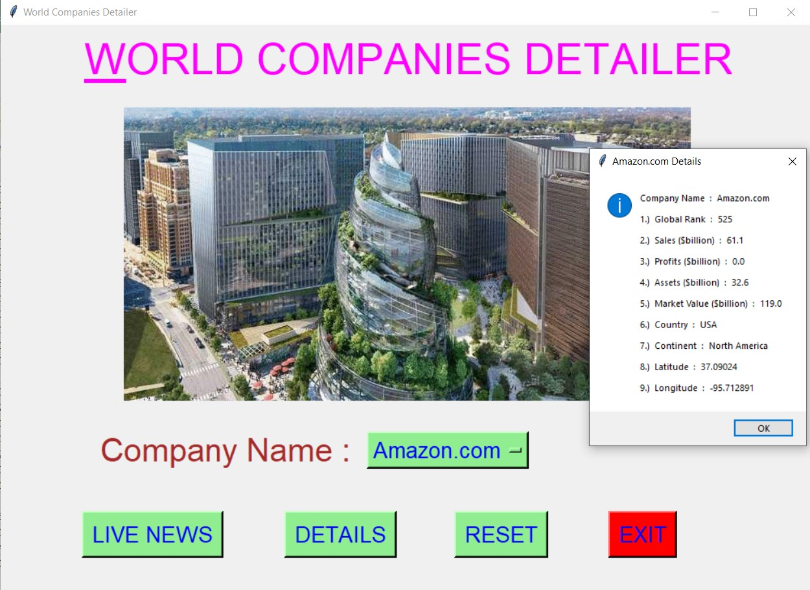
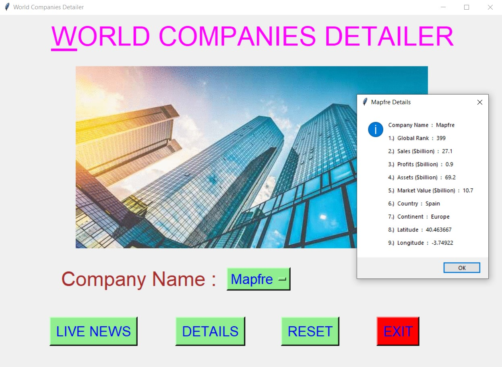
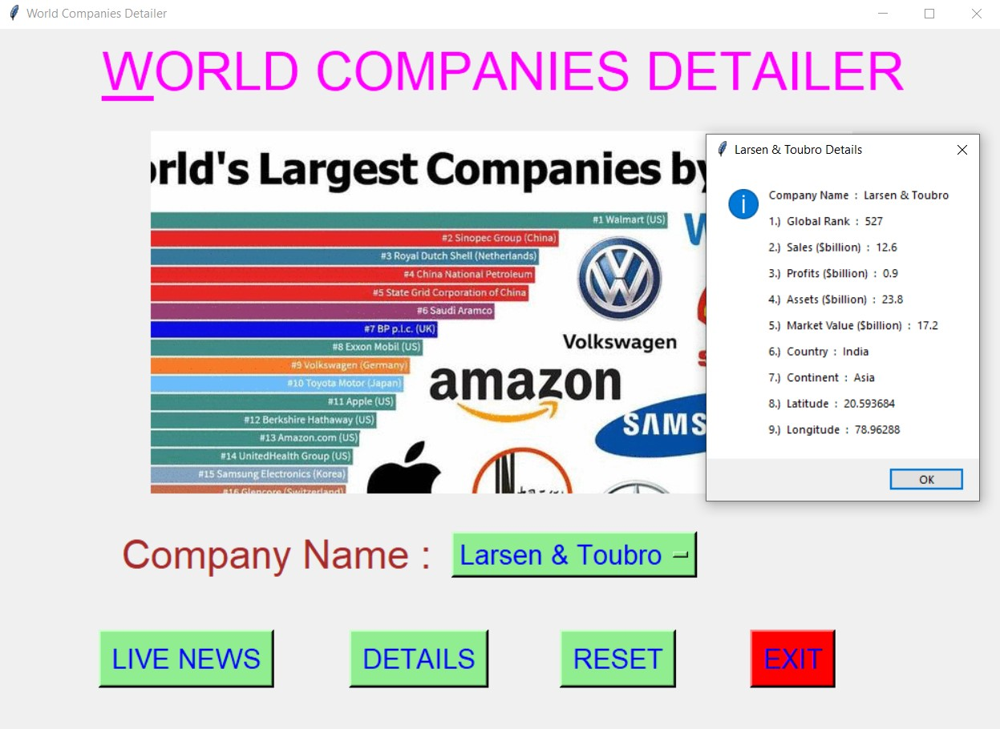
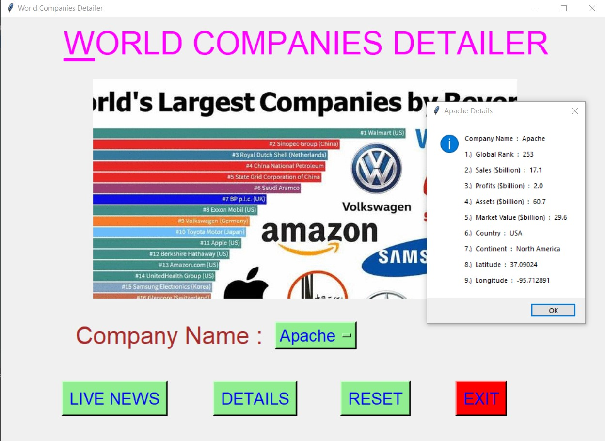
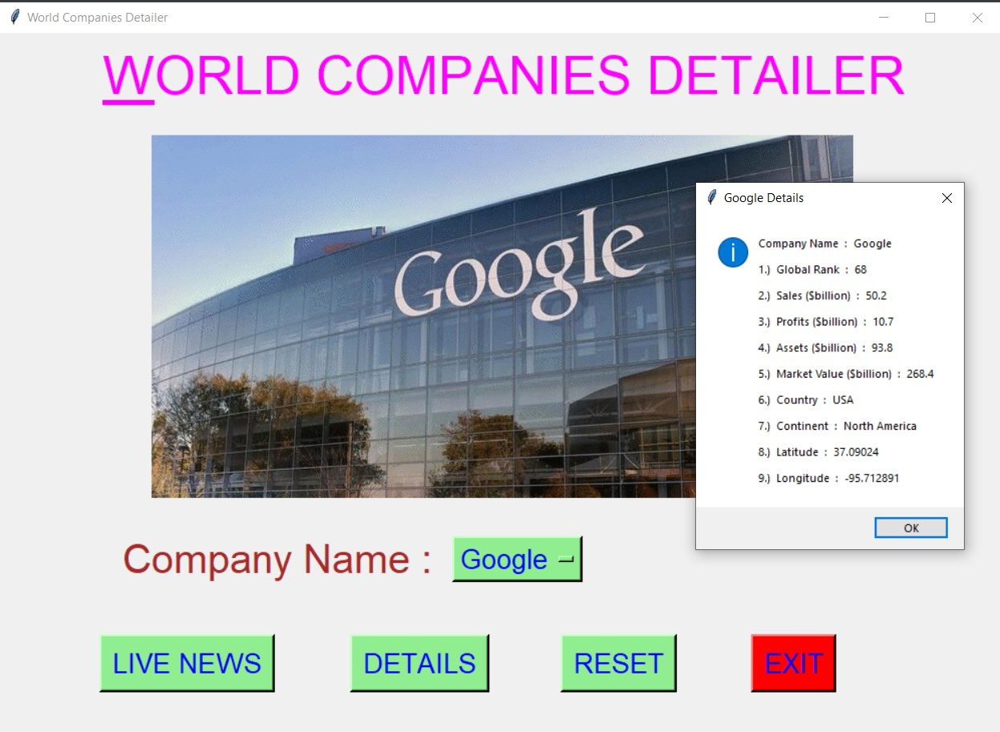
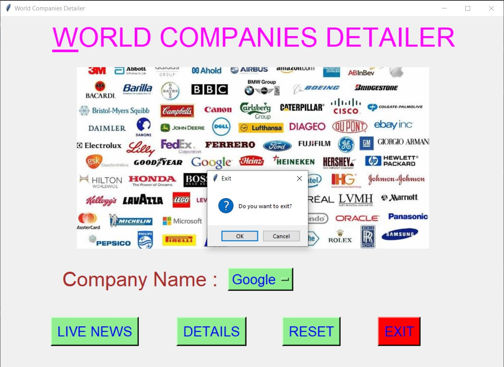

# ✔ WORLD COMPANIES DETAILER
- ### A "World Companies Detailer" is an application created in python with tkinter gui.
- ### In this application, user can get the details about more than 1000 companies in the world.
- ### And the details will be like Company name, Sales ($billion), Global Rank, Profits ($billion), Assets ($billion), Market Value ($billion), Country, Continent, Latitude, Longitude.
- ### Also with details, can live news of top companies.
- ### for the data, used the world_companies.csv data, and read using pandas library.

****

# REQUIREMENTS :
- ### python 3
- ### tkinter module
- ### from tkinter messagebox module
- ### pandas
- ### webbrowser

****

# How this Script works :
- ### User just need to download the file and run the world_companies_detailer.py on their local system.
- ### Now on the main window of the application the user needs to select the name of the company, whose details he/she wants to get from the drop down OptionMenu.
- ### After user has chosen the name of Company, when user clicks on the BY DETAILS button, he/she will be able to see the details of that selected Company in terms of Company name, Sales ($billion), Global Rank, Profits ($billion), Assets ($billion), Market Value ($billion), Country, Continent, Latitude, Longitude.
- ### Also there is a LIVE NEWS button, clicking on which user will be directed to the webpage which shows the live news of company.
- ### Also there is a RESET button, clicking on which user can resets both the Option Menu to default element name "Reliance Industries".
- ### Also there is an EXIT button, clicking on which exit dialog box appears asking for the permission of the user for closing the window.

# Purpose :
- ### This scripts helps us to easily get details of about 1000's of Top World companies along with some live news even.

# Compilation Steps :
- ### Install tkinter, pandas, webbrowser
- ### After that download the code file, and run world_companies_detailer.py on local system.
- ### Then the script will start running and user can explore each company listed in the OptionMenu.

****

# SCREENSHOTS :

****

   
   
   
   
   
   
   
   
   

****

# Author :
- ### Akash Ramanand Rajak
