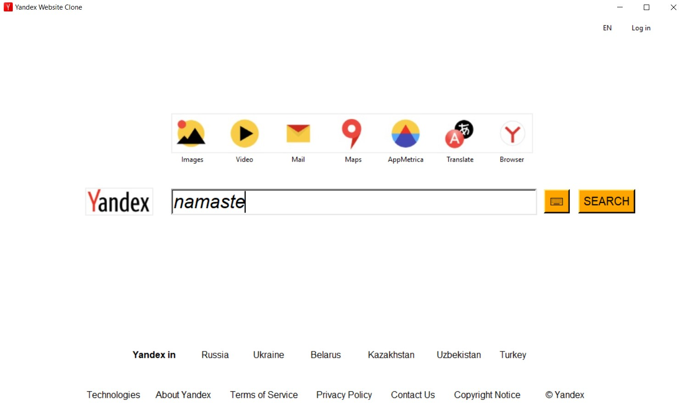
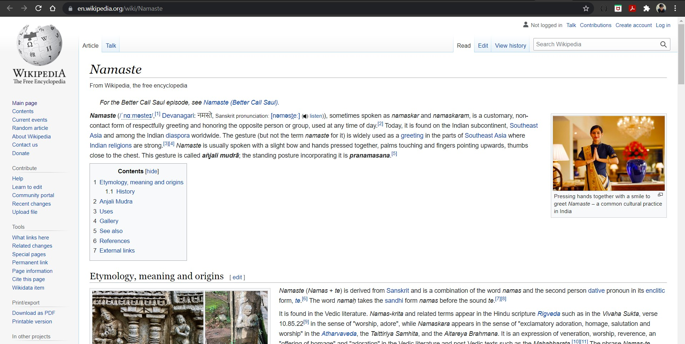
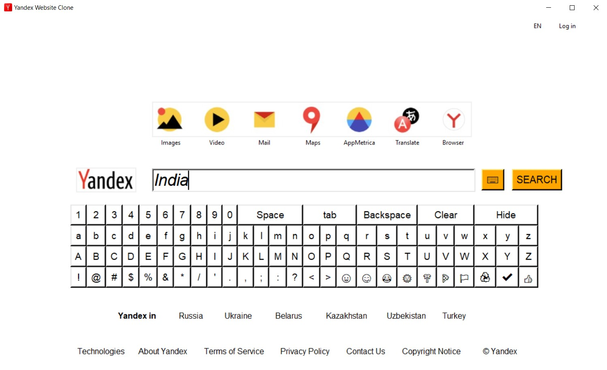
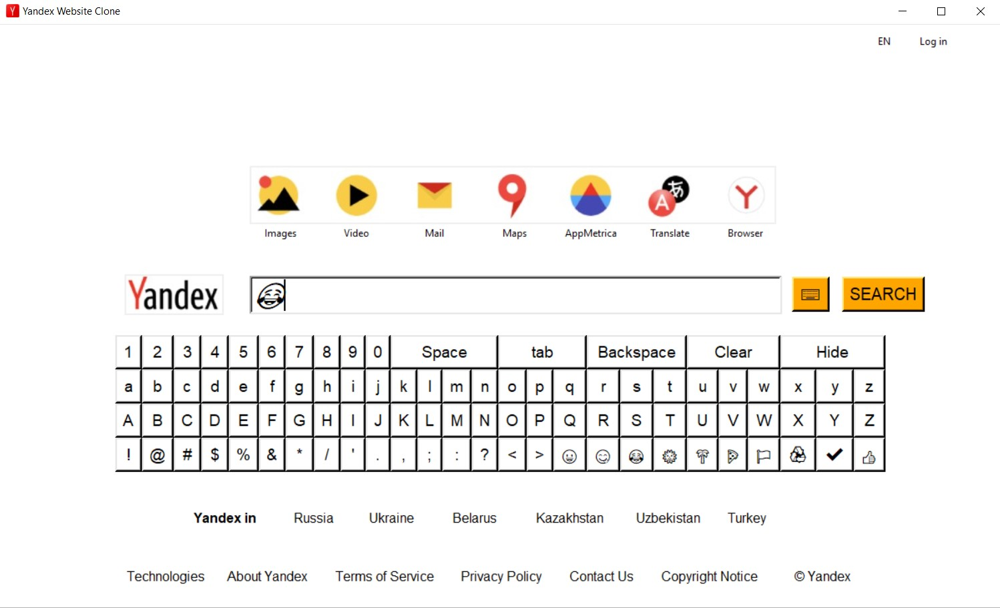

# ✔ Yandex Website Clone
- ### A "Yandex Website Clone" is an application created in python with tkinter gui.
- ### It's GUI is same as the Yandex Website gui.
- ### In this application, there is an option for Images, Video, Mail, Maps, AppMetrica, Translate, Browser and for login also.
- ### Also a Search is implemented using googlesearch library of python.
- ### Also there is option for seeing the About, advertising, business and how search works section in it.
- ### Also an option take input using virtual keypad added beside entry box.
- ### Also there will be option for seeing the terms and privacy section of the Yandex Company.

****

# REQUIREMENTS :
- ### python 3
- ### tkinter module
- ### webbrowser
- ### PIL
- ### googlesearch

****

# How this Script works :
- ### User just need to download the file and run the yandex_website_clone.py on their local system.
- ### Now on the main window of the application, a gui same as how Yandex website is looking, will appear.
- ### From the application we can navigate to Images, Video, Mail, Maps, AppMetrica, Translate, Browser and for login also.
- ### Also we can search anything in the search bar using google search module in python.
- ### Also there is option for seeing the About, advertising, business and how search works section in it.
- ### Also there will be option for seeing the terms and privacy section of the Yandex Company.
- ### Also an option take input using virtual keypad added beside entry box.

# Purpose :
- ### This scripts helps user to use the yandex type website application in tkinter GUI.

# Compilation Steps :
- ### Install tkinter, PIL, webbrowser, googlesearch
- ### After that download the code file, and yandex_website_clone.py on local system.
- ### Then the script will start running and user can explore each and every option given in GUI.

****

# SCREENSHOTS :

****

   
   
   
   
   
   
   
   
   
   

****

# Name :
- ### Akash Ramanand Rajak

