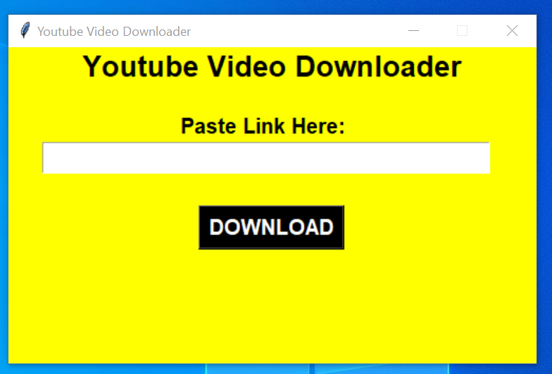
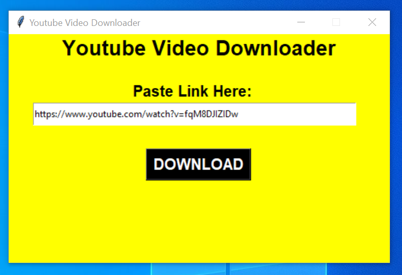
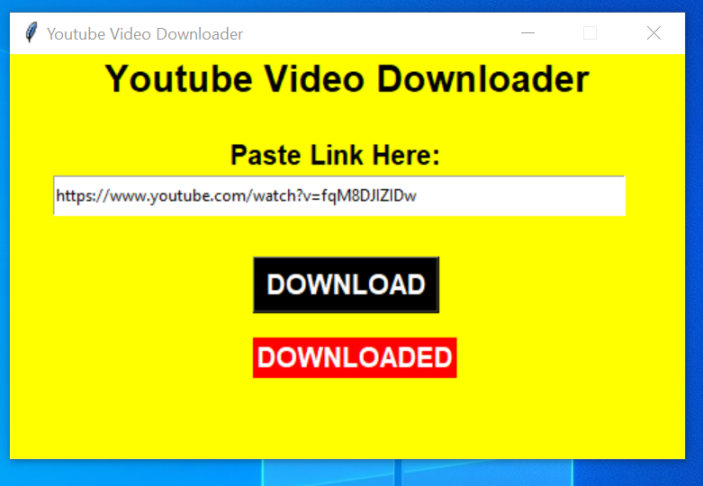

## GUI based YouTube Video Downloader

### About the script
A GUI application made using Tkinter. It basically has a textfield where the user can copy paste any YouTube Video link and click on "Download" button. The video gets downloaded in the same folder where the user is executing this code. And a message "Downloaded" gets displayed.
In this way, user can download any YouTube video of 'mp4' format and the speed depends on duration of video.

### Setup instructions

1. Install Python 3.x (recommended)
2. Download this repository as zip and extract.
3. Use Python IDLE or PyCharm to run the program.
4. Install the requirements specified in the **requirements.txt** file.
5. Execute the code, Have fun!!

### Compilation/Execution steps

- After installing the requirements, open the **youtube_video_downloader.py** file in Editor(VS code or any IDE).
- You can either directly execute the python file by clicking on Run, or type 
`python youtube_video_downloader.py` in the terminal.
- The GUI opens and follow the steps as discussed below.

### How it works?

- It is a GUI application built using tkinter library of python.
- When you execute the code, your application gets opened.
- It has a placeholder where any Youtube video link (of 'mp4' format) can be pasted.
- After pasting/typing the link, you can click on **DOWNLOAD** button.
- The video gets downloaded into the same folder where the code is present.
- After downloading, a text gets displayed saying **DOWNLOADED**
- The downloading speed depends on the duration of the video. please be patient..

### Screenshot of the application (Output)

### Author

[Damarla Venkata Sai Chandana](https://github.com/chandu6111)
