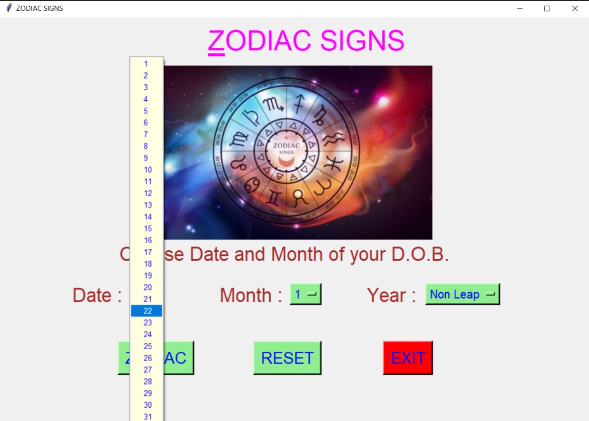
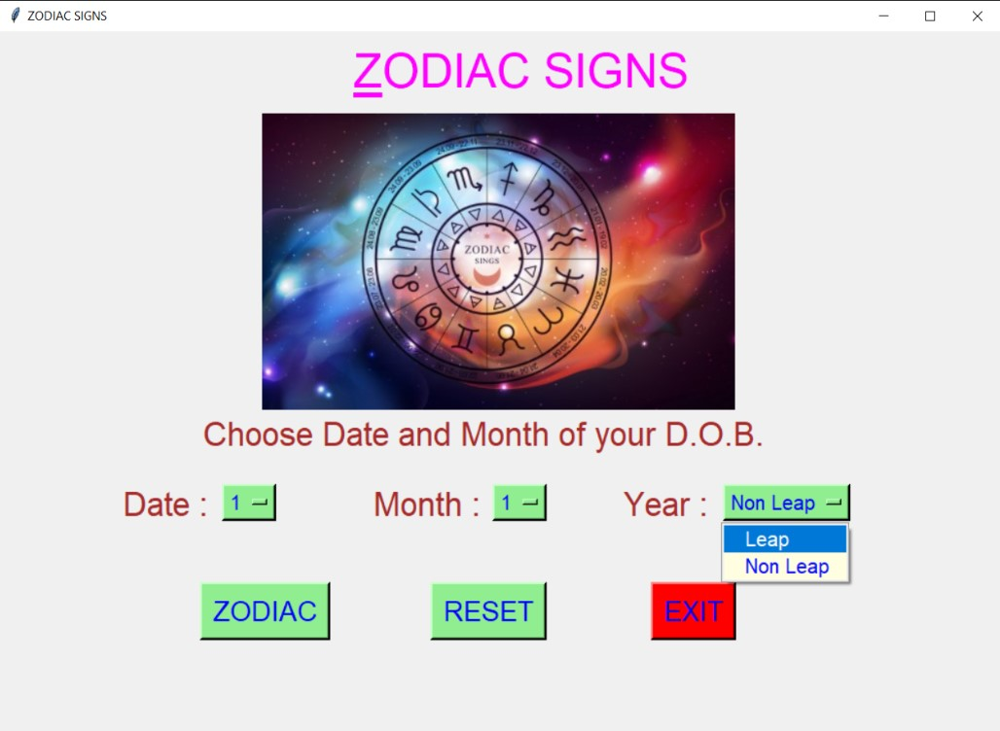
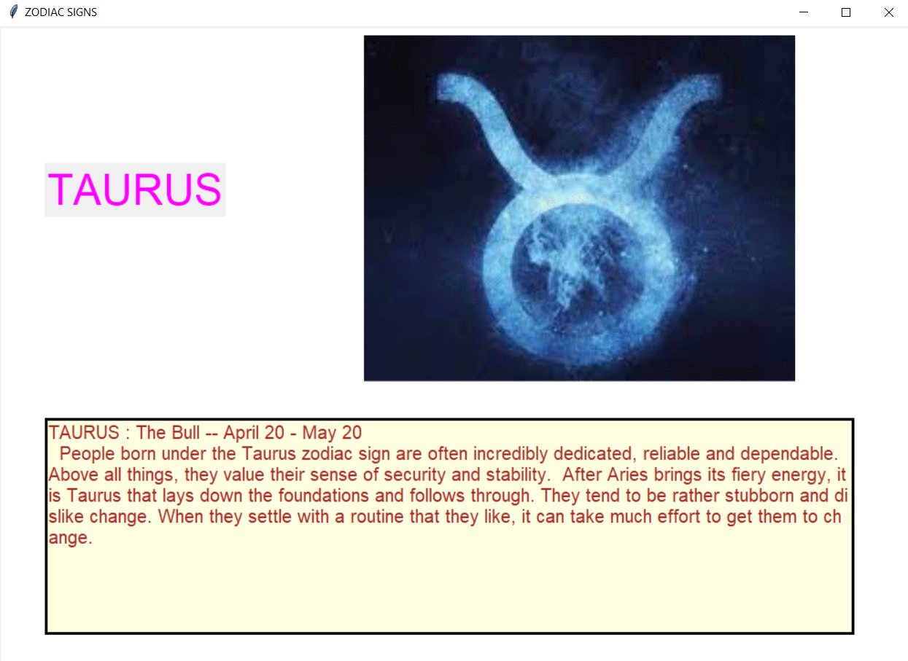
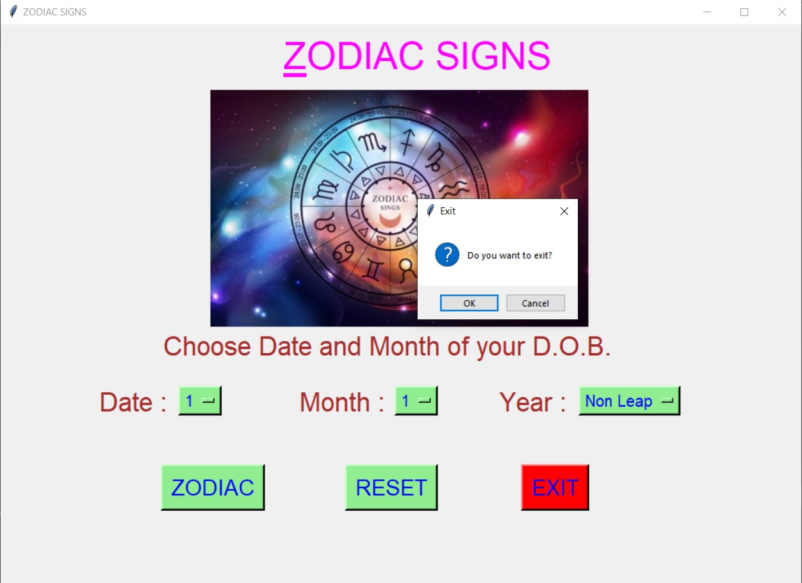
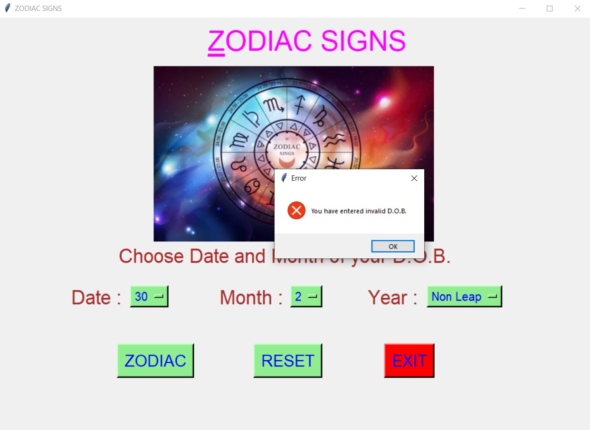

# ✔ ZODIAC SIGN FINDER
- ### A Zodiac Sign Finder created in python with tkinter gui.
- ### In this script, the user will be able to enter his/her D.O.B. and will be able to see his/her Zodiac Sign to which they belong.
- ### Also not only they see the name of their Zodiac Sign, but also some Information about that zodiac sign.

****

# REQUIREMENTS :
- ### python 3
- ### tkinter module
- ### from tkinter messagebox module=
- ### PIL module

****

# How this Script works :
- ### User just need to download the file and run the zodiac_sign_finder.py on their local system.
- ### Now on the main window of the script the user is asked to enter his date of birth in terms of date, month and year(either leap or non leap).
- ### After choosing the D.O.B., when player click on the ZODIAC button, he will be redirected to new frame showing information about which zodiac sign the user belongs to.
- ### The user can read the information about his/her zodiac sign from that frame.
- ### Also in this the validity of D.O.B. is also implemented, means is user enter wrong D.O.B.(means D.O.B. that never happen eg. 30 feb, etc.), he/she will get eror showing message dialog box.
- ### Also there is a reset button, clicking on which user can reset the values he/she has entered.
- ### Also there is an exit button, clicking on which exit dialog box appears asking for the permission of the user for closing the window.
- ### This way user can get to know about which zodiac sign he/she belongs and also some interesting information about that sign.

****

# SCREENSHOTS :

****

   
   
   
   
   
   
   
   
   
   
   
   
   
   
   
   
   
   
   

****

# Sample Video of its running process :
https://user-images.githubusercontent.com/57003737/122421690-2eb5fa00-cfaa-11eb-9035-b3a97738b29f.mp4