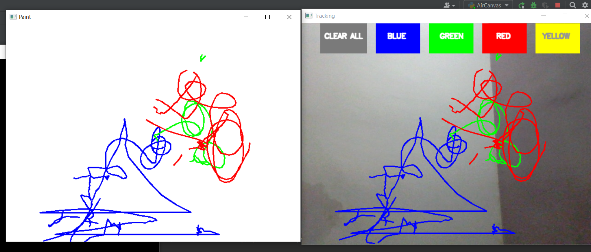

# Air Canvas
- Ever thought of drawing our imagination by just waving your finger in the air?  In this project, we have built an Air Canvas which can draw anything on it by just capturing the motion of a colored marker with a camera.<br><br>

 Air Canvas is a Computer Vision based project which tracks a target and uses the said target to draw on air. It is developed in python programming language using opencv and numpy module.

## Motivation for this idea
- This project is created keeping in view that there is a need for a dustless class room for the students to study in. I know that there are many ways like touch screens and more but what about the schools which can’t afford it to buy such huge large screens and teach on them like a T.V. <br>
- So, I thought why not can a finger be tracked, but that too at a initial level without deep learning. Hence it was OpenCV which came to the rescue.<br>

## About this project

- The preferred language is Python due to its exhaustive libraries and easy to use syntax but understanding the basics it can be implemented in any OpenCV supported language.<br>
- Here the motion of the target is captured by a webcam. The video from the webcam is processed by the computer to get an AR like image overlay on top of the live footage.<br>
- Here a colored object at the tip of the finger(target) is used as the marker. <br>
- Here Color Detection and tracking are used in order to achieve the objective. <br>

## How to Use?
- You have to just blow your finger(target) in the air and see the magic.
-  To change the color of the pointer move the target up to the color changer option.

## Setup instructions
1. Install Python 3.x (recommended) from <a href="https://www.python.org/downloads/">here</a>
2. Install opencv 2.x(recommended) from <a href="https://pypi.org/project/opencv-python/">here</a>
3. Download this repository as zip and extract.
4. open cmd prompt and adjust the directory to 'Air Canvas' folder.
5. type this command to run the code<br>
```bash
air_canvas.py
```
6. Press Enter to run the code and start playing.<br>
7. Have fun!!


## Output


## Author
<a href="https://github.com/sambit221">Sambit Kumar Tripathy</a>