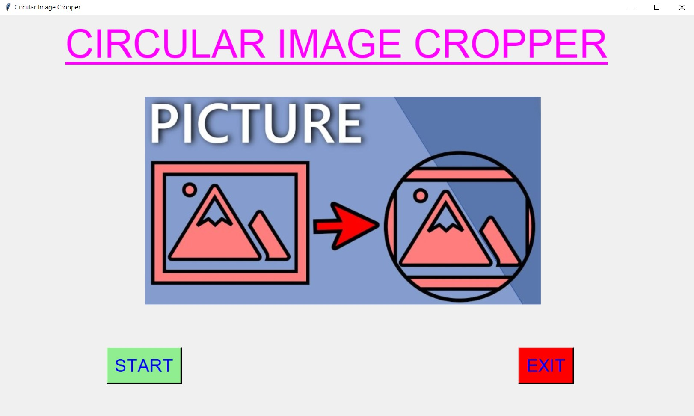
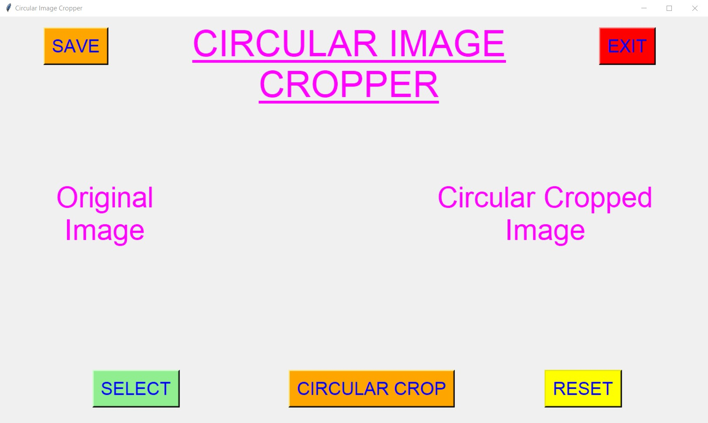
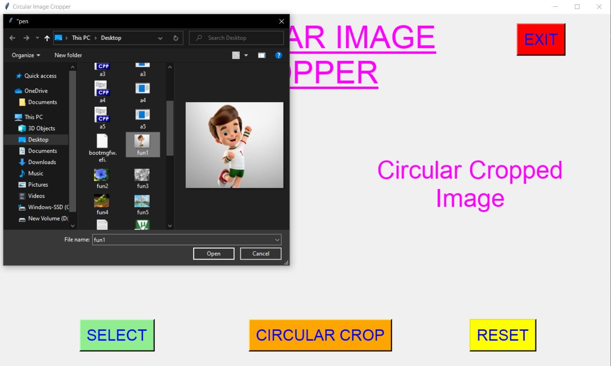
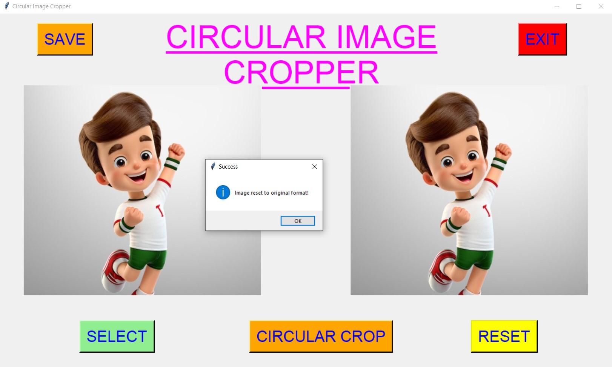
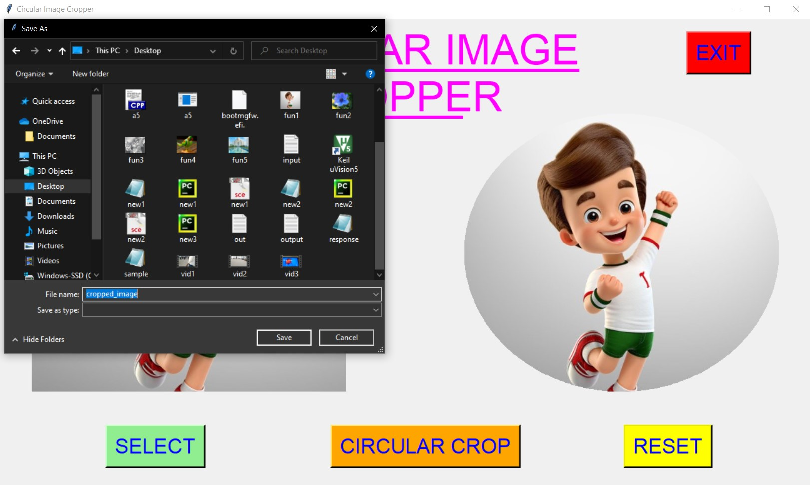
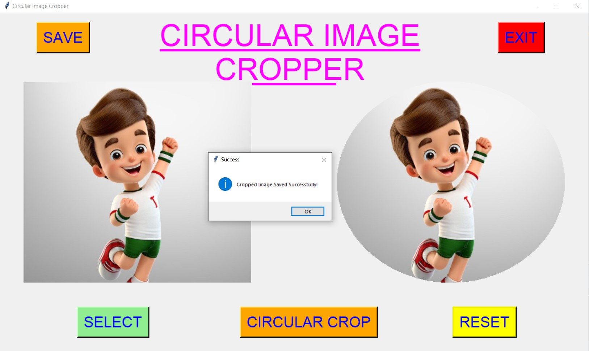
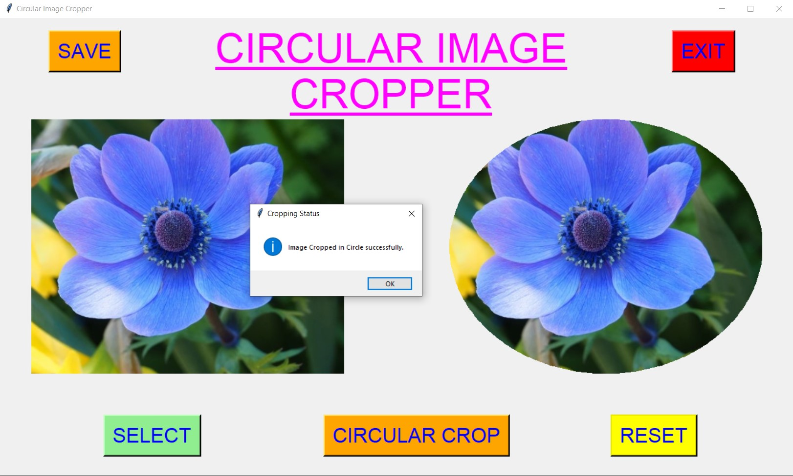
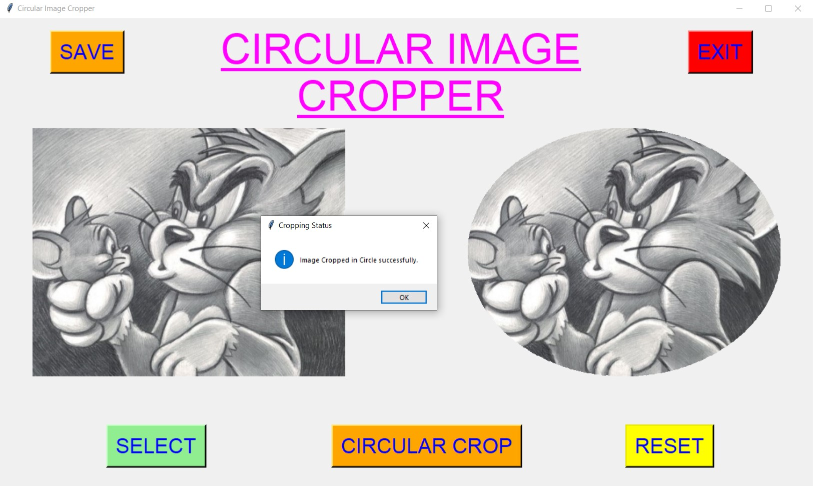
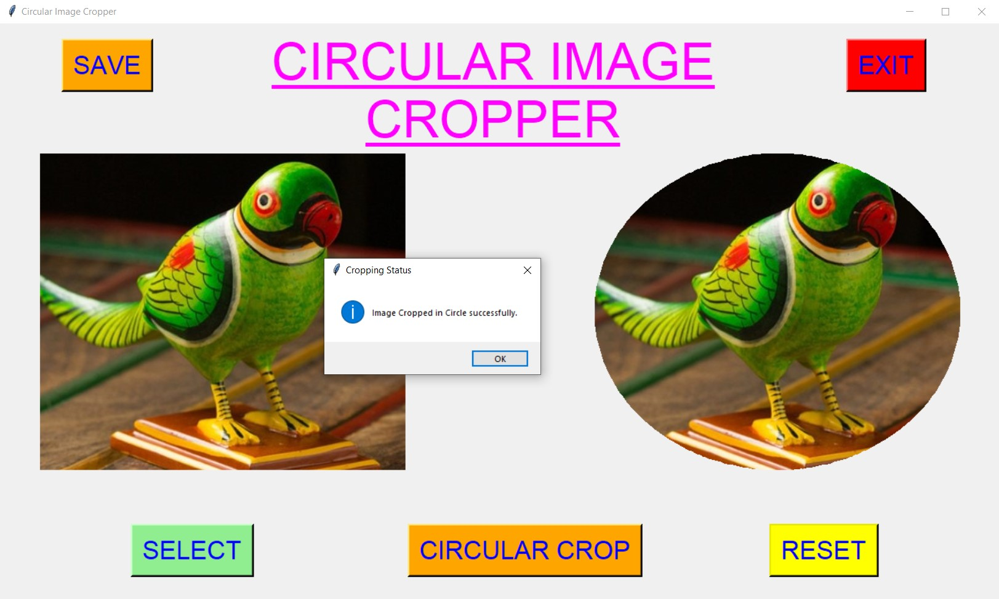
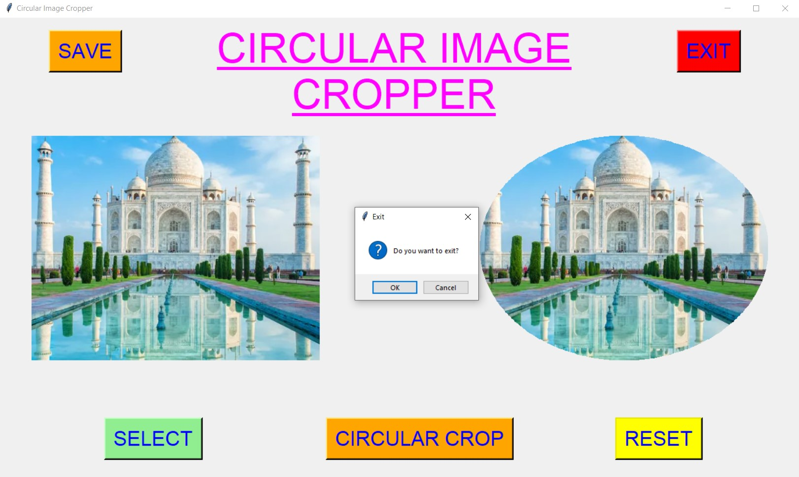

# ✔ CIRCULAR IMAGE CROPPER
- ### An Circular Image Cropper is an image processing application created in python with tkinter gui and OpenCv library.
- ### In this application user can select an image, and will be able to crop the image circularly.
- ### Also user will be able to see the preview of the original image as well as the cropped image.
- ### User can also reset the cropped image to original format using RESET button.
- ### Also after cropping user will be able to save the cropped image to any where on the local system.

****

# REQUIREMENTS :
- ### python 3=
- ### tkinter module
- ### filedialog from tkinter
- ### messagebox
- ### from PIL import Image, ImageTk, ImageDraw
- ### numpy
- ### cv2

****

# HOW TO Use it :
- ### User just need to download the file, and run the circular_image_cropper.py, on local system.
- ### After running a GUI window appears, where user can see button like START and EXIT.
- ### After user clicks on the START button a main application window will appear, where user needs to select an image file using SELECT button from the local system.
- ### After selecting the image, two images will appear on screen one on left side, which is original and one on write in which Circular Cropped format will be shown.
- ### Now user can start cropping of selected image using CIRCULAR CROP button.
- ### After segmenting user can also save the cropped image to any location in local system using SAVE button.
- ### User can also reset the cropped image to original format using RESET button.s
- ### Also there is exit button, clicking on which we get a exit dialog box asking the permission to exit.

# Purpose :
- ### This scripts helps user to easily crop any image in circular format and even save it anywhere in local system.

# Compilation Steps :
- ### Install tkinter, PIL, numpy, cv2
- ### After that download the code file, and run circular_image_cropper.py on local system.
- ### Then the script will start running and user can explore it by selecting any image and cropping it circularly.

****

# SCREENSHOTS :
****

   
   
   
   
   
   
   
   
   
   
   
   

****

# Name : 
- ### Akash Ramanand Rajak
