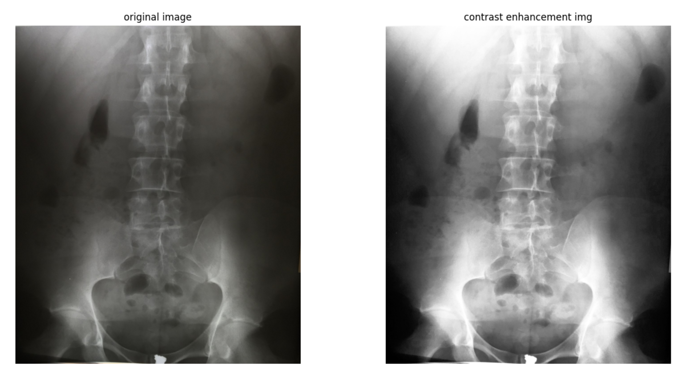

# Contrast enhancement

- Using the [histogram equalization](https://en.wikipedia.org/wiki/Histogram_equalization), we can enhance the contrast in low contrast images. This algorithm uses the cummulative distribution function to map the intensities of a low distribuited histogram into a more spreaded one.

- Implementation of the histogram equalization algorithm for image contrast enhancement.
- It requires the libraries:
  - numpy
  - matplotlib

## Setup instructions

Install the libraries numpy and matplotlib using the following:

> `pip3 install matplotlib`

> `pip3 install numpy`

Inside of the `Contrast enhancement` folder run:

> `python3 contrast_enhancement.py`

## Output

## Author(s)

**Bryan Medina**
