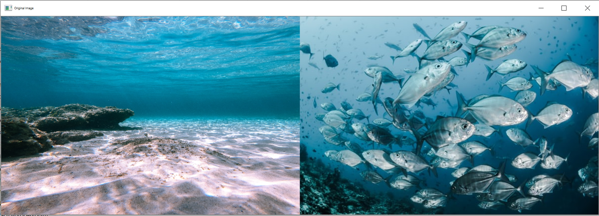
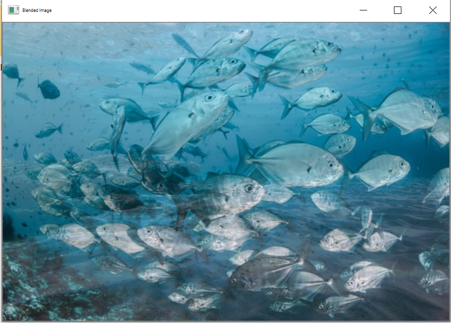
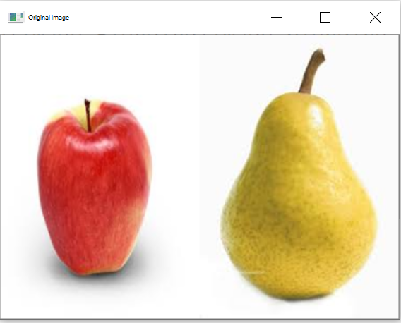
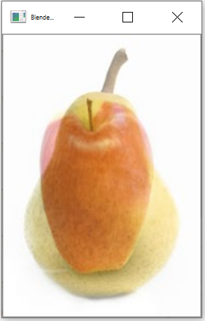

<h1>Image Blending</h1>

  <h2>Description</h2>
  
 Image Blending is an image processing technique where in two input images are mixed together.
    The output image is a combination of the corresponding pixel values of the input images.
    OpenCV is a very mature library and contains many out-of-the-box image processing algorithms.Image Blending can be seamlessly done using OpenCv wherein different weights are given to images so that it gives a feeling of blending or transparency.The function that is used for this is <b>The addWeighted() function</b>.
  

  
OpenCV-Python uses the <b>addWeighted() function</b> to blend images. The function and its parameters are as follows.
    <pre>cv.addWeighted(src1,alpha, src2, beta, gamma[, dst[, dtype]])</pre>
  <ul>
    <li>src1- first input array.</li>
    <li>alpha- weight of the first array elements.</li>
    <li>src2- second input array</li>
    <li>beta- weight of second array elements</li>
  <li>gamma- scalar added to each sum.
    and two optional arguments which are not required for this demonstration.</li></ul>
  

   

  
  

  <h2>How it works?</h2>
  <ul>
  <li>Input any two images that you want to pefrom Blending operation.</li>
  <li>Reading the input images.</li>
  <li>Resizing the images becuase Images have to be of the same size to be added so resize one image to the size of the other before adding.</li>
  <li>Perform Blending operation on the images using addWeighted() function of OpenCv.</li>
  <li>Display the final Blended image</li>
  
  

  

  <h2>Let's Look at the Sample Output</h2>
  
  
  
<b>Blended Image</b>

    
  

    

  
<b>Blended Image</b>

    

  

 
