# ✔ IMAGE CONTOURS CO-ORDINATES
- ### An Image Contours Co-ordinates is an application created in python with tkinter gui and OpenCv library.
- ### In this application user can select any image with some object or shapes in it, and will be able to get all the contours co-ordinates in it.
- ### Also user will be able to see the preview of both original image and the image with contours co-ordinate marked.

****

# REQUIREMENTS :
- ### python 3
- ### tkinter module
- ### filedialog from tkinter
- ### messagebox
- ### from PIL import Image, ImageTk
- ### cv2
- ### numpy

****

# HOW TO Use it :
- ### User just need to download the file, and run the image_contours_co-ordinates.py, on local system.
- ### After running a GUI window appears, where user can start the main application by clicking on the START button.
- ### After that a new GUI window will open, in which user will have buttons like SELECT, ORIGINAL IMAGE, CONTOURS CO-ORD. and EXIT.
- ### User can select any image file with some object or shapes in it from the local system, using SELECT button.
- ### After user has selected image, when user clicks on the ORIGINAL IMAGE and CONTOURS CO-ORD., he/she will be able to see the preview of original image and image with contours co-ordinates marked respectively.
- ### Also there is an EXIT button clicking opn which user can exit from the application.

# Purpose :
- ### This scripts helps user to easily get the all the co-ordinates of all the contours present in the selected image from local system.

# Compilation Steps :
- ### Install tkinter, PIL, cv2, numpy
- ### After that download the code file, and run image_contours_co-ordinates.py on local system.
- ### Then the script will start running and user can explore selecting any image with shapes in it and getting the co-ordinates of all the contours present in it and seeing the preview for the same.

****

# SCREENSHOTS :
****

  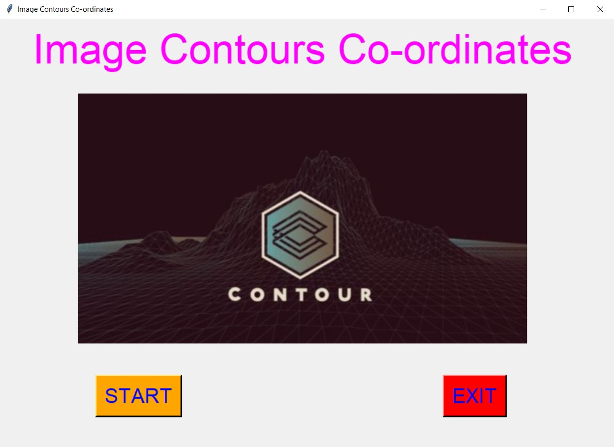 
  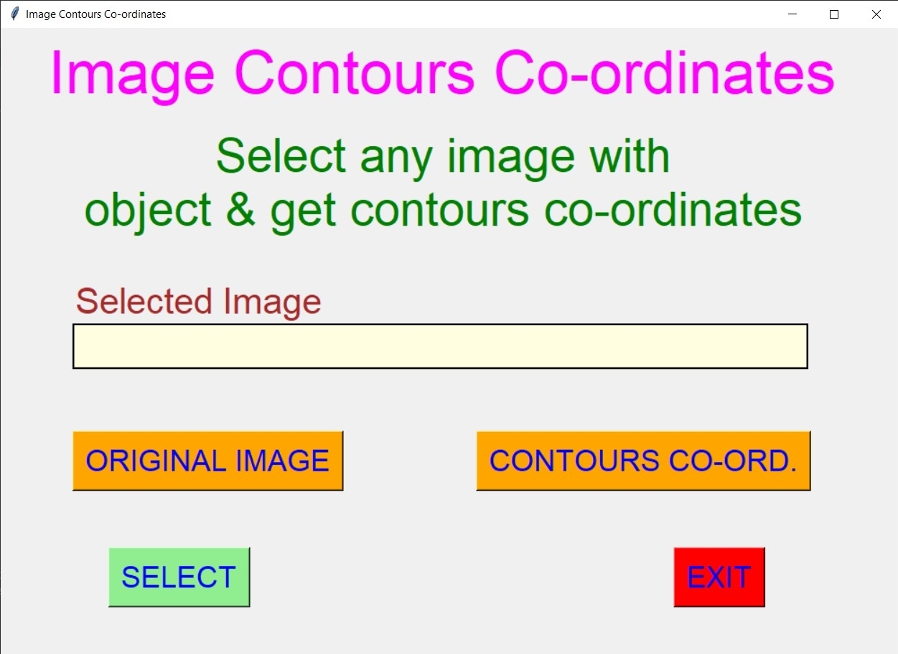 
  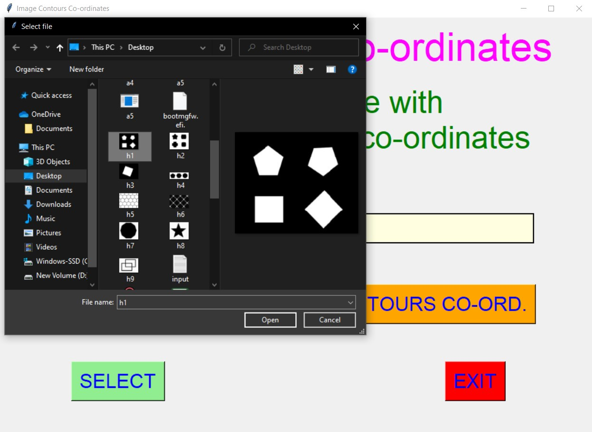 
  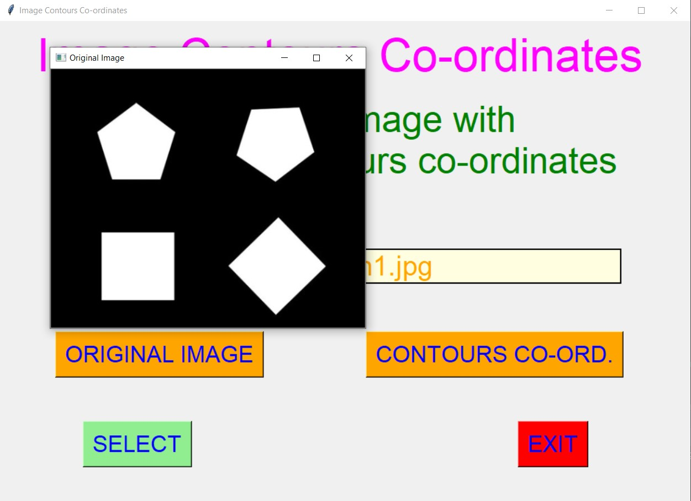 
  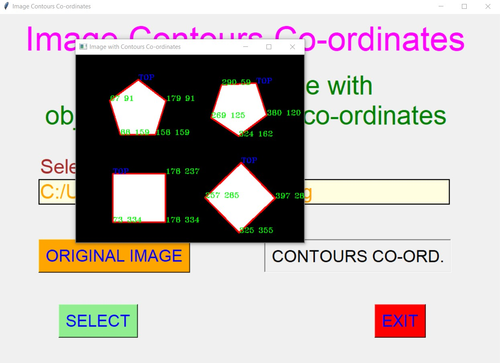 
  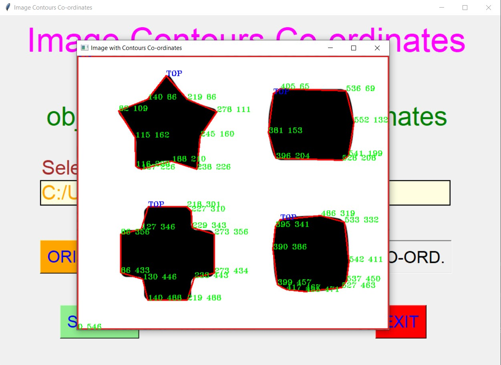 
  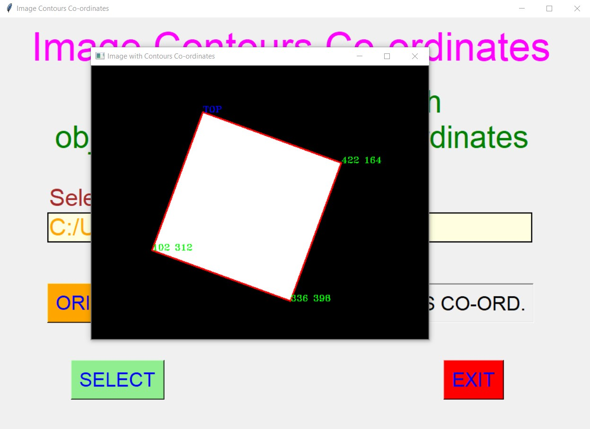 
  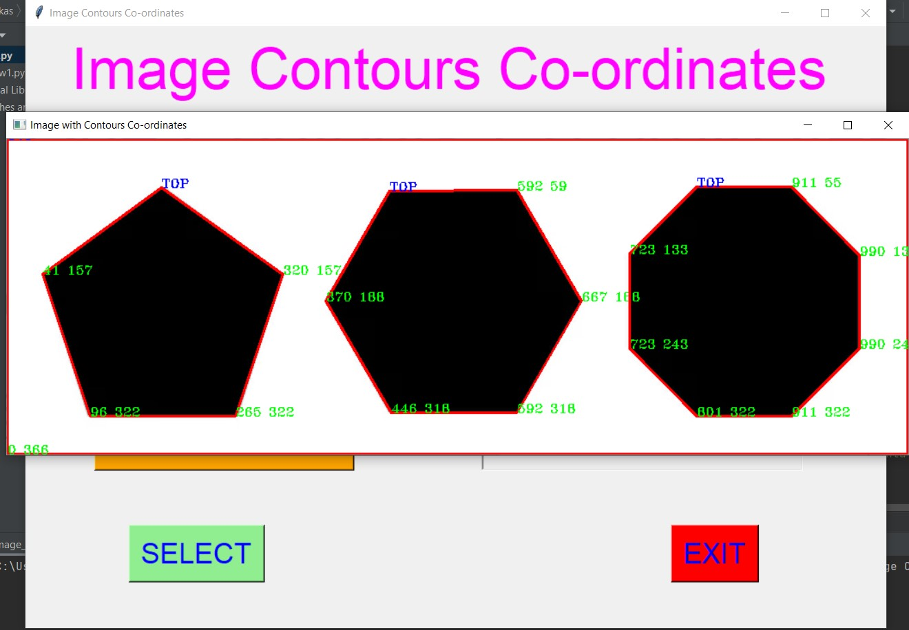 
  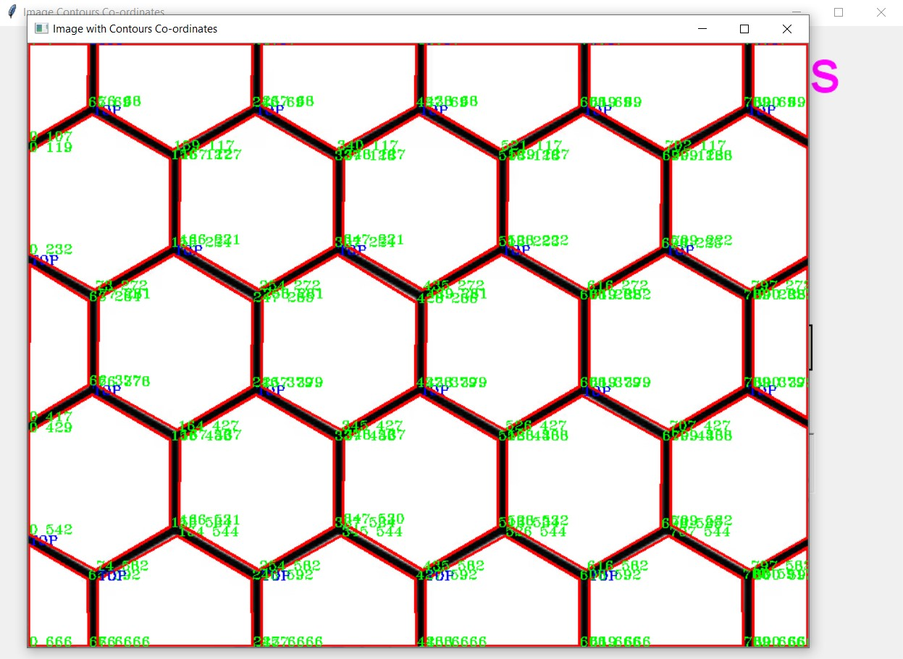 
   
  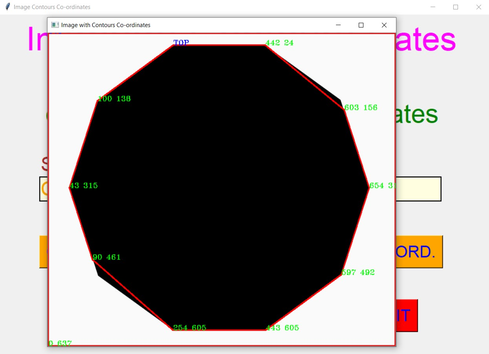 
  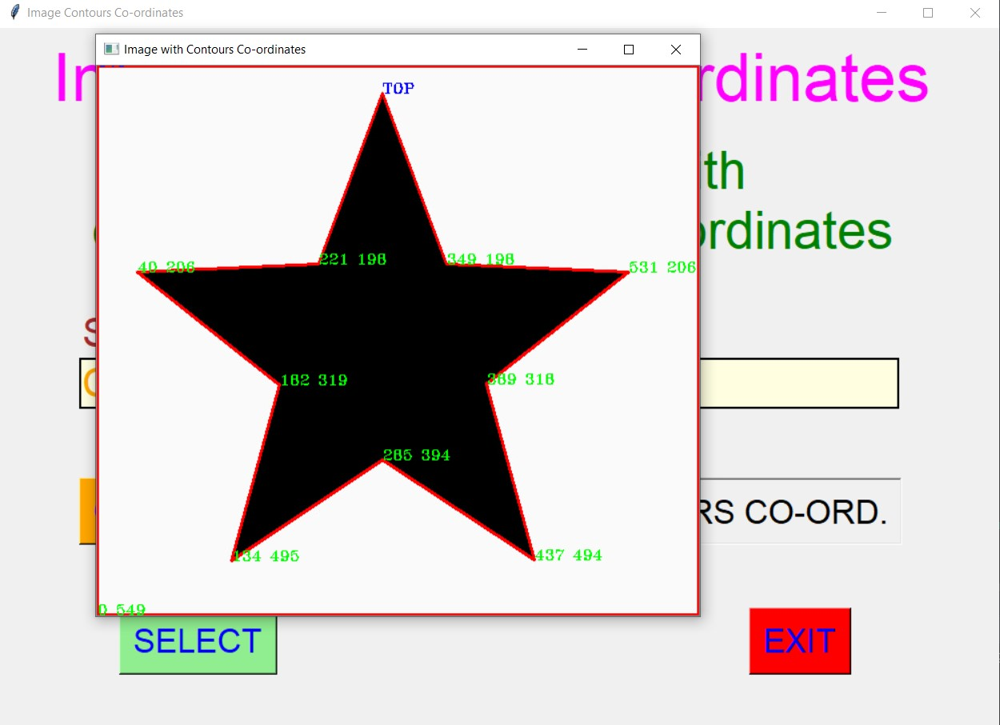 
  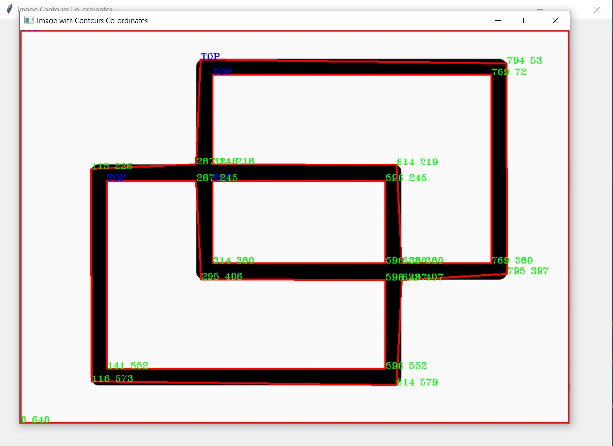 

****

# Name : 
- ### Akash Ramanand Rajak
