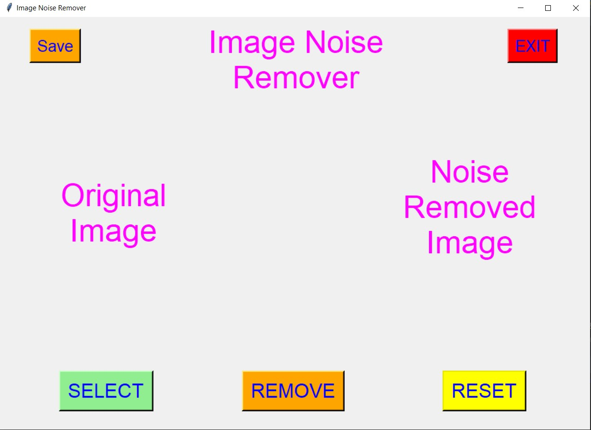
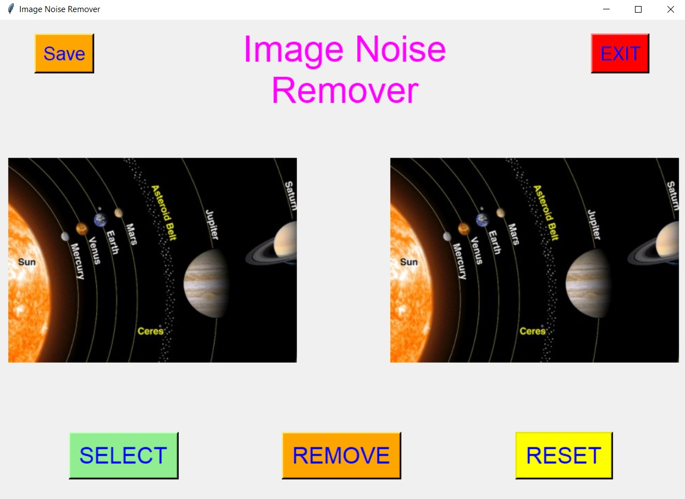
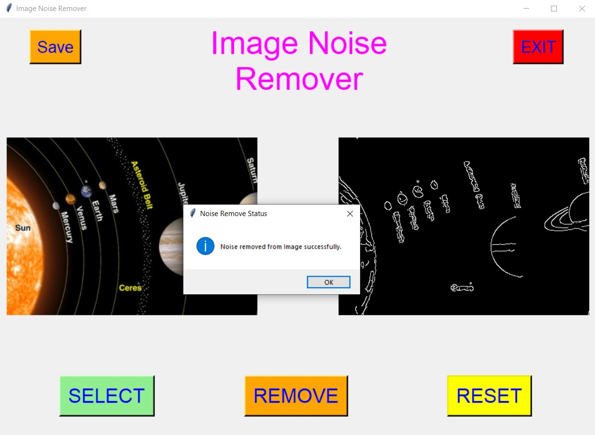
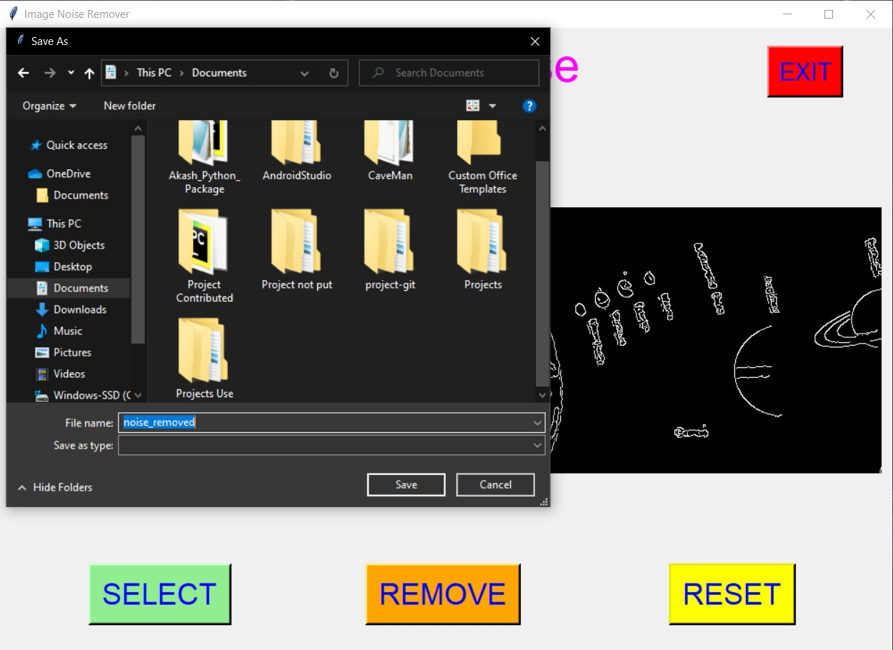
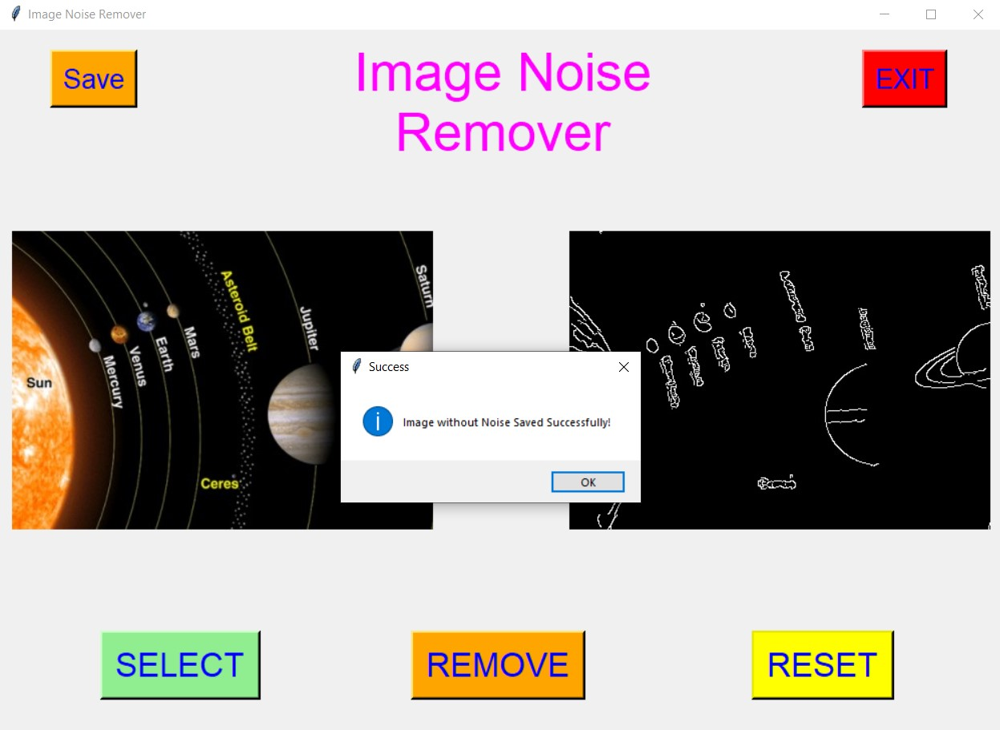
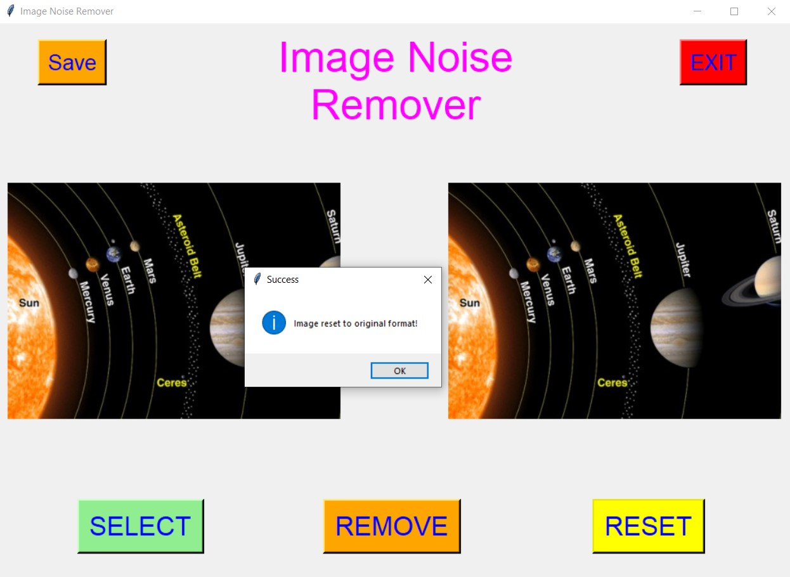
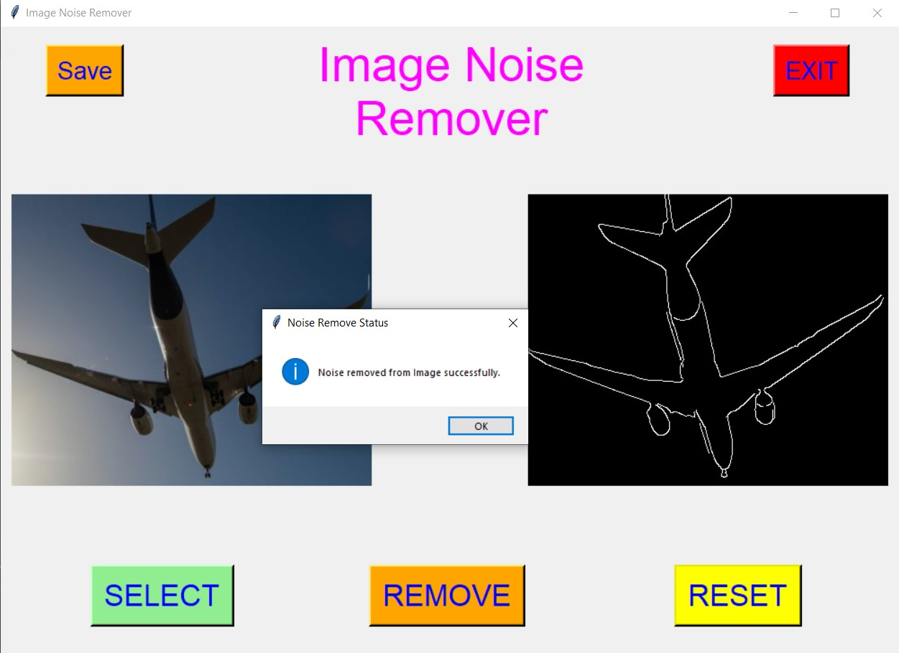
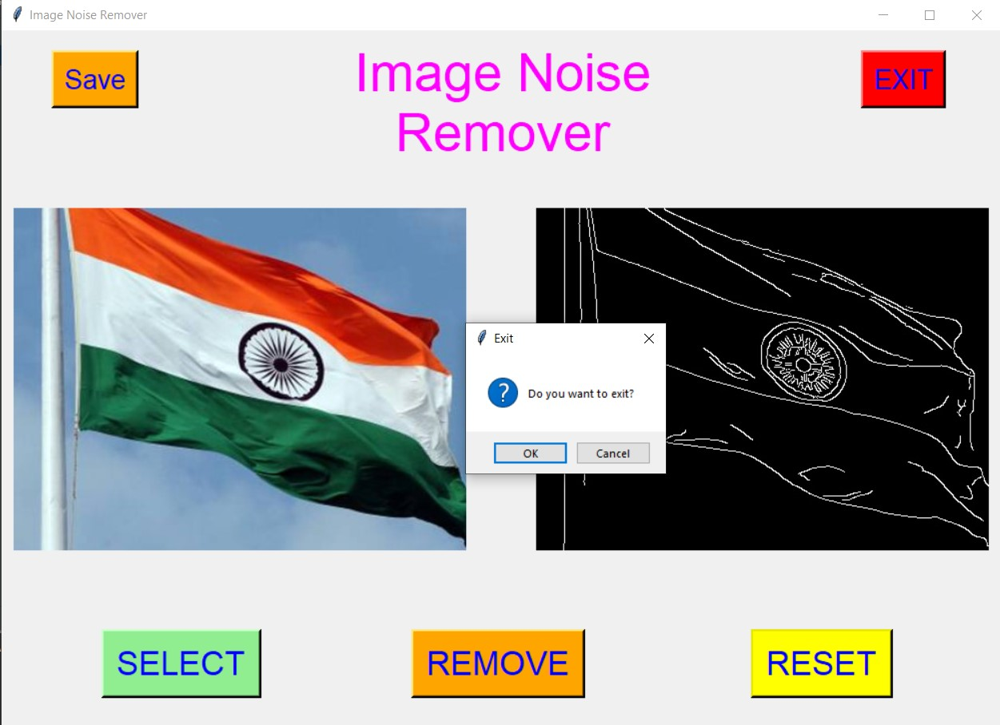

# ✔ IMAGE NOISE REMOVER
- ### An Image Noise Remover is an image processing application created in python with tkinter gui and OpenCv library.
- ### In this application user can select an image and can remove the various noise present in it.
- ### Noise includes different random fluctuation of the colors, random distortion part, etc.
- ### Also after removing noise, user can also save the image without noise anywhere in the local system.
- ### Also there is option to reset to the original image.

****

# REQUIREMENTS :
- ### python 3
- ### os module
- ### cv2 module
- ### tkinter module
- ### filedialog from tkinter
- ### messagebox
- ### from PIL import Image, ImageTk
- ### numpy
- ### random

****

# HOW TO Use it :
- ### User just need to download the file, and run the image_noise_remover.py, on local system.
- ### After running a GUI window appears, where user needs to choose an image file using SELECT button.
- ### After selecting the image, two images will appear on screen one on left side, which is original and one on right in which Noise Removed Image will be shown.
- ### Now user can remove the noise using REMOVE button.
- ### Noise includes different random fluctuation of the colors, random distortion part, etc.
- ### Also after removing noise, user can also save the image without noise anywhere in the local system, using SAVE button.
- ### Also there is a RESET button, clicking on which resets the edited image to original format.
- ### Also there is exit button, clicking on which we get a exit dialog box asking the permission to exit.

# Purpose :
- ### This scripts helps user to remove the any noise present in the image.

# Compilation Steps :
- ### Install tkinter, PIL, numpy, cv2, os, random
- ### After that download the code file, and run image_noise_remover.py on local system.
- ### Then the script will start running and user can explore it by removing noise from any image and saving it.

****

# SCREENSHOTS :
****

   
   
   
   
   
   
   
   
   
   

****

# Name : 
- ### Akash Ramanand Rajak
