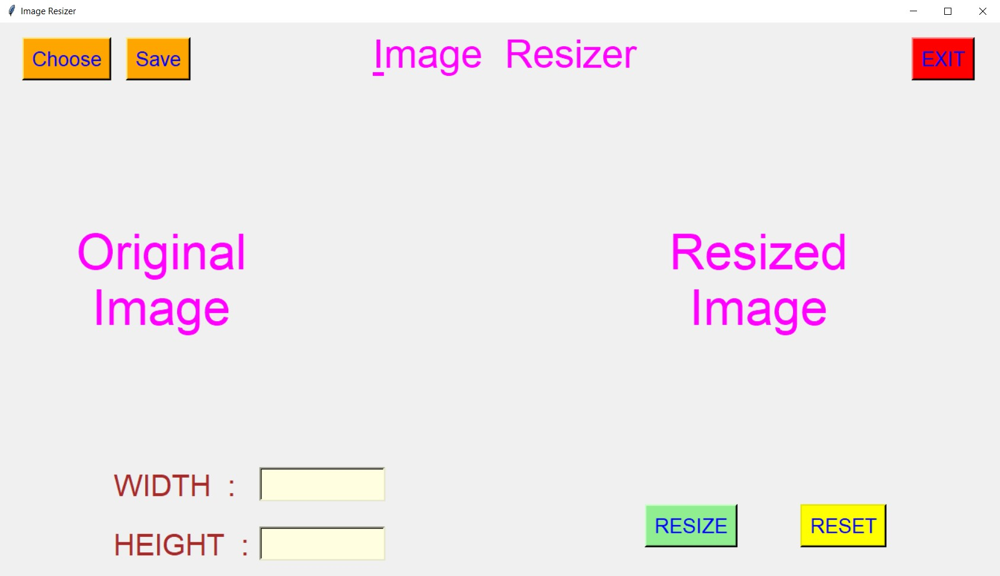
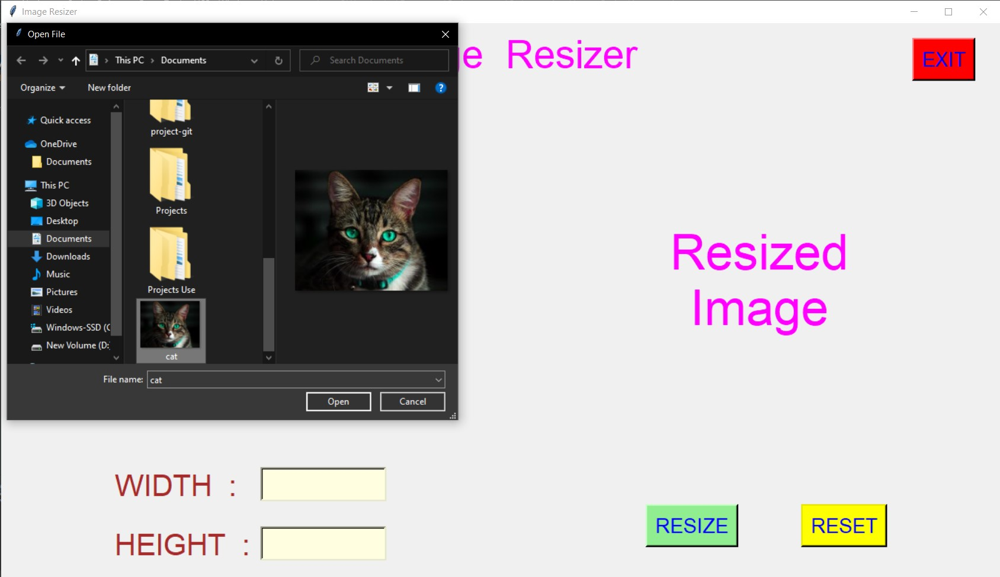
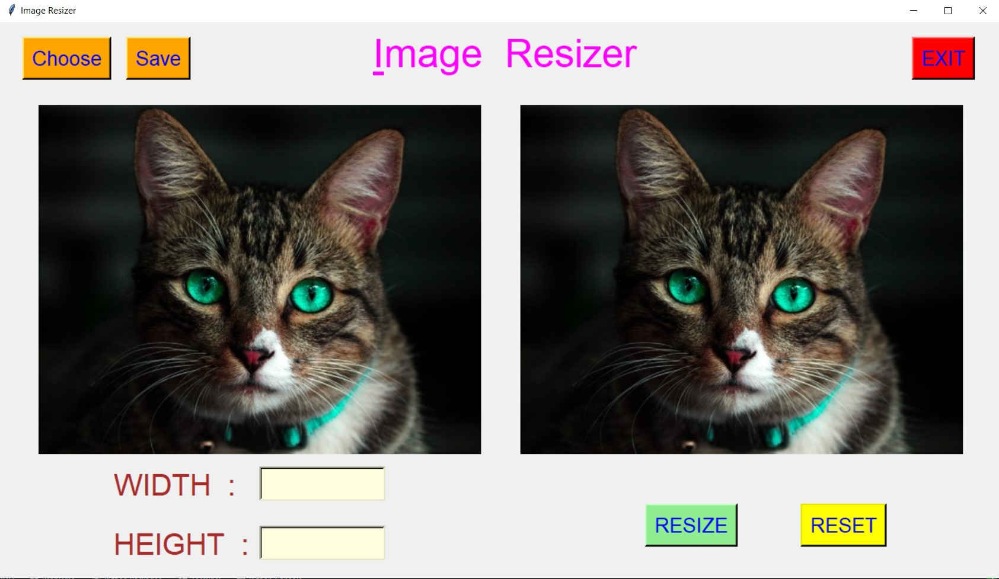
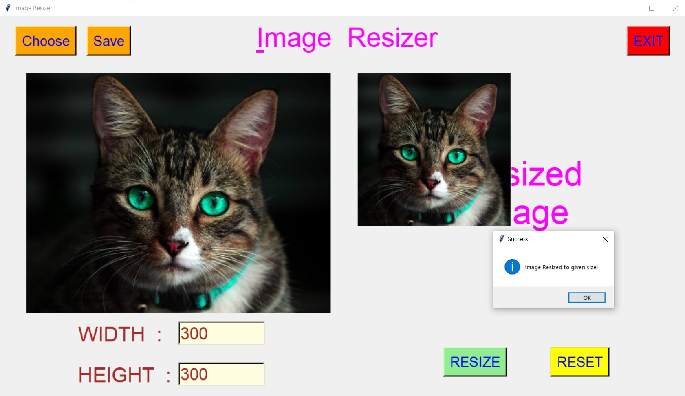
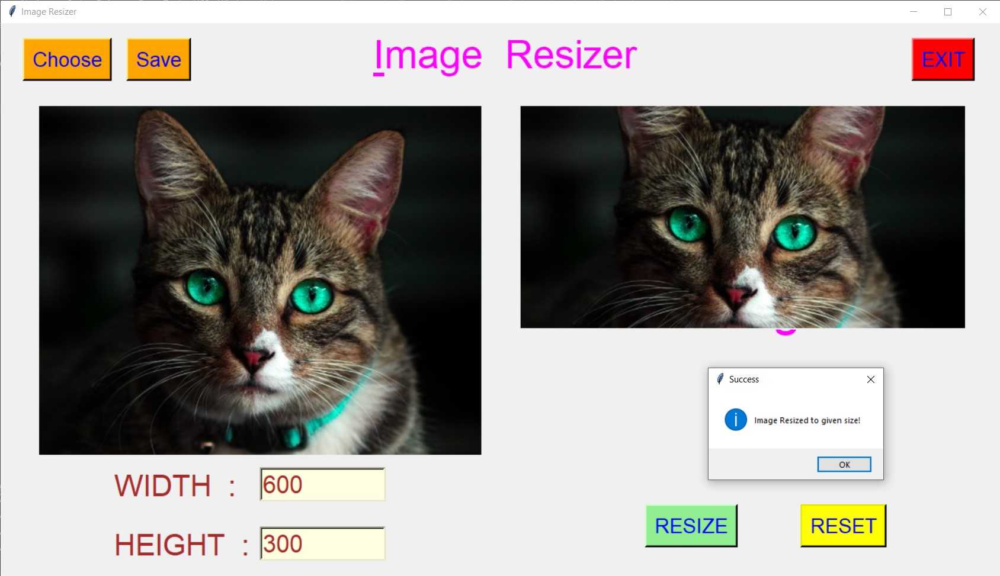
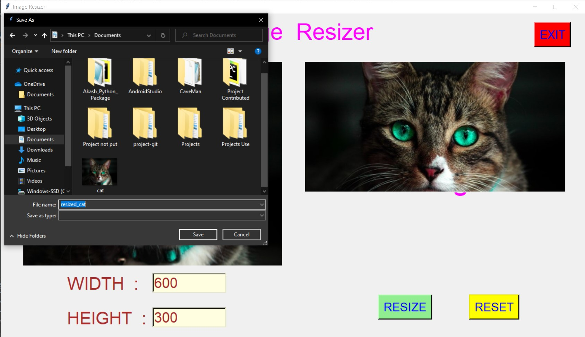
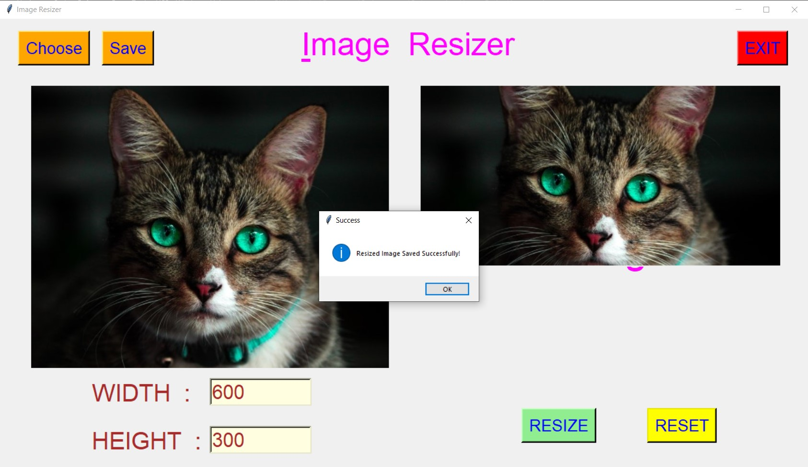
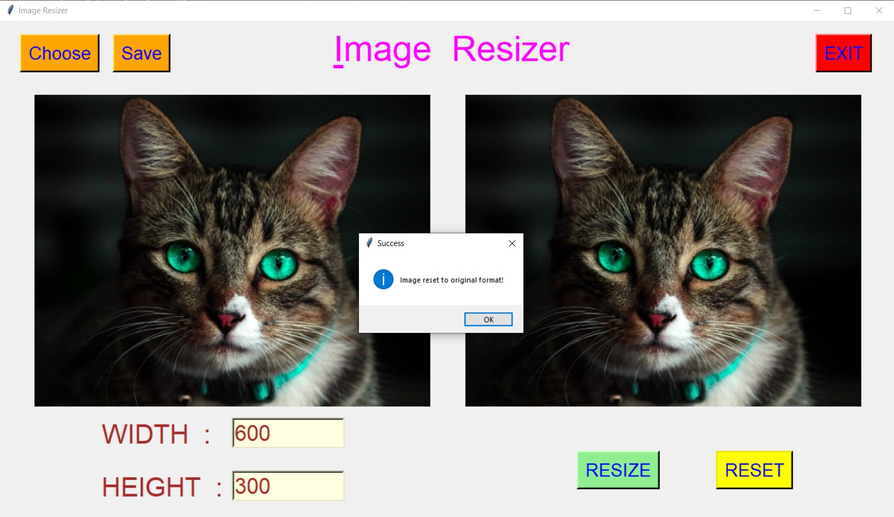
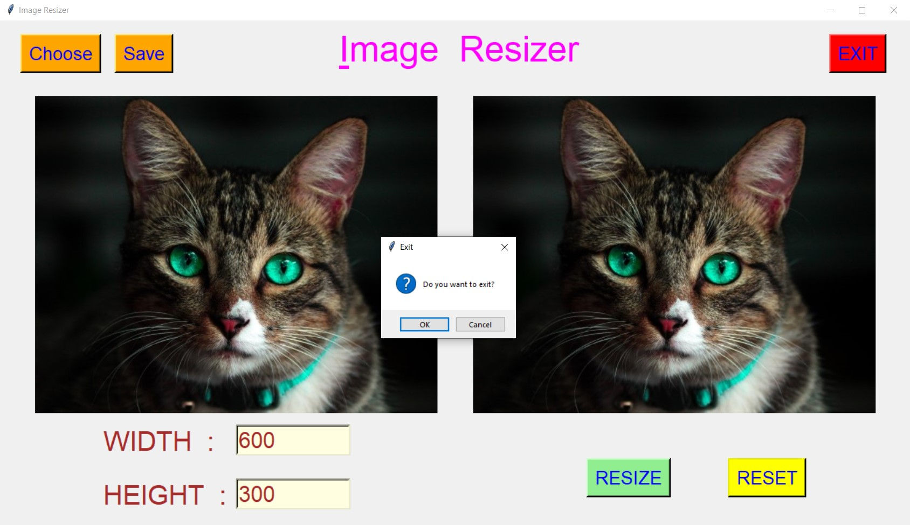

# ✔ IMAGE RESIZER
- ### An Image Resizer is an image processing application created in python with tkinter gui.
- ### In this application user can select any image and can resize it to any size.
- ### Also while resizing user will be able to see both the original image and the resized image.
- ### Also after resizing user can also save it anywhere on the local system.
- ### And if user want to reset to the original size, he/she can also do that using RESET button.

****

# REQUIREMENTS :
- ### python 3
- ### os module
- ### cv2 module
- ### numpy 
- ### random
- ### tkinter module
- ### filedialog from tkinter
- ### messagebox
- ### from PIL import Image, ImageTk, ImageDraw
- ### resizeimage

****

# HOW TO Use it :
- ### User just need to download the file, and run the image_resizer.py, on local system.
- ### After running a GUI window appears, here user can choose any image from the local system using CHOOSE button.
- ### After choosing the image, user will be able to see two image on GUI window, one for showing original size and second for showing the resized image.
- ### Now user can enter the width and height of the resized image hw/she wants in the entry box, and click on RESIZE button.
- ### Clicking on that will resize the image accordingly and shows the resized image on the right side part of GUI Window.
- ### After resizing use can also save the resized image to any place on local system using SAVE button.
- ### Also if user wants to reset to the original size, he/she can also do that using RESET button.
- ### Also there is exit button, clicking on which we get a exit dialog box asking the permission to exit.

# Purpose :
- ### This scripts helps us to easily resize the selected image to any width and height.

# Compilation Steps :
- ### Install python3, tkinter, pandas, os, cv2, PIL, resizeimage
- ### After that download the code file, and run image_resizer.py.py on local system.
- ### Then the script will start running and user can explore more by selecting image and resizing it to any width and height.

****

# SCREENSHOTS :

****

   
   
   
   
   
   
   
   
   

****

# Author : 
- ### Akash Ramanand Rajak
