# ✔ IMAGE SEGMENTATION
- ### An Image Segmentation is an image processing application created in python with tkinter gui and OpenCv library.
- ### In this application user can select an image or any texture, will be able to marks that image with segments present.
- ### Also after segmenting user can also save the segmented image anywhere in the local system.

****

# REQUIREMENTS :
- ### python 3
- ### os module
- ### cv2 module
- ### tkinter module
- ### filedialog from tkinter
- ### messagebox
- ### from PIL import Image, ImageTk
- ### numpy
- ### random

****

# HOW TO Use it :
- ### User just need to download the file, and run the image_segmentation.py, on local system.
- ### After running a GUI window appears, where user can see button like START and EXIT.
- ### After user clicks on the START button a main application wilndow will appear, where user needs to choose an image file using SELECT button.
- ### After selecting the image, two images will appear on screen one on left side, which is original and one on write in which Segmented format will be shown.
- ### Now user can start segmentation of selected image using SEGMENT button.
- ### After segmenting user can also save the segmented image to any location in local system using SAVE button.
- ### Also there is exit button, clicking on which we get a exit dialog box asking the permission to exit.

# Purpose :
- ### This scripts helps user to easily segment the any image with texture in it and mark the texture segment in dark black color.

# Compilation Steps :
- ### Install tkinter, PIL, numpy, cv2, os, random
- ### After that download the code file, and run image_segmentation.py on local system.
- ### Then the script will start running and user can explore it by selecting any image with texture and segmenting it.

****

# SCREENSHOTS :
****

  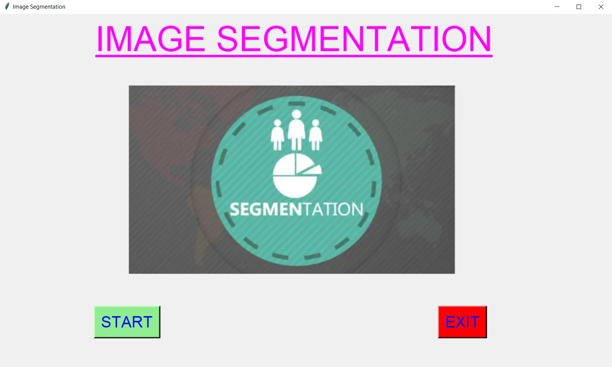 
  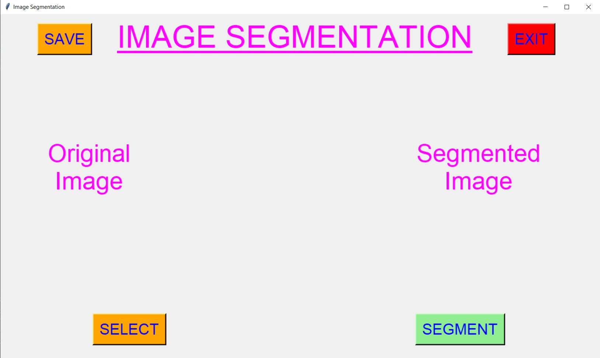 
  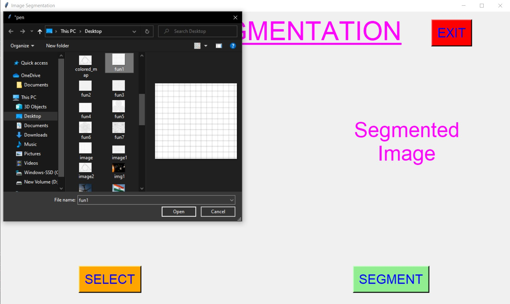 
  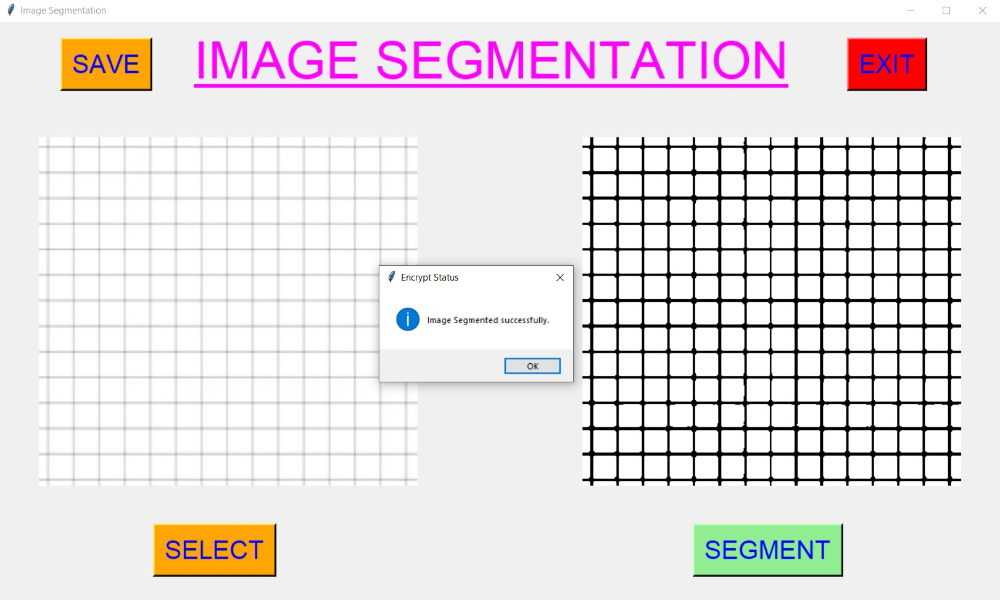 
  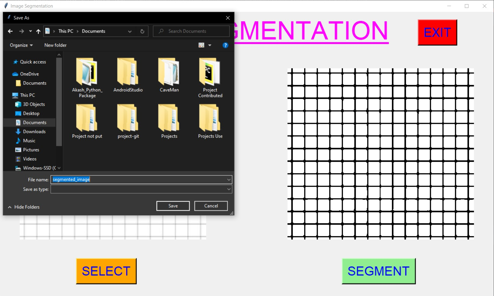 
  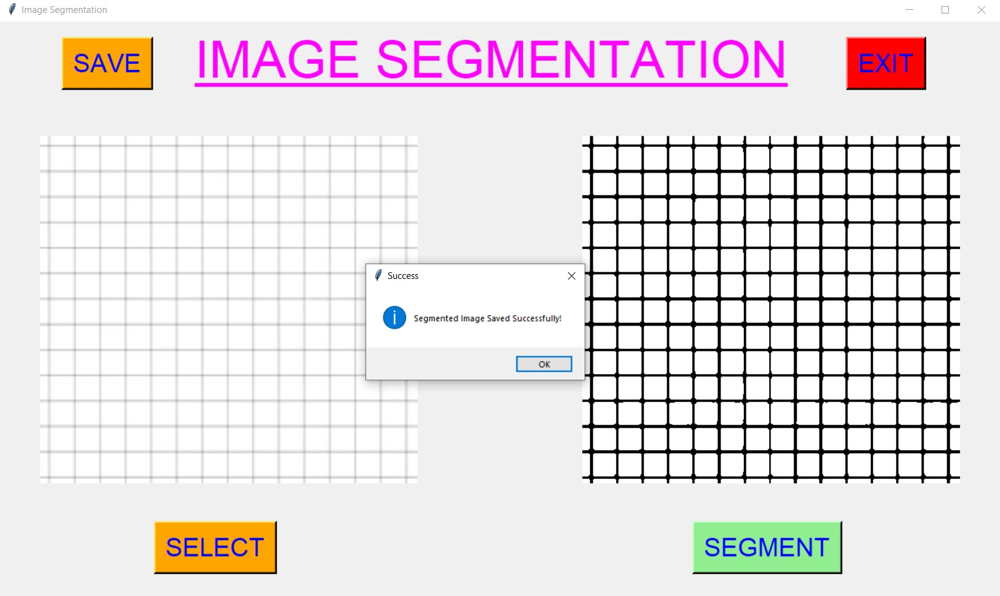 
  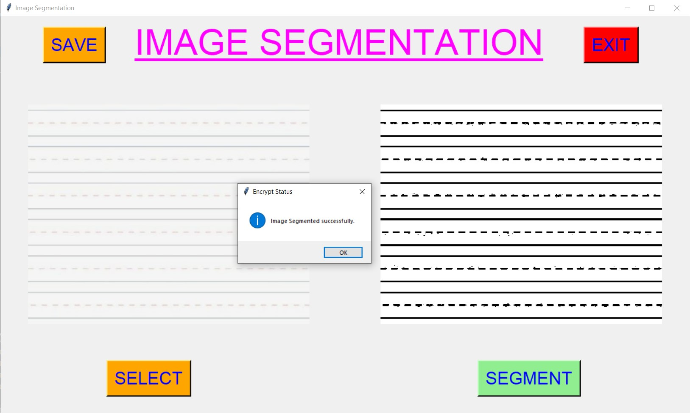 
  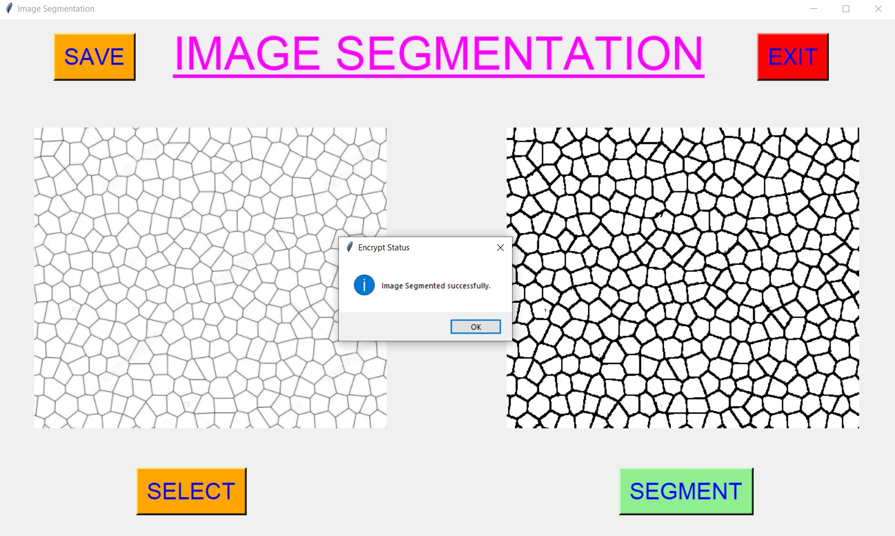 
  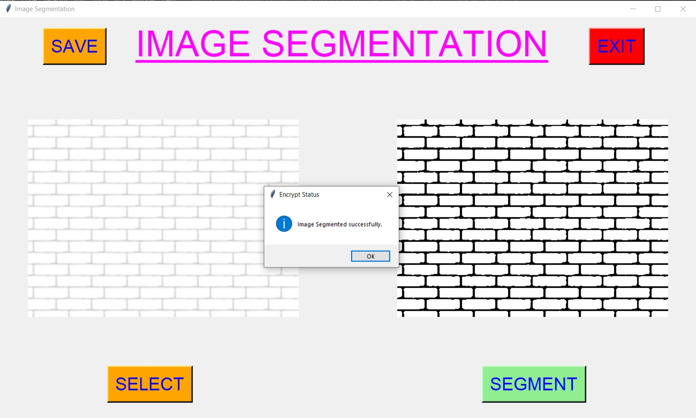 
  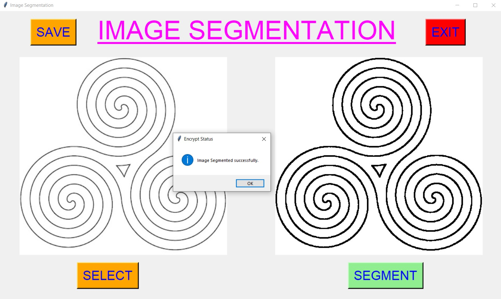 
  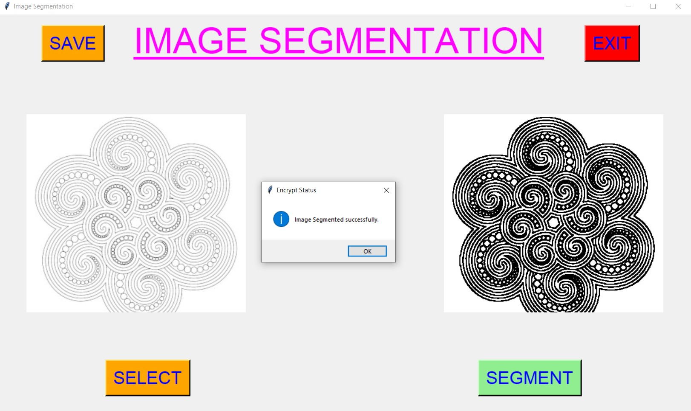 
  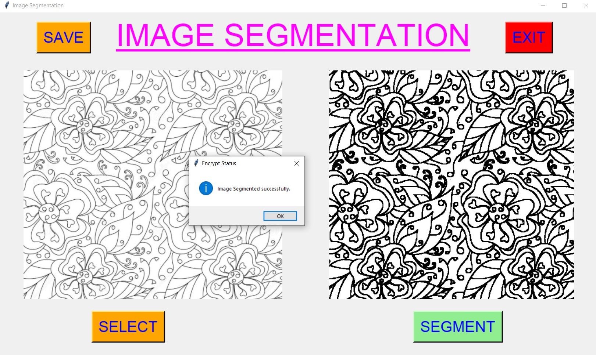 

****

# Name : 
- ### Akash Ramanand Rajak
