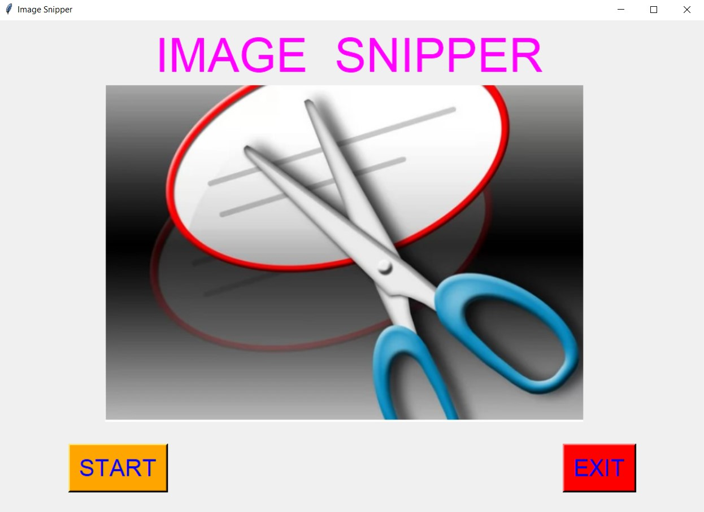
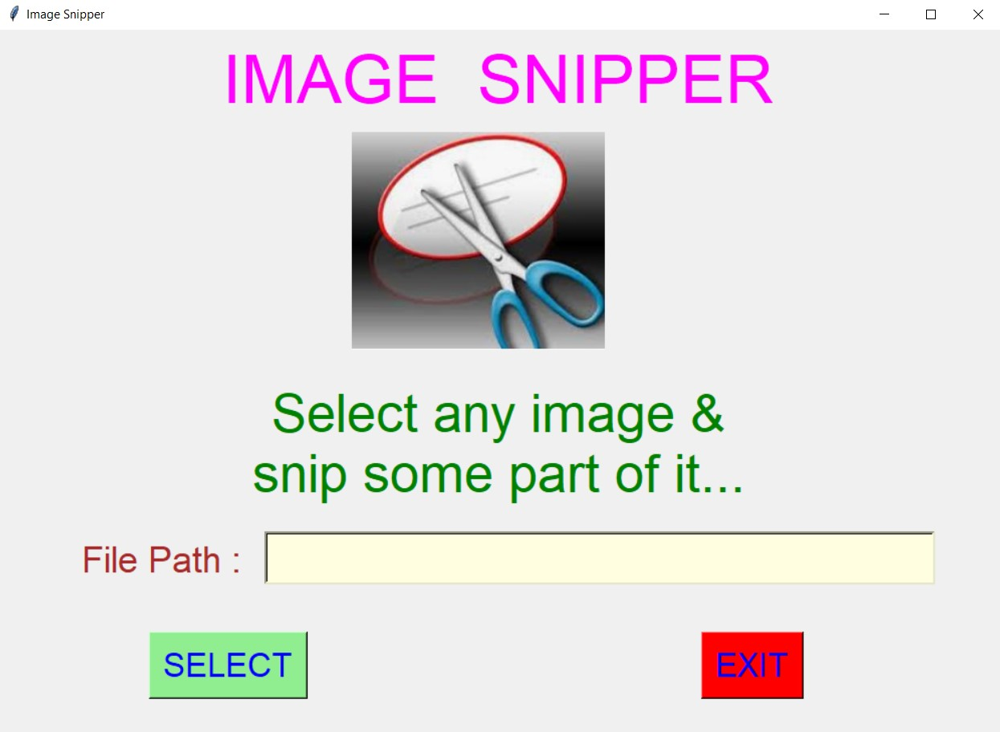
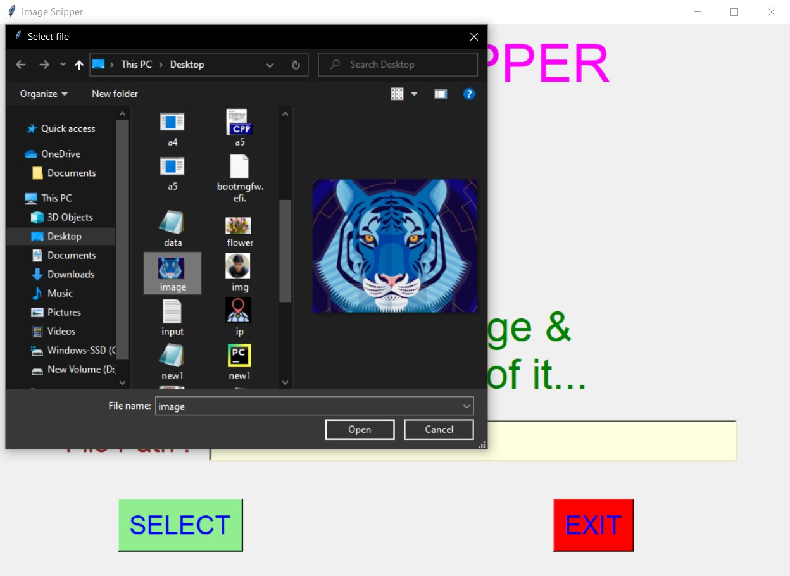
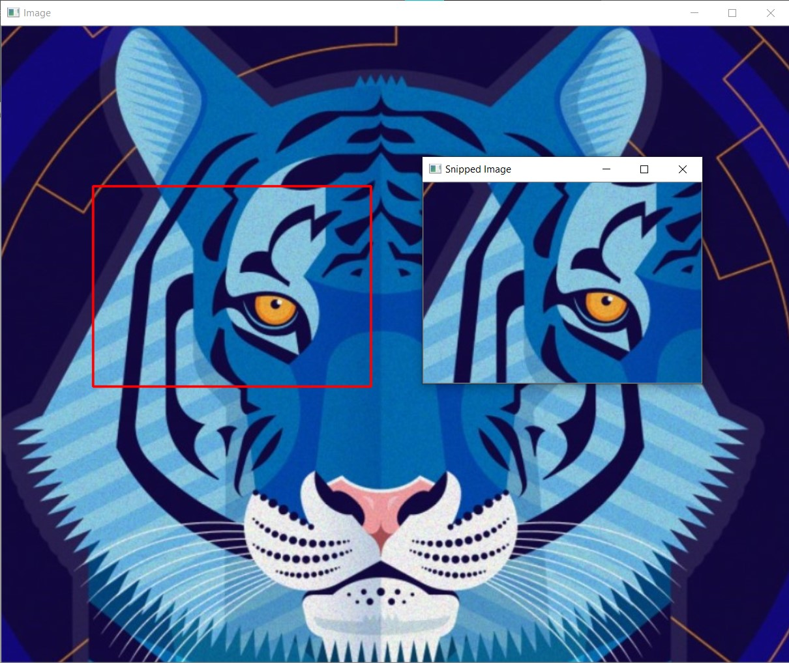
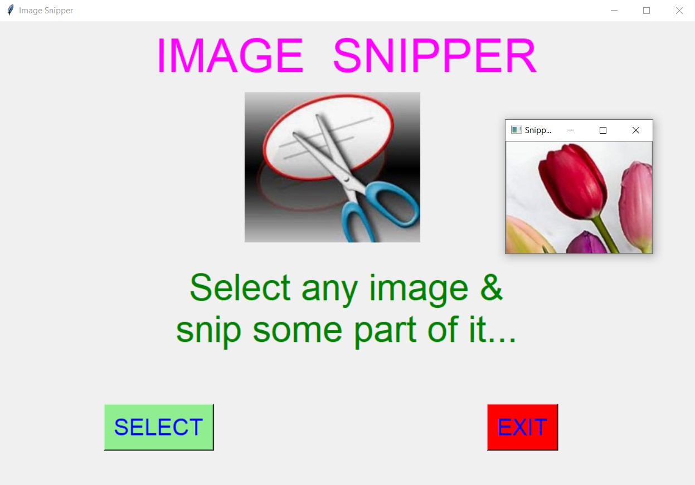
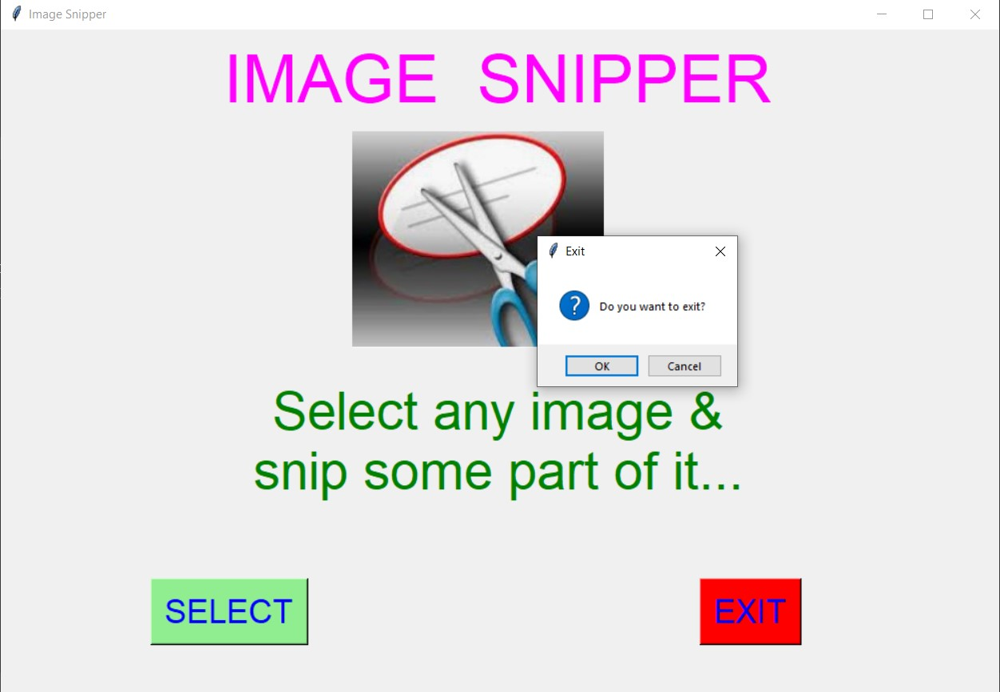

# ✔ IMAGE SNIPPER
- #### An IMAGE SNIPPER is an application created in python with tkinter gui and OpenCv library.
- #### In this application user can select any image and will be able to snip any specific part of that selected image.
- #### Also after snipping, user will also be shown the preview of the snipped image.
- #### User can also save that snipped image any where on local system by using save command.
- #### For implementing this used OpenCv library.

****

# REQUIREMENTS :
- #### python 3
- #### cv2 module
- #### tkinter module
- #### filedialog from tkinter
- #### messagebox
- #### from PIL import Image, ImageTk
- #### numpy

****

# HOW TO Use it :
- #### User just need to download the file, and run the image_snipper.py, on local system.
- #### After running a GUI window appears, where user can start the video player by clicking on the START button.
- #### After that a new GUI window will open, in which user will have buttons like SELECT and EXIT.
- #### User can select any image file from the local system, using SELECT button.
- #### After that user will be able to see the '+' sign arrow pointer, using which user can hold it and select the specific part of the image to be snipped.
- #### When user leaves the holded pointer, he/she will be previewed with the snipped image in the new window.
- #### User can also save that snipped image any where on local system by using save command.

# Purpose :
- #### This scripts helps user to easily snip any specific part of the image user wants and save it.

# Compilation Steps :
- #### Install tkinter, PIL, cv2, numpy
- #### After that download the code file, and run image_snipper.py on local system.
- #### Then the script will start running and user can explore it by selecting any image and snipping it.

****

# SCREENSHOTS :
****

   
   
   
   
   
   
   

****

# Name : 
- ### Akash Ramanand Rajak
