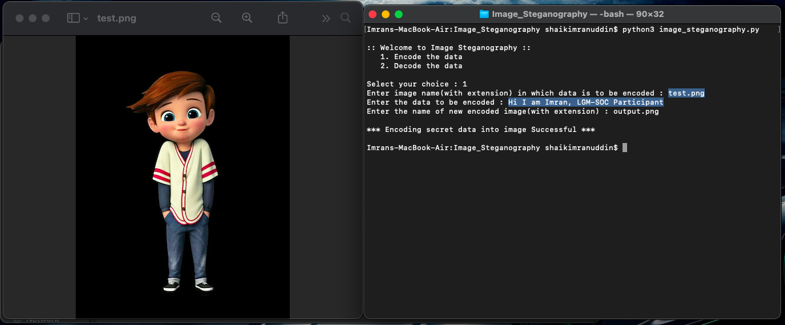

  
# Image Steganography

## Description

Image Steganography refers to the process of hiding data within an image file. The image selected for this purpose is called the cover-image and the image obtained after steganography is called the stego-image.

### How it is done?

The idea behind Image Steganography is simple. Images are composed of digital data (pixels), which describes what’s inside the picture, usually the colors of all the pixels. Since we know every image is made up of pixels and every pixel contains 3-values (red, green, blue). In image steganography, a message is embedded into an image by altering the values of some pixels, which are chosen by an encryption algorithm. The recipient of the image must be aware of the same algorithm in order to known which pixels he or she must select to extract the message.

Every byte of data is converted to its 8-bit binary code using ASCII values. Now pixels are read from left to right in a group of 3 containing a total of 9 values. The first 8-values are used to store binary data. The value is made odd if 1 occurs and even if 0 occurs.
To decode, three pixels are read at a time, till the last value is odd, which means the message is over. Every 3-pixels contain a binary data, which can be extracted by the same encoding logic. If the value if odd the binary bit is 1 else 0.

## Library imported :

Image library of Python Imaging Library(PIL) module - is used to extract pixels of image

## Output :
Encoding Screenshot:

Decoding Screenshot:

## Author : Shaik Imranuddin 

