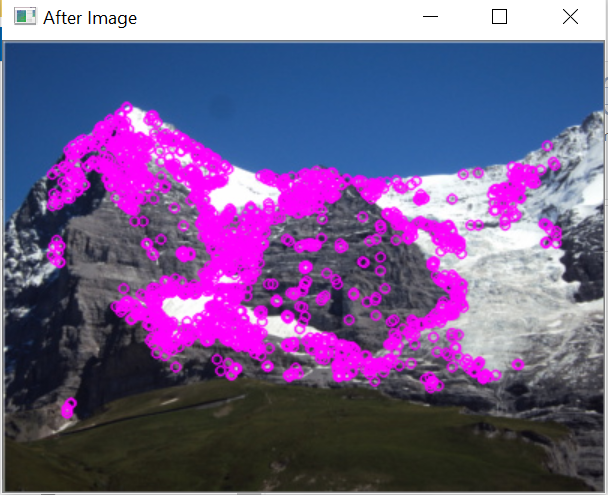
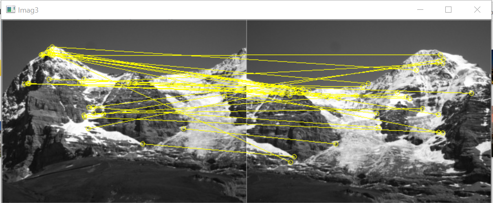
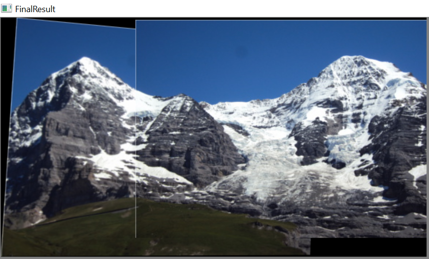
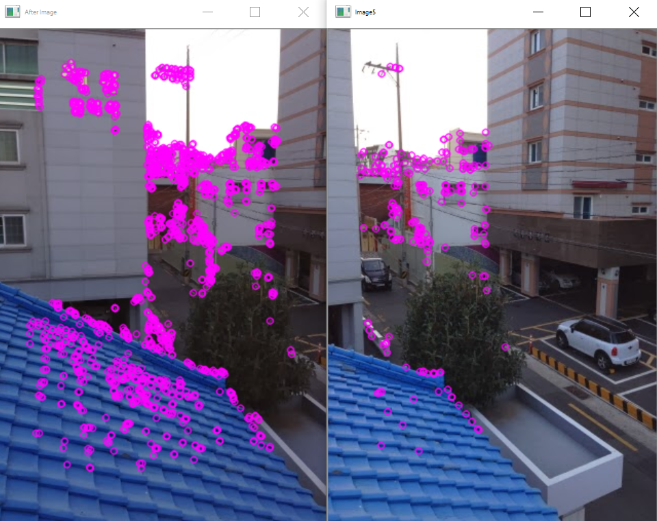
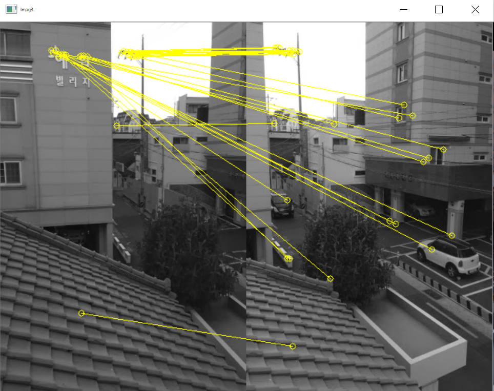
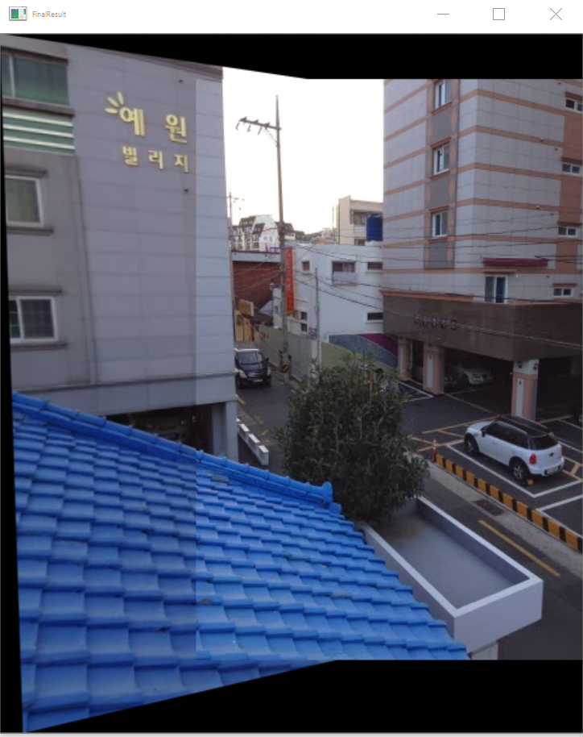

<h1>Image Stitching</h1>

 Image Stitching is one of the technique wherein we have several images with overlapping areas. 
  The output is a unification of these images. 
  It is important to note that a full scene from the input image must be preserved in the process.
  We use scale invariant features transform(SIFT) to extract local features of the input images,
  K nearest neighbors algorithms to match these features and Random sample consensus(Ransac) to calculate the homograph matrix, 
  which will be used for image warping. Finally we apply a weighted matrix as a mask for image blending.

  <h2>Workflow of the Algorithm</h2>
  <li>Input any image that you need to Perform image stitching.</li>
  <li>Once the images are read,we need  to extract distinctive keypoints from the image using different feature detection algorithms (SIFT, SURF, ORB).
       In this,I have used ORB algorithm from OpenCv for feature detection.</li>
  <li>After we specify the number of keypoints that we want to detect we will detect keypoints and descriptors in both images 
    using the function<b> orb.detectAndCompute()</b> provided by OpenCv.</li>
  <li>Once we have extracted the features, the next step is to match these features between our two images.In this, I have used Brute Force matcher to match the descriptors.</li>
  <li>Next step is to computing homography matrix by applying RANSAC algorithm. Then, we will use this matrix to calculate the warping transformation based on matched features.</li>
  <li>Once the wrapping function is done, our images are ready to stitch and you will get a seamless panaromic image of the two input images after stitching</li>
  

  <h2>Sample Images <h2>
  

  
Demo 1

             
  
 Detecting Points

    
  
Matching Points

    
  
Stitched Image

    
  

  

    
.Demo 2

               
    
 Detecting Points

    
    
Matching Points

    
     
Stitched Image

    
  

  
