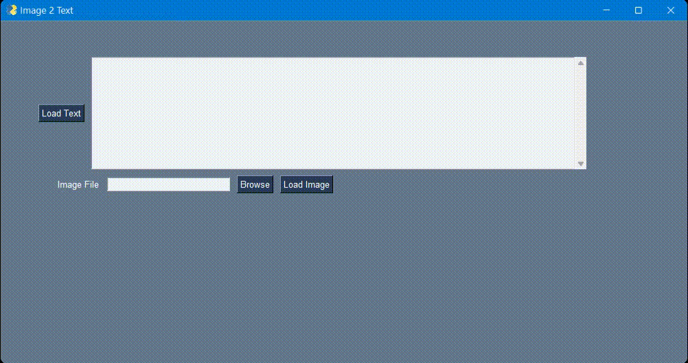

<div align="center">

# Image to Text Conveter in python

</div>


## Aim

The main aim of the project is to provide a GUI interface for the uploading an image and extracting the text present in the image

## Prerequisites

- [Tesseract-OCR](https://tesseract-ocr.github.io/tessdoc/Home.html#500x) should be installed on your system


## Purpose

For use of Optical Character Recognision in the text extraction from an image

## Description

This project is a desktop app which load the text that is included in the image.
Libraries used:
- Pillow
- PySimpleGUI
- pytesseract    


## Workflow of the Project

### `main()` function

The UI is defined under the main function which is called when the window is initialize. The main function contains the:
- Layout for the application
- A loop for checking for events on the window (until the window is terminated)

### `window.read()` function

The `window.read()` function listens to:
- events that happen on the application window
- values from specific keys

### Keys

Keys are given to the ui elements as ids in html. Thus, values in the code is the collection (more like a dictionary for the window) and contains key value pairs as:
```py
values = {
    keys: 'some value'
}
```

for ex.
```py
values = {
    "-FILE-": "path/to/file"
}
```

The values are accessed in the similar fashion ( *(key, value) pairs where the key is the id of the ui element and value is the innerValue of the element*  ) in the entire application.

### Layout

This is straight forward.
- a 1-D list is row
- a 2-D list is a column

```py
layout = [
    [
        [row1, col1],[row1, col2],
    ]
    [
        [row2, col1],[row2, col2]
    ],
]
```

### `ocr_core(filename)` function

This function need two things in place to work properly:
- The Tesseract-OCR path should be given properly (see the setup point 4)
- The file that is given should exisit on the computer at the given path

Next is all handled by the `pytesseract.image_to_string()` function which provided by the *pytesseract* module


## Setup instructions

1. Intitialize a virtual-environment in the directory.
1. now activate the env by 
    - `./env/Scripts/activate` on windows
    - `source env/bin/activate` on Linux and Mac
1. Then after, install the dependencies by running `pip install requirements.txt`
1. Now go and replace your tesseract-OCR path on the **line 18** of the `image_to_text_converter.py` file
1. Now simply run the code by `python image_to_text_converter.py`


### Output

If we have an image such as:
<div align="center">


</div>

The output will be the extracted text:
```
You will face many defeats in
life, but never let yourself be
defeated.

MAYA ANGELOU
```



## Conclusion

Thus in this way we have used the pytesseract module and the OCR to detect characters in the given image. This project uses PySimpleGUI which is a simpler yet elegant way for making ui in python.

## Author

Nirbhay Chaplot
