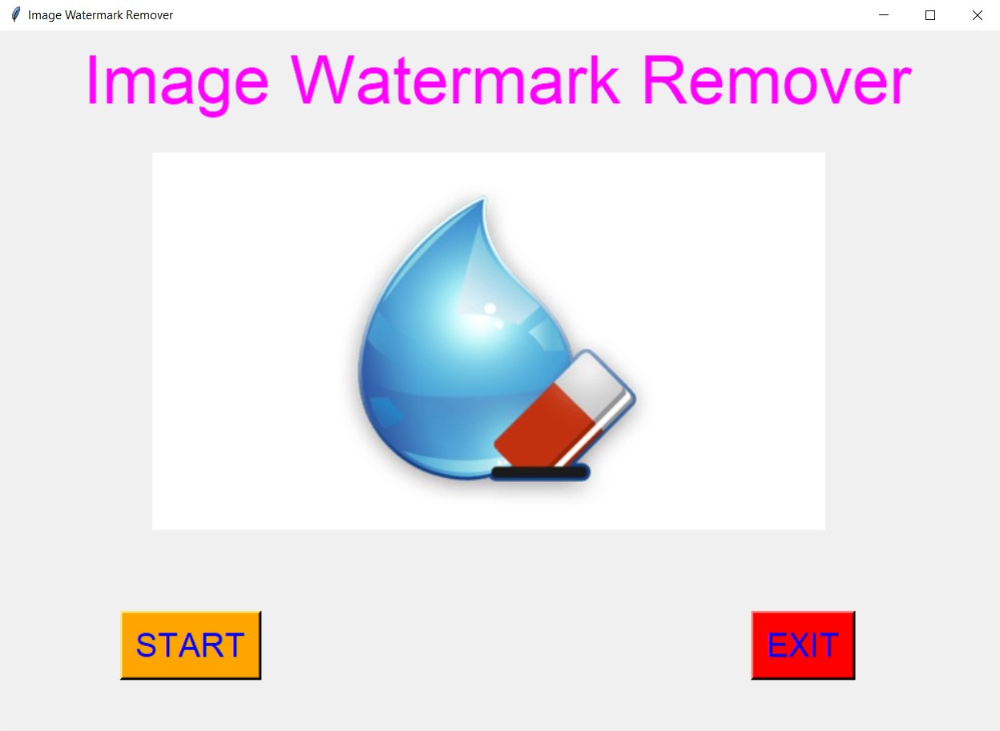
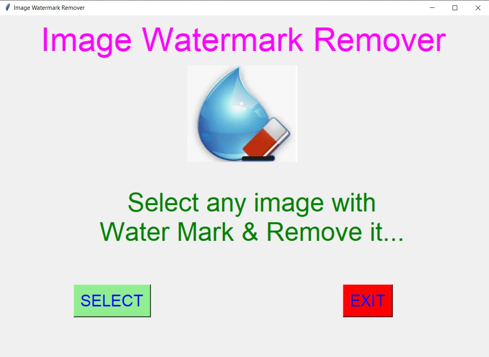
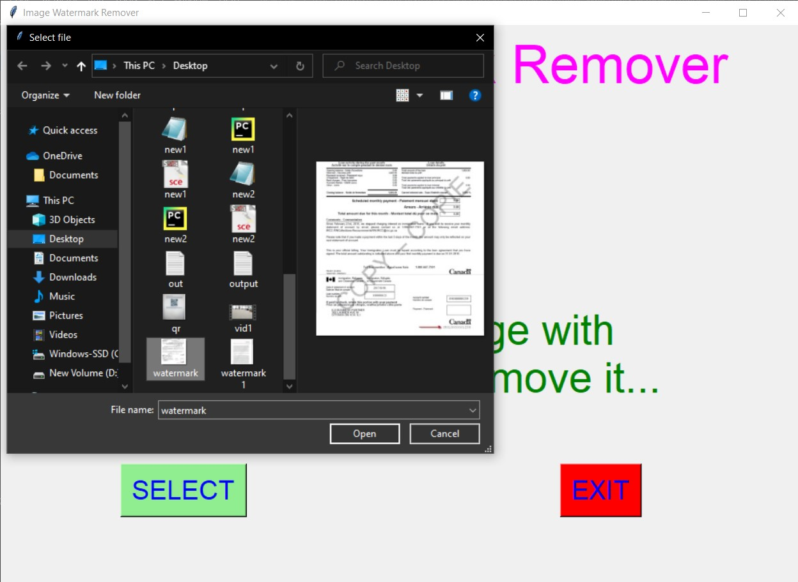
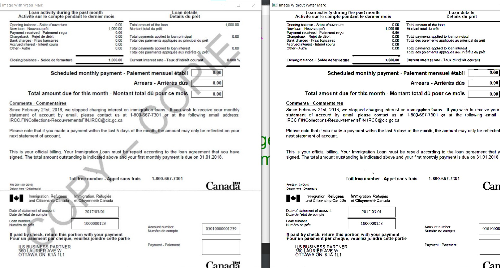
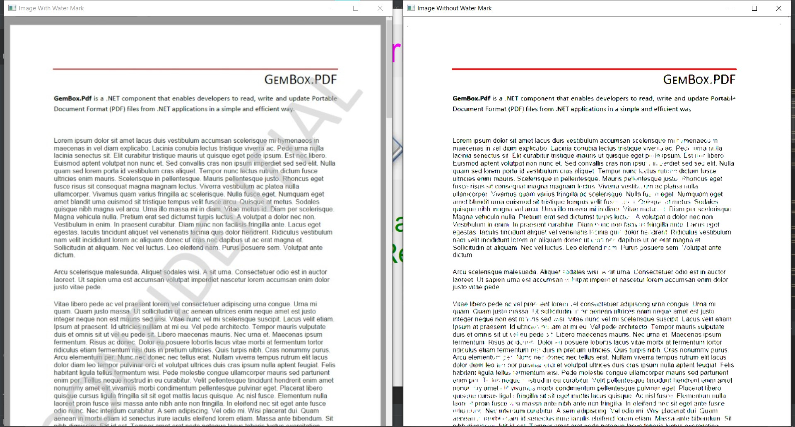
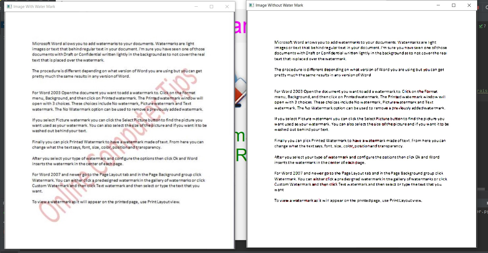

# ✔ IMAGE WATERMARK REMOVER
- #### An Image Watermark Remover is an application created in python with tkinter gui and OpenCv library.
- #### In this application user can select any image with watermark in it and will be able to remove the watermark from that selected image.
- #### Also user will be shown both the image with watermark and the image without watermark as an output.
- #### User can also save that snipped image any where on local system by using save command.
- #### For implementing this used OpenCv library.

****

# REQUIREMENTS :
- #### python 3
- #### cv2 module
- #### tkinter module
- #### filedialog from tkinter
- #### messagebox
- #### from PIL import Image, ImageTk

****

# HOW TO Use it :
- #### User just need to download the file, and run the image_watermark_remover.py, on local system.
- #### After running a GUI window appears, where user can start the application of removing watermark by clicking on the START button.
- #### After that a new GUI window will open, in which user will have buttons like SELECT and EXIT.
- #### User can select any image file with watermark in it from the local system, using SELECT button.
- #### After that user will be able to see both the image with watermark and image without watermark as an output.
- #### User can also save that image without watermark any where on local system by using save command.

# Purpose :
- #### This scripts helps user to easily remove the water mark present in the image.

# Compilation Steps :
- #### Install tkinter, PIL, cv2
- #### After that download the code file, and run image_watermark_remover.py on local system.
- #### Then the script will start running and user can explore it by selecting any image with watermark in it and removing it.

****

# SCREENSHOTS :
****

   
   
   
   
   
   

****

# Name : 
- ### Akash Ramanand Rajak
