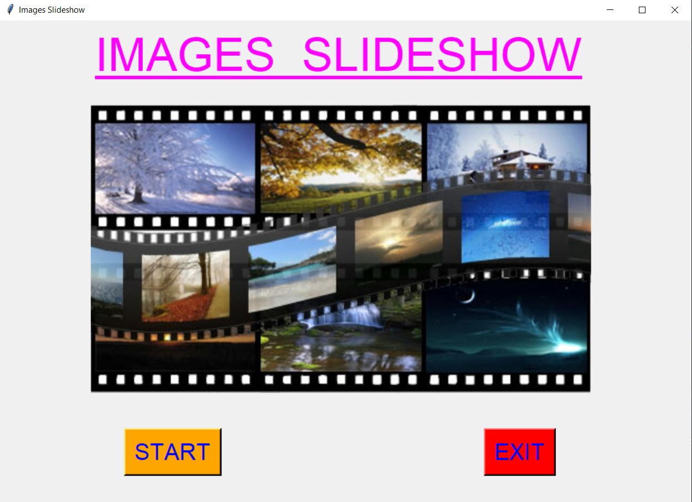
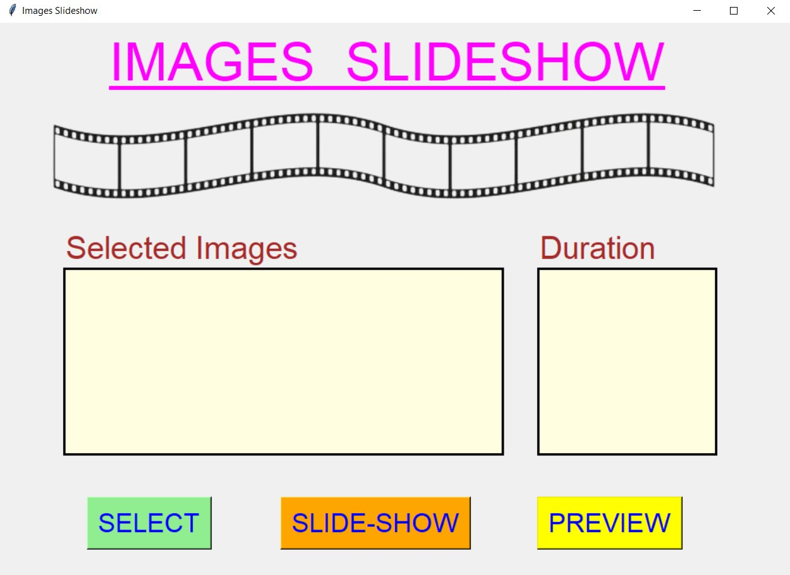
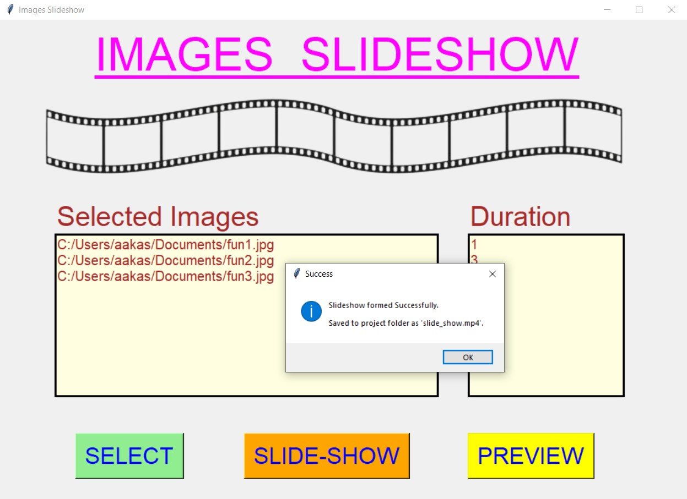
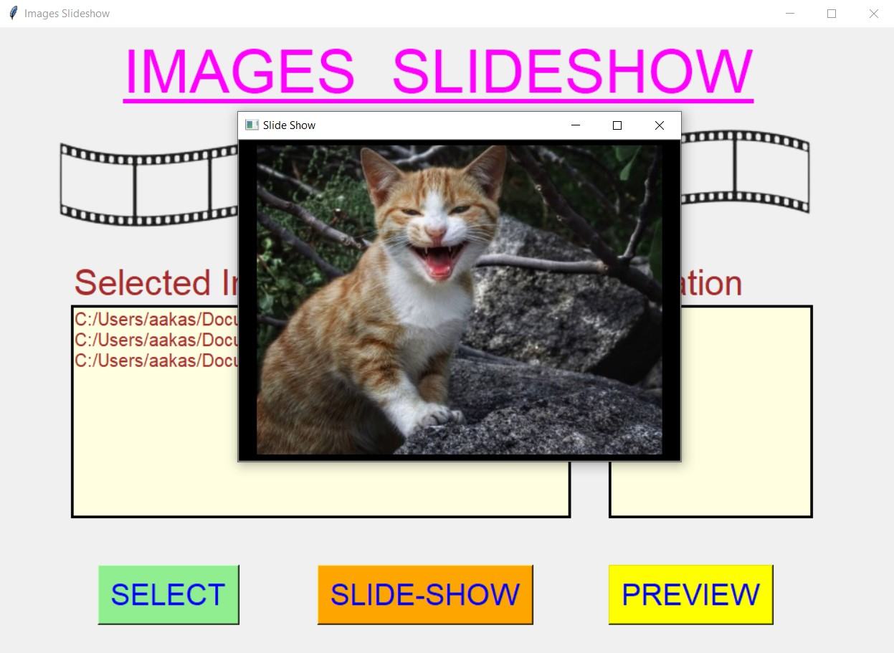
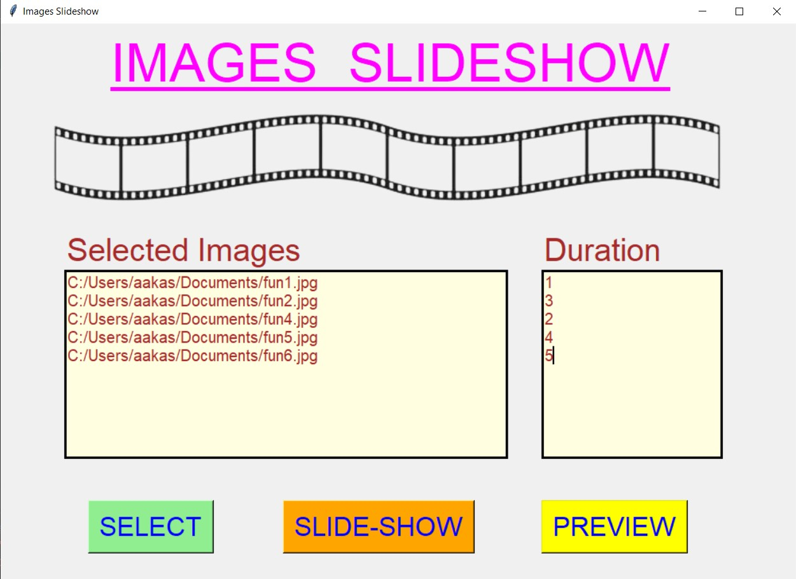
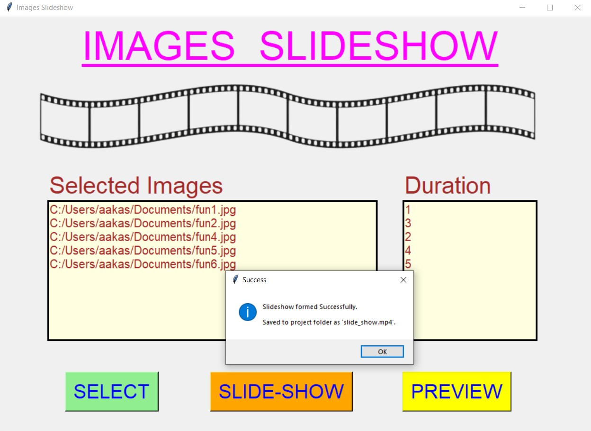
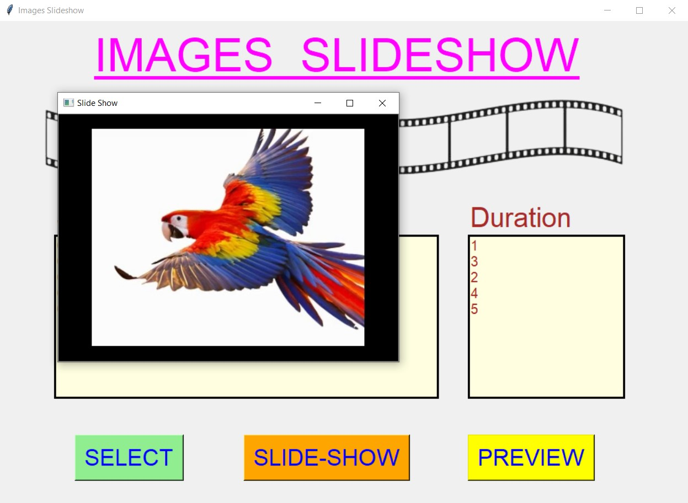
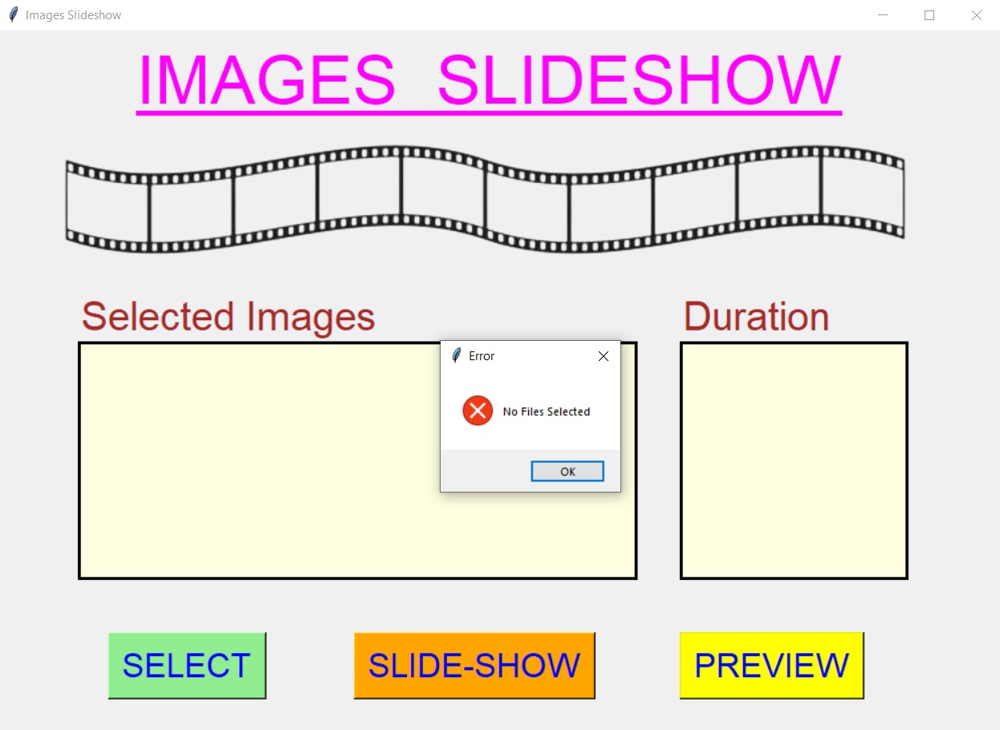
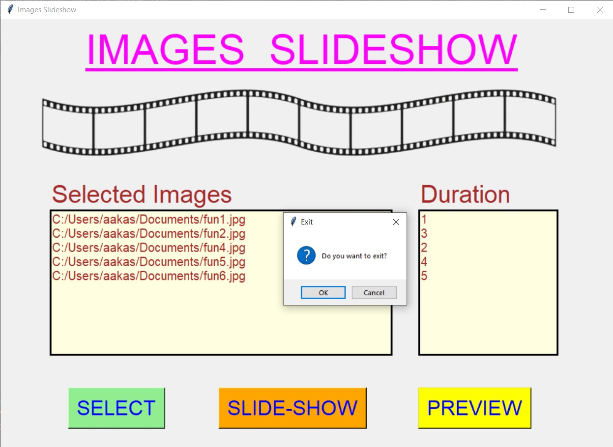

# ✔ IMAGES SLIDESHOW
- ### An Images Slideshow is an application created in python with tkinter gui and OpenCv library.
- ### In this application user can select any no. of images and can can form a slideshow of all those selected images.
- ### Also user can set the duration time in the slideshow for each images as per user wants.
- ### The output file will be saved automatically to the project directory.
- ### Also this application will allow user to see the preview of the slideshow created.

****

# REQUIREMENTS :
- ### python 3
- ### cv2 module
- ### tkinter module
- ### filedialog from tkinter
- ### messagebox
- ### from PIL import Image, ImageTk
- ### import cv2
- ### from moviepy.editor import *

****

# HOW TO Use it :
- ### User just need to download the file, and run the images_slideshow.py, on local system.
- ### After running a GUI window appears, where user can start the slideshow application by clicking on the START button.
- ### After that a new GUI window will open, in which user will have buttons like SELECT, SLIDE-SHOW and PREVIEW.
- ### User can select any no. of image file from the local system, using SELECT button and set the duration time for each image using duration text box.
- ### After user has selected images and set the duration time for each image, when user clicks on the SLIDE-SHOW button, the process will start and after completion user will get the success message.
- ### Also if user hasn't selected any image file and tries to form slide show, user will get an error message for the same.
- ### Also when user clicks on the PREVIEW button, user will be able to see the preview of the slide show created from the selected images.

# Purpose :
- ### This scripts helps us to easily stitch multiple videos in according to either row or column.

# Compilation Steps :
- ### Install tkinter, PIL, cv2, moviepy
- ### After that download the code file, and run images_slideshow.py on local system.
- ### Then the script will start running and user can explore selecting any multiple images and making slideshow of it and seeing preview of that.

****

# SCREENSHOTS :
****

   
   
   
   
   
   
   
   
   
   

****

# Name : 
- ### Akash Ramanand Rajak
