# ✔ MAP COLORING
- ### An Map Coloring is an image processing application created in python with tkinter gui and OpenCv library.
- ### In this application user can select an image of map of any country or any place, then will be able to color the parts of location separated by line in that map image.
- ### Also user will be shown the preview of the original map image and colored map image.
- ### Also after coloring user can also save the colored map image anywhere in the local system.

****

# REQUIREMENTS :
- ### python 3
- ### os module
- ### cv2 module
- ### tkinter module
- ### filedialog from tkinter
- ### messagebox
- ### from PIL import Image, ImageTk
- ### numpy
- ### random

****

# HOW TO Use it :
- ### User just need to download the file, and run the map_coloring.py, on local system.
- ### After running a GUI window appears, where user can see button like START and EXIT.
- ### After user clicks on the START button a main application window will appear, where user needs to choose a map image using SELECT button.
- ### After selecting the image, two images will appear on screen one on left side, which is original and one on write in which Colored map will be shown.
- ### Now user can color the map image using COLOR button.
- ### Also user will be shown the preview of the original map image and colored map image.
- ### Also after coloring user can also save the colored map image anywhere in the local system.
- ### Also there is exit button, clicking on which we get a exit dialog box asking the permission to exit.

# Purpose :
- ### This scripts helps user to easily color the image of map of any country or any place.

# Compilation Steps :
- ### Install tkinter, PIL, numpy, cv2, os, random
- ### After that download the code file, and run map_coloring.py on local system.
- ### Then the script will start running and user can explore it by selecting any image of map with outlines in it and coloring it.

****

# SCREENSHOTS :
****

  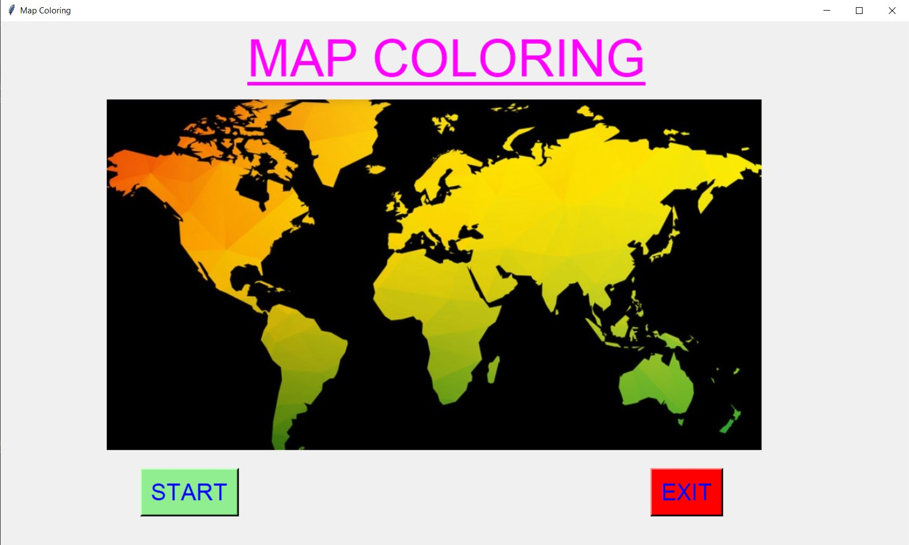 
  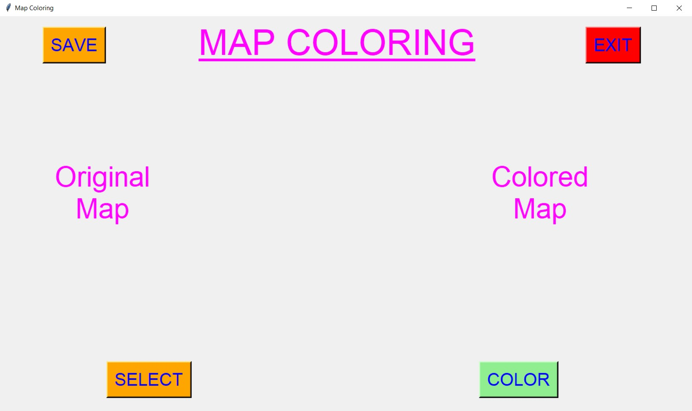 
  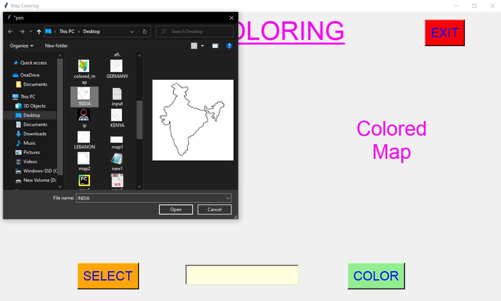 
  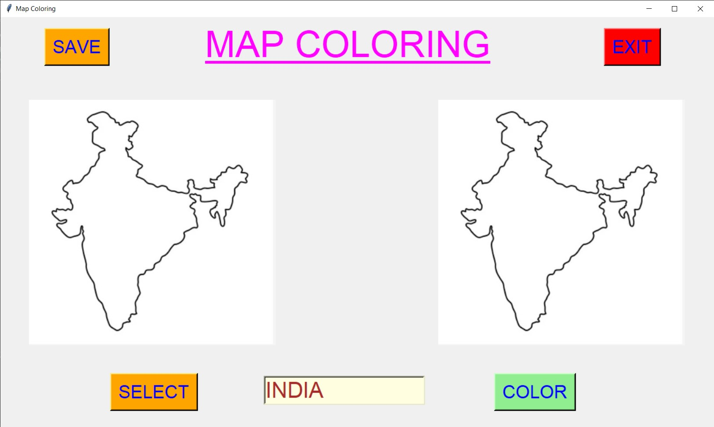 
  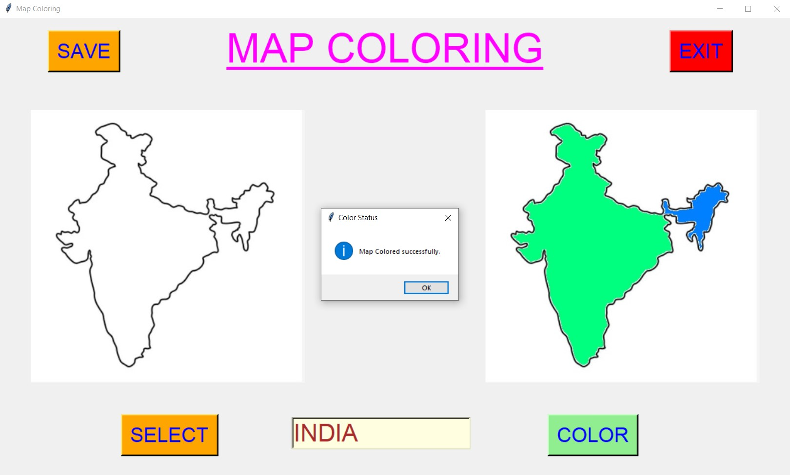 
  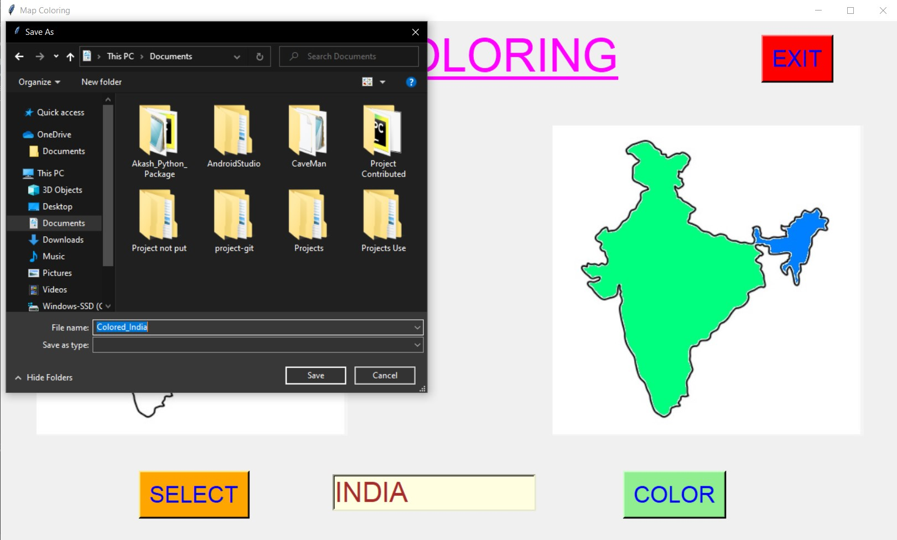 
  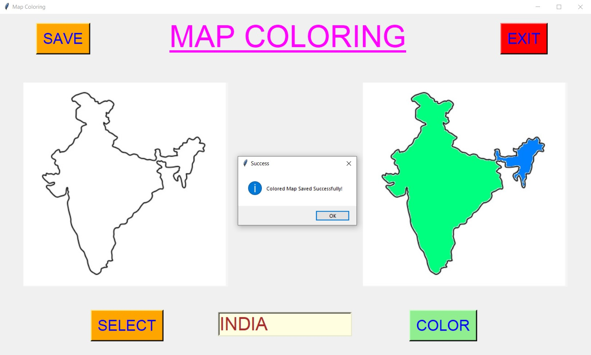 
  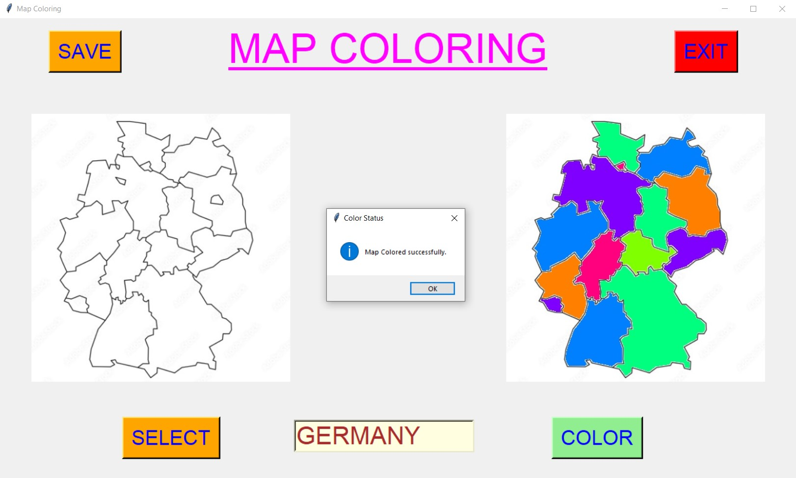 
  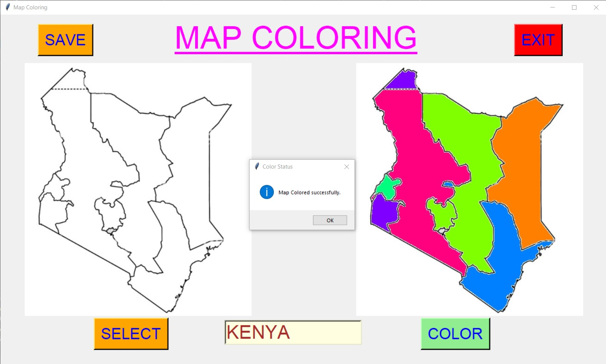 
  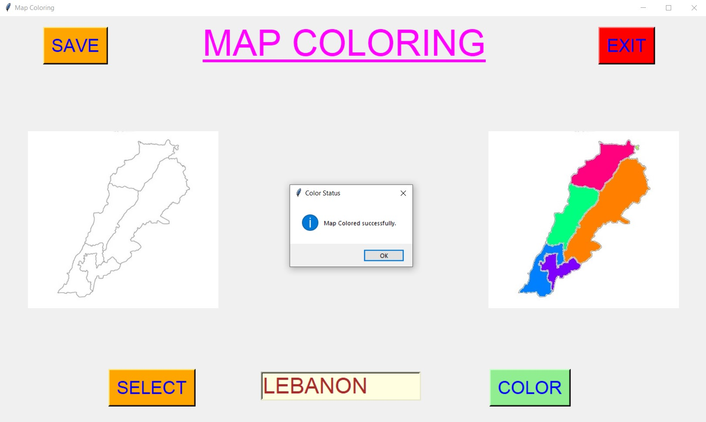 
  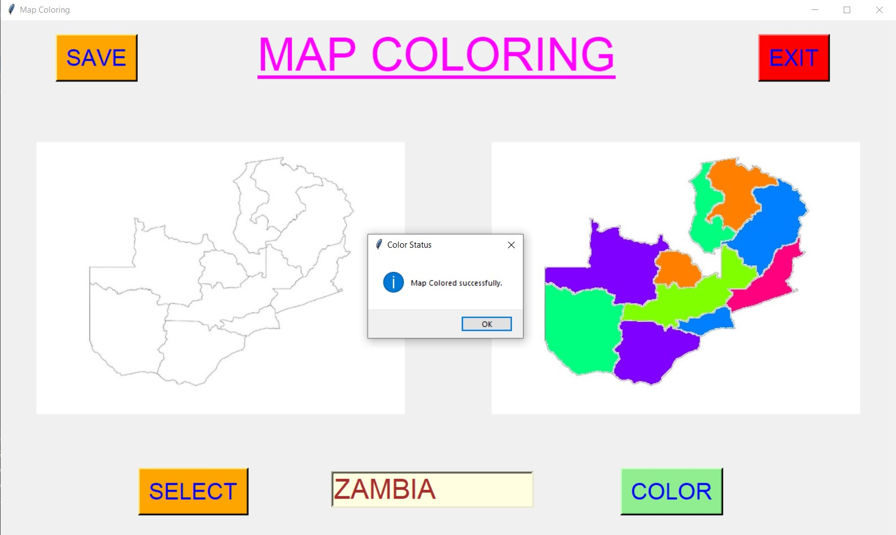 
  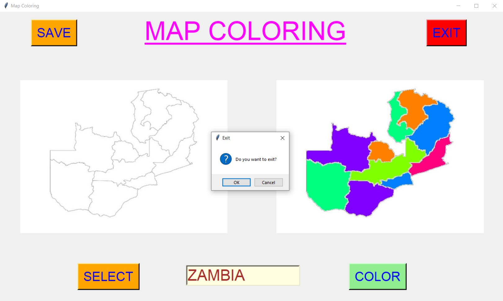 

****

# Name : 
- ### Akash Ramanand Rajak
