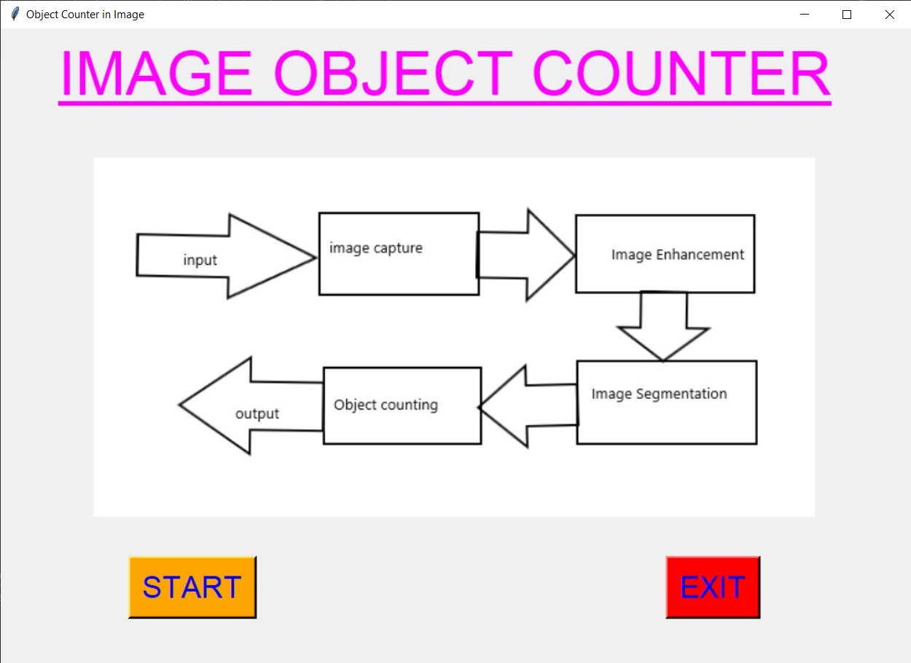
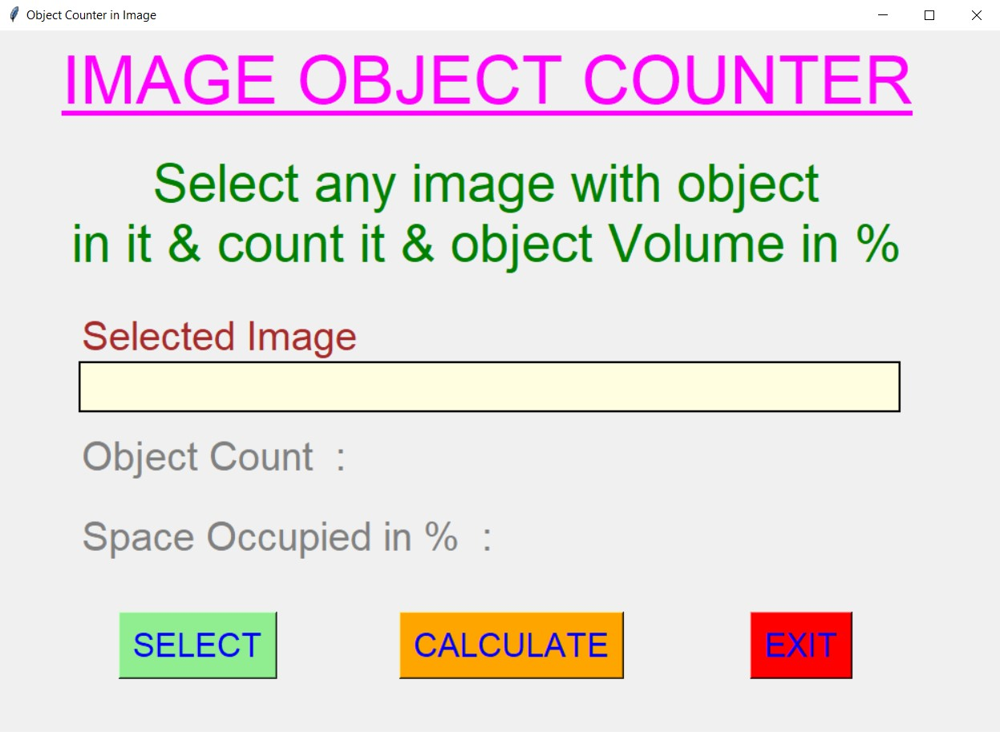
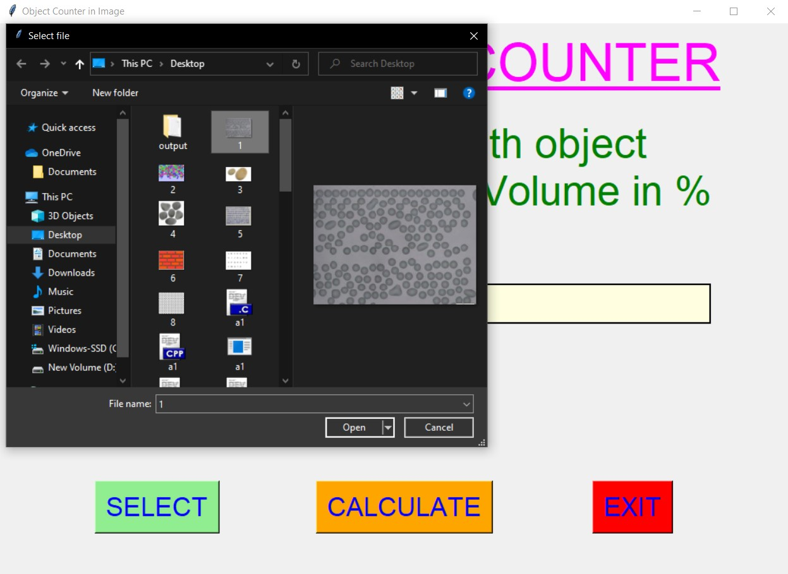
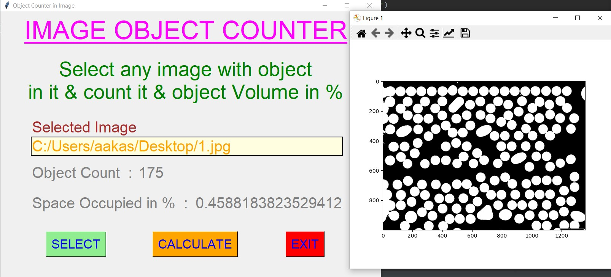
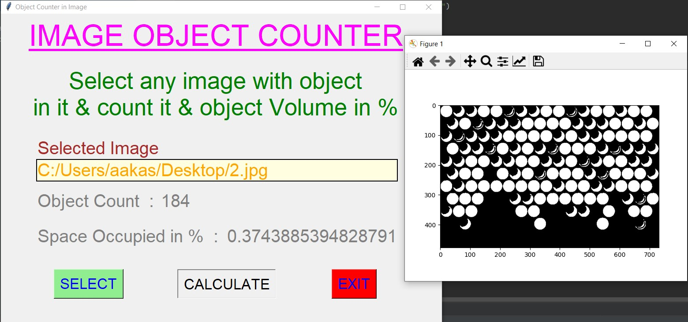
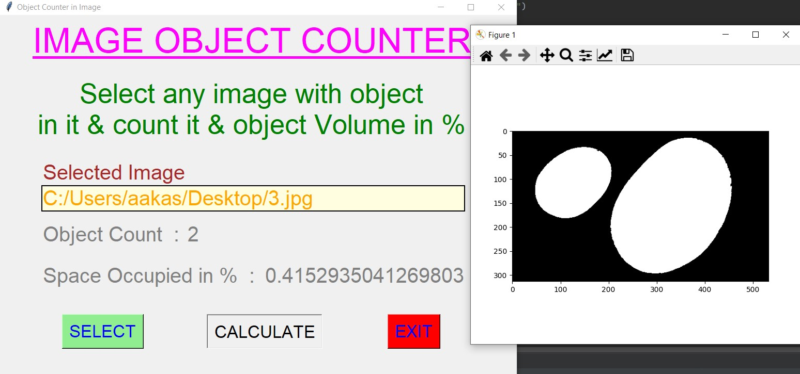
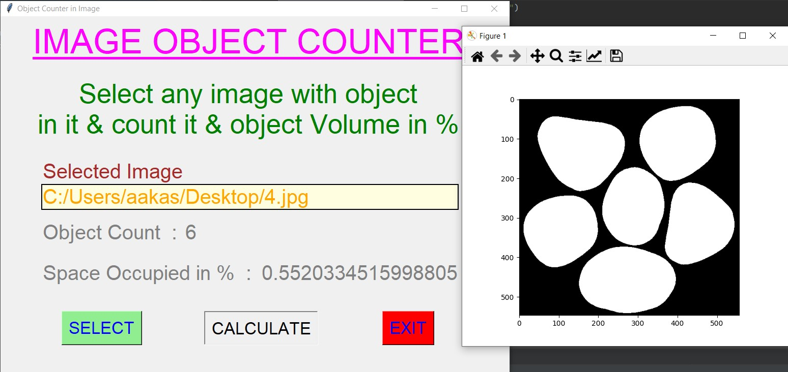
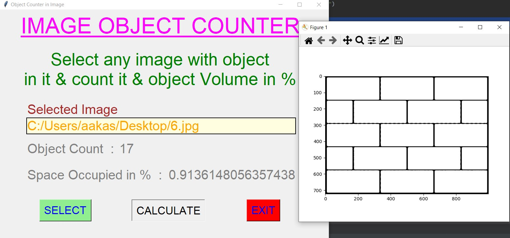
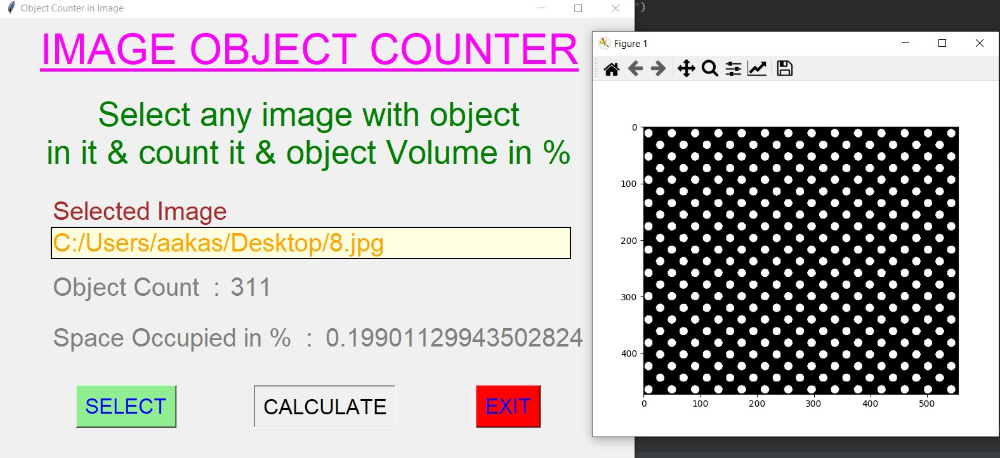

# ✔ OBJECT COUNTER IN IMAGE
- ### An Object Counter in Image is an application created in python with tkinter gui.
- ### In this application user will be able to select any image which has some objects in it, and will be able to calculate the object count in it
- ### Along with count user will also be able to calculate the space occupied by object in that image.

****

# REQUIREMENTS :
- ### python 3
- ### tkinter module
- ### filedialog from tkinter
- ### messagebox
- ### from PIL import Image, ImageTk
- ### from skimage import io, filters
- ### from scipy import ndimage
- ### import matplotlib.pyplot as plt
- ### from skimage import measure

****

# HOW TO Use it :
- ### User just need to download the file, and run the object_counter_in_image.py, on local system.
- ### After running a GUI window appears, where user can start counting application by clicking on the START button.
- ### After that a new GUI window will open, in which user will have buttons like SELECT, CALCULATE and EXIT.
- ### User can select any image file (either jpg, png, or any other extension of image) from the local system, using SELECT button.
- ### User will also be able to seel the full path of the image selected.
- ### Also there is an EXIT button clicking opn which user can exit from the application.

# Purpose :
- ### This scripts helps user to easily get the object count and volume of any image(with object in it) from local system.

# Compilation Steps :
- ### Install tkinter, PIL, skimage, scipy, matplotlib.pyplot
- ### After that download the code file, and run object_counter_in_image.py on local system.
- ### Then the script will start running and user can explore selecting any image and getting the object count and volume occupied by that object in image.

****

# SCREENSHOTS :
****

   
   
   
   
   
   
   
   
   
   

****

# Name : 
- ### Akash Ramanand Rajak
