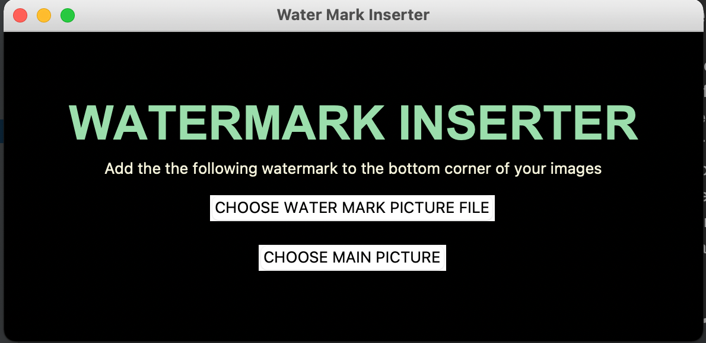

# Watermark Inserter GUI
- A GUI created with tkinter and Pillow (PIL) packages of python.

## How it works
- Instal pillow (PIL) as it is not a default package of python
```
pip install pil
```
- The GUI will prompt you to select two images, one of them a logo or watermark text preferably and your main image.




- The chosen watermark image will then get re-sized to 150 pixels by 150 pixels and inserted in the bottom right corner 
of your main image.


- The new image will be saved into the images folder.


