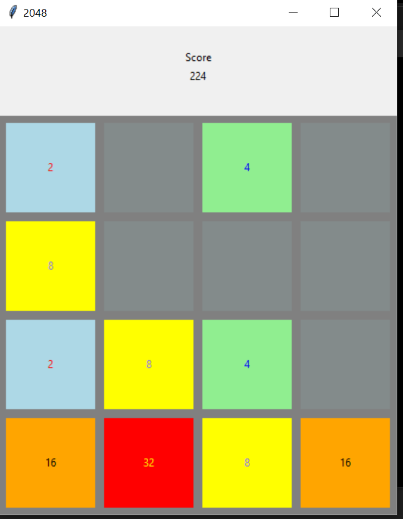

# 2048 Game 
2048 a game developed in python programming Language using random module and tkinter module.

## About the game
* It is a single player sliding tile puzzle game
* The user can keep playing till he gets a 2048 tile or all the grids are full and no grids can be merged

## How to play? 
* The user has to use arrow keys to play the game
* The user has to press the arrow key such that the adjacent tiles get merged.
* The tiles get merged only if the initial 2 tiles have the same value
* If there is no possiblity for a merge then pressing any key will bring up a new tile
* The user will win if he gets a 2048 tile
* The user looses when there are no merges left and all tiles are full

## Setup instructions
1. Install Python 3.x (recommended) from https://www.python.org/downloads/
2. Download this repository as zip and extract.
3. Run the code and start playing.
4. Have fun!!

## Real time use and purpose
 * It is used to play 2048 game which sharpens your mind and is also a source of distraction and relaxation.
 
## Output

## Author
K.Harshitha 

