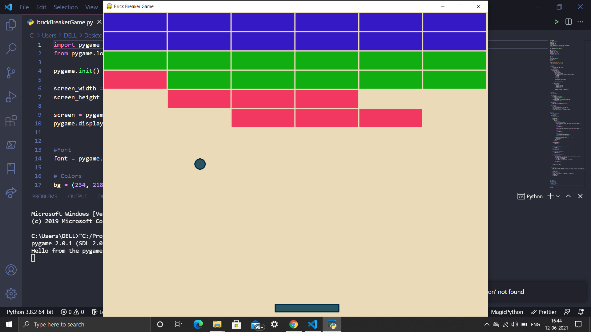

# Brick Breaker Game
### This repo contains program for a Birck Breaker Game using pygame.

#### In this game, the ball will bounce off every wall except the bottom one. 
Using the paddle to move along the screen, the player hits the ball that can touch the bricks and destroy them. 
Player have to destroy all the bricks to win the game.

#### Setup instructions
1.Install  3.x (recommended) from here.

2.Install Pygame 2.x(recommended) from here.

3.Download this repository as zip and extract.

4.Open cmd prompt and adjust the directory to 'Brick Breaker Game' folder.

5.Type this command to run the code

brickBreakerGame.py

Have fun!!

## Output

## 
<a href="https://github.com/Jagannath8">Jagannath Pal</a>
