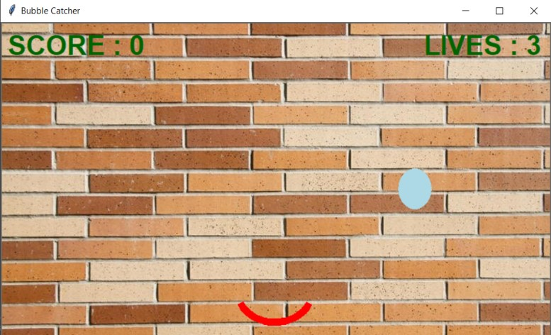
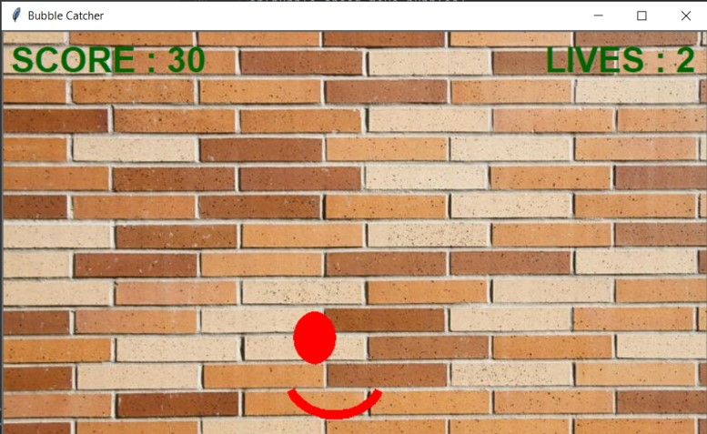
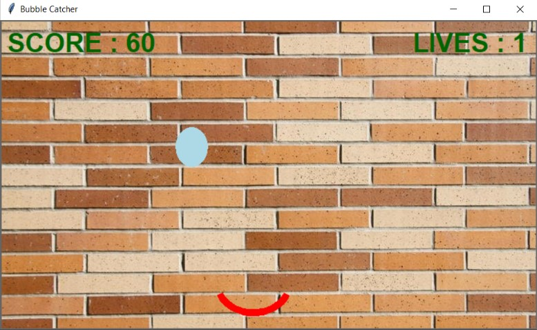
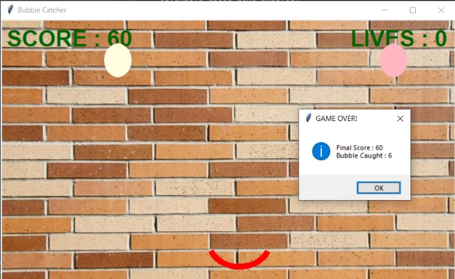

# ✔ BUBBLE CATCHER GAME
- ### A Bubble Catcher game created in python with tkinter gui.
- ### The game is single player mode and player need to catch as many as bubbles falling from the top.
- ### Also in this player has 3 lives, for each failure of player catching the bubble, the lives decreases by 1.
- ### And if lives becomes 0, the GAME OVER! message is displayed.

****

# REQUIREMENTS :
- ### python 3
- ### intertools module
- ### tkinter module
- ### PIL module

****

# HOW TO PLAY GAME :
- ### Player just need to download the file, and run the bubble_catcher.py, on local system, ans start playing.
- ### While PLaying, he/she needs to move the catcher (arc shape) to left or right and gain the score.

****

# SCREENSHOTS :

****

   
   
   
   

****

# Author : 
- ### Akash Ramanand Rajak

****