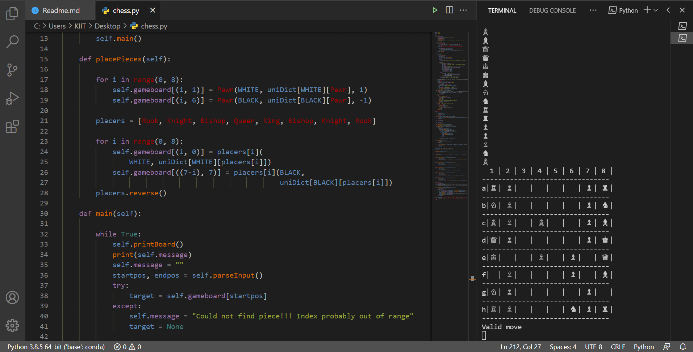

# Chess Game
### This repo contains program for a Chess Game in python.

#### In this game, the whole board can be controlled using simple algebraic commands, 
For example:
>>>e4 e7
This will move the pawn present on the e4 position to the e7 position. The program will evaluate constantly, whether its a valid move or not.  

General Chess Rules
White is always first to move and players take turns alternately moving one piece at a time. A piece may be moved to another position or may capture an opponent´s piece, replacing on its square. With the exception of the knight, a piece may not move over or through any of the other pieces. When a king is threatened with capture (but can protect himself or escape), it´s called check. If a king is in check, then the player must make a move that eliminates the threat of capture and cannot leave the king in check. Checkmate happens when a king is placed in check and there is no legal/valid move to escape. Checkmate ends the game and the side whose king was checkmated looses.

#### Setup instructions
1. Install 3.x (recommended).

2. Download this repository as zip and extract.

4. Open cmd prompt and adjust the directory to 'Chess Game' folder.

5. Type this command to run the code

chessGame.py

Have fun!!

## Output

