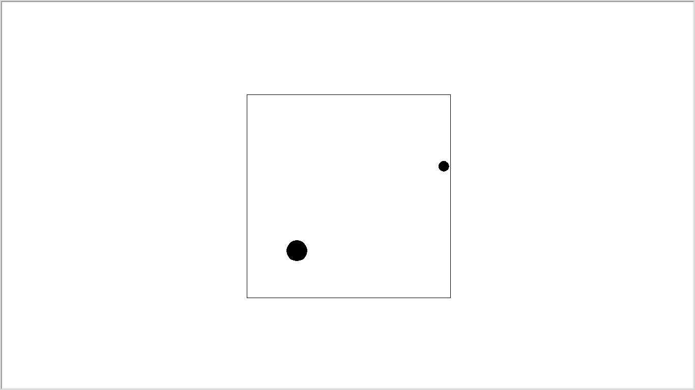

# Collison Detection

## Aim

The project aims to implement a physically precise model of a box and a ball setup. The implementation has two balls bouncing in a box.
The collision between the balls and the wall ie. ball-ball and ball-wall collisions are detected and handled accordingly.
Collisions are handled according to the law of conservation of Momentum and Kinetic Energy.

## Purpose

Collision Detection and proper and efficient handling of Collisions batween any two rigid bodies is a key necessity of any game engine or and physics Simulation software.

## Software used:
- Python 3
- Turtle module

## Workflow of the Project

The first step was to create the necessary class structure for the box and the ball saperatly.
Then the necessary methods were implemented and tested.
finally, the main driver code is implemented and executed with proper arguements.

## Setup instructions

To setup the code and run it, a simple git clone will do:
```
git clone <url>
cd Awesome_Python_Scripts/PyGamesScripts/collision_detection
```

## Compilation Steps

If python is installed in the local machine, script can be executed simply by:

```
python collision_detection.py
```

## Output



## Author(s)

Victor Swaroop [@GVictorsd](https://github.com/GVictorsd)


