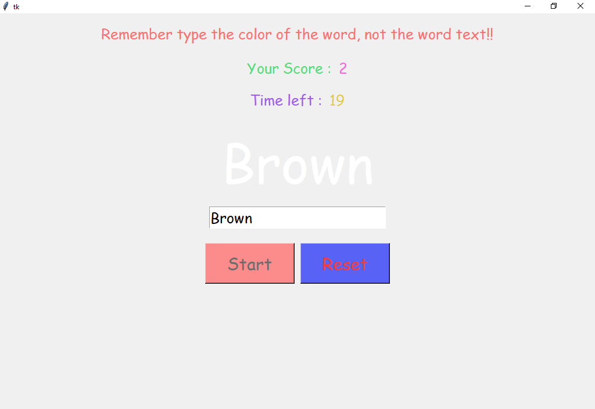

# Color Game 
##### It is a simple game made with the tkiner, a GUI module of python.

### How to Play?
- This game will put your attention to the test.
- You have 30 seconds type the **color of the words** displayed.
- A new word will get displayed once you type its color correctly.
- Do not get distracted by **word text** or the **background color**.
- Try to get as many colors correct as you can.

## SCRENSHOT OF GAME

(Note: The word will not change to a new one in this case, the correct answer is "white")

