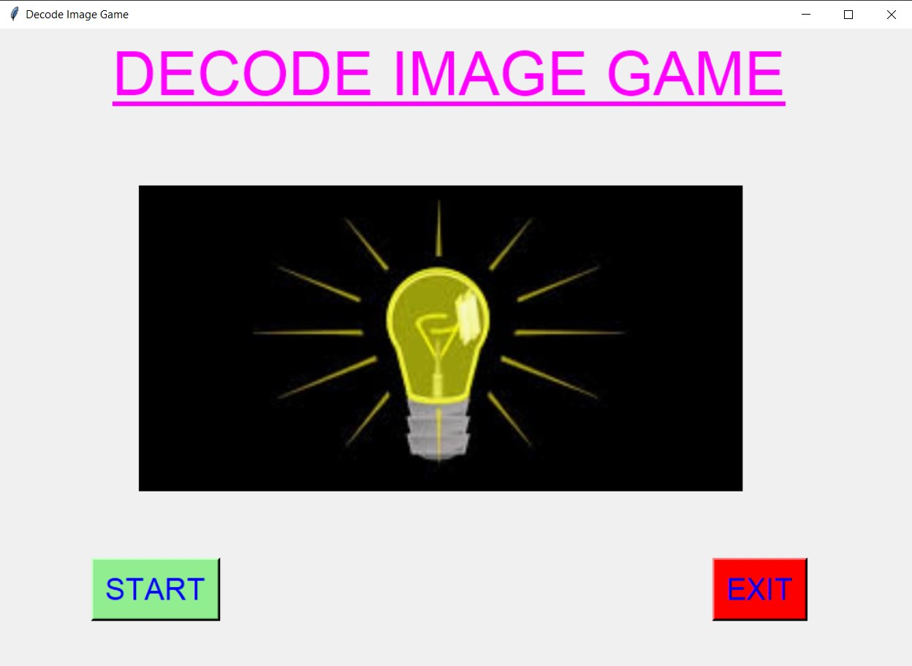
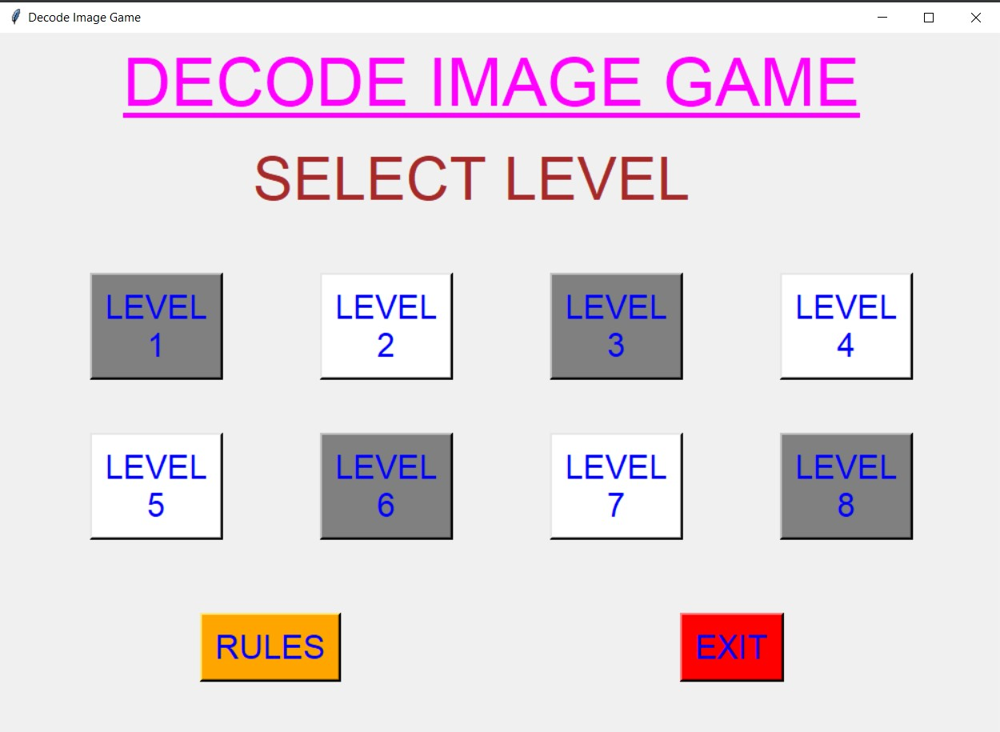
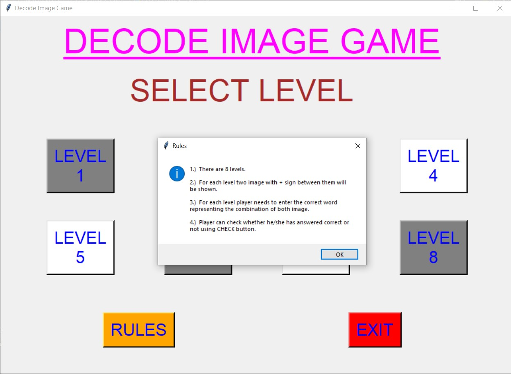
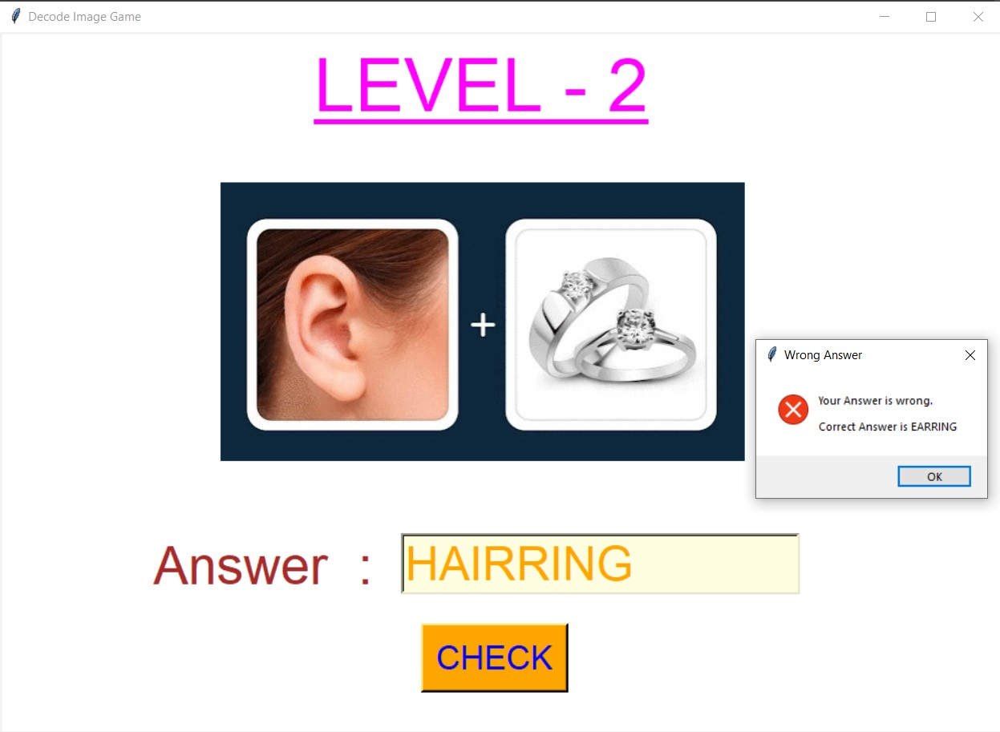
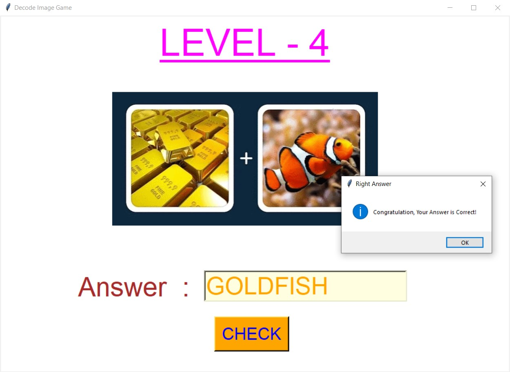
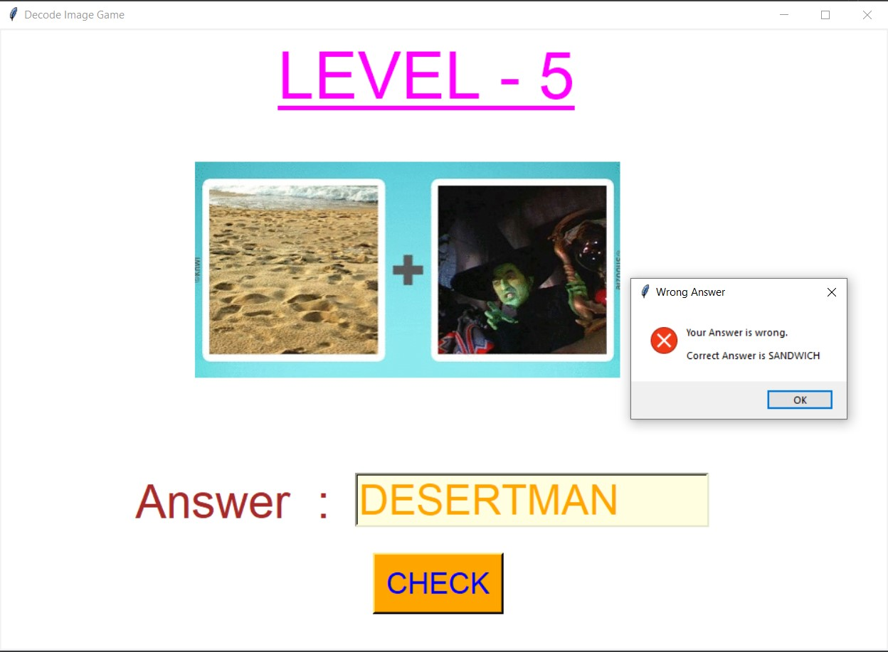
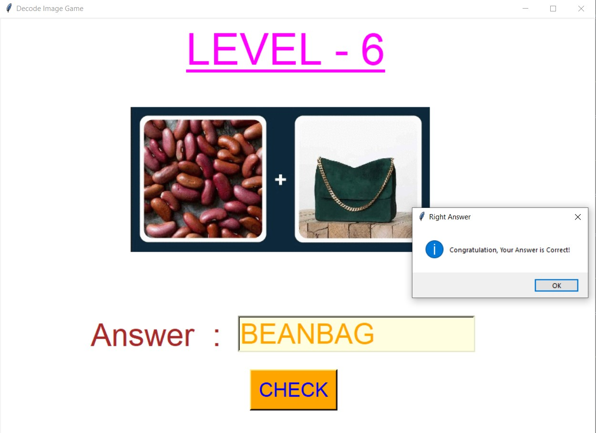
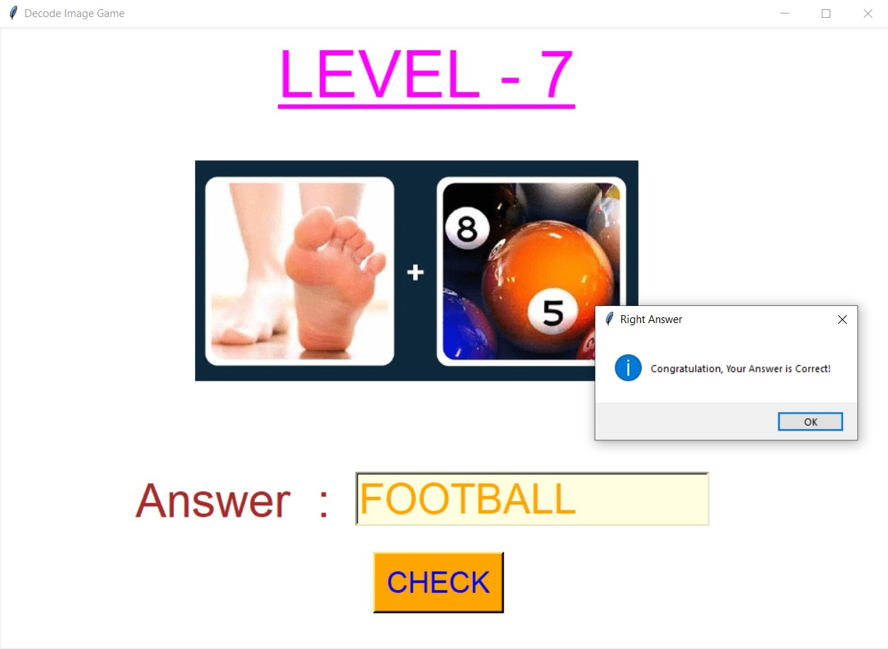
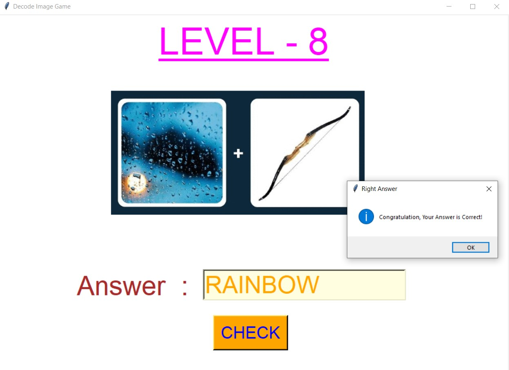

# ✔ DECODE IMAGE GAME
- ### A Decode Image Game created in python with tkinter gui.
- ### In this game, there will be different level and for each level user will be shown an image and user need to decode that image and write the correct word for that image in the entry box.
- ### After entering , user can check whether his/her answer is correct or not.
- ### If Answer is not correct, it also shows the correct answer to the user.

****

# REQUIREMENTS :
- ### python 3
- ### tkinter module
- ### from tkinter messagebox module
- ### PIL module

****

# How this Script works :
- ### User just need to download the file and run the decode_image_game.py on their local system.
- ### Now on the main window of the appplication, the user will able to see two button, START and EXIT.
- ### When user clicks on the START button, main game GUI will open.
- ### Here user can see the rules by clicking on the RULES button.
- ### User will be able to see different level and for each level user will be shown an image and user need to decode that image and write the correct word for that image in the entry box.
- ### After entering , user can check whether his/her answer is correct or not.
- ### If Answer is not correct, it also shows the correct answer to the user.
- ### Also there is an exit button, clicking on which exit dialog box appears asking for the permission of the user for closing the window.
- ### At last the score will be shown at the last in new frame, with no. of correct and wrong answers.

# Purpose :
- #### This game will helps user to build the great IQ level when player plays and decode images.

# Compilation Steps :
- #### Install tkinter, PIL
- #### After that download the code file, and run decode_image_game.py on local system.
- #### Then the game will start running and user can explore it by selecting each level and decoding imagem shown in each level.

****

# SCREENSHOTS :

****

   
   
   
   
   
   
   
   
   
   
   

****

# Name :
- ### Akash Ramanand Rajak
