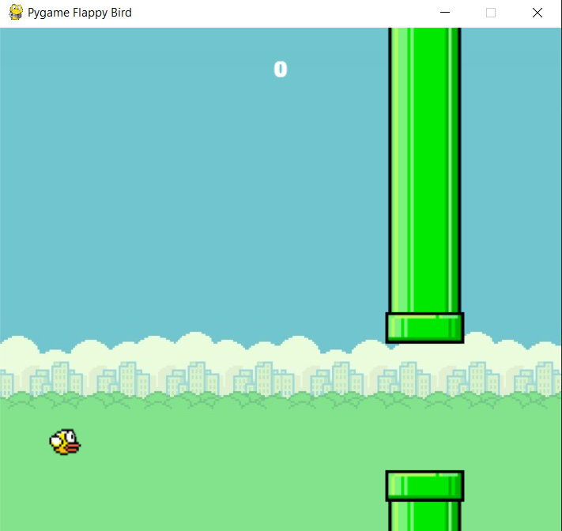

# Flappy Bird
Flappy Bird Game is a desktop application i.e, developed in python programming language using pygame module.

## About the game
- It is single player only i.e. you play with computer.
- You have to keep the bird moving forward and avoid the contact with the obstacles.

## How to Play?
- You have to remain in the screen until long green channels show up before you.
-  The user needs to control the bird fluttering up, down  using the Spacebar or mouse clicks. 
- Avoid the contacts with the pipes to score more.
- As long as you be alive more will be your score.


## Setup instructions
1. Install Python 3.x (recommended) from <a href="https://www.python.org/downloads/">here</a>
2. Install Pygame 2.x(recommended) from <a href="https://pypi.org/project/pygame/">here</a>
3. Download this repository as zip and extract.
4. open cmd prompt and adjust the directory to 'Flappy Bird' folder.
5. type this command to run the code<br>
```bash
flappy_bird.py
```
6. Press Enter to run the code and start playing.<br>
7. Have fun!!


## Output


## Author
<a href="https://github.com/sambit221">Sambit Kumar Tripathy</a>